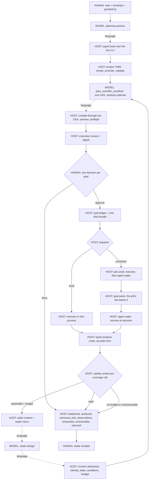

# ChemSmart Product Charter

## Mission

ChemSmart is the canonical, CLI-first hub through which humans and AI agents
operate computational-chemistry programs. Scientific intent belongs in
readable project YAML and typed scientific DAGs. ChemSmart validates that
intent, materialises program-native inputs, compiles the public CLI, controls
execution, and returns typed scientific evidence.

The model is a computational scientist, not an input-file generator. It may
choose a defensible method, program, decomposition, and interpretation when a
task leaves them open. It must not bypass ChemSmart by inventing native input,
shell commands, execution status, or result values.

## Architecture

One driver runs every goal, and every entry point is a view of it: the
``goal`` command, the ``plan`` command, and the terminal interface. Solid
edges are code-enforced; dotted edges are where the model chooses and the
host checks only the result.

The driver is a step machine -- plan, decide, execute, outcome, settle --
and every phase boundary is a ledger entry, so a process may stop after
any step and a later process may resume from the ledger. That is what
lets an approved run be handed to a scheduler: the job script runs the
same provider-free executor inside the allocation and its own tail runs
``chemsmart agent wake``, which rebuilds the driver at the outcome phase.
No poller, no scheduler accounting, and no second decision are involved;
the same one-shot bundle continues in its own run directory.

The surface the model reads is a tree, not a list. A stem of sixteen
tools, the operations that belong to no family, and the universal rules
is what every session reads; a guide is a family unit -- structure,
scan, constants, cbs, ensemble, spectroscopy, database, crossprogram,
recovery, saddle -- of extra tools, extra operations, a few hundred
words of guidance, and the rules placed on it. The host opens a guide on
four signals, each recorded with the new tool-schema digest: the task
text, the workspace, the planned DAG's own jobtypes, operations and
programs (a DAG naming two programs opens ``crossprogram``), and the
previous run's terminal states under a goal; the model may open any
guide itself with ``open_guide``. The exposure record follows the
surface each request is actually built from, so a guide opened
mid-session is recorded with the digest it produced. Opening a guide
changes what the model can express and how much it reads, never what
the host approves.

Every natural-language rule the host places in front of the model is a
registered capability with an id, a placement (stem, a guide, the goal
wake, or one tool's description), the tier that first needs it, and the
provenance that earned it; the system prompt, the wake context, and the
tool descriptions render from that registry. And every capability of
every kind -- program job types, tools, selectors, operations,
predicates, constants, skills, guides, rules -- climbs one ladder,
declared, wired, advertised, tested, qualified, computed from the
registries that own each kind: wired from the host's handler table and
the readers, tested from the ``capability`` markers tests carry,
qualified from a curated release record of the live runs behind each
executable program job type and from the host's own store, which the
driver writes at every achieved settlement. ``chemsmart agent
capabilities`` renders the ladder; a cell the agent can run but cannot
judge, and a claim without a run behind it, say so out loud.

## Product boundary for version 3.1.4

The production Agent supports:

- project-YAML creation and validation;
- ChemSmart CLI compilation and safe preview;
- causal scientific workflow planning;
- inspection and typed analysis of supported results; and
- explicitly approved execution on release-qualified CPU paths: ORCA
  single-points, optimization/frequency, transition-state, excited-state,
  relaxed coordinate scans, intrinsic reaction coordinates, and serial DAG
  workflows; PySCF ``sp/opt/hess``; and xTB ``sp/opt/hess``.

ORCA ``scan`` is qualified for approved execution: a relaxed torsional profile
ran through the ordinary plan, preview, single human approval, and provider-free
execution path, and its surface is read into typed quantities by the same
analysis layer as any other result. A scan's driven coordinate is carried on the
workflow node, not in project YAML, because it is a fact about this molecule in
this calculation rather than reusable method rationale.

ORCA ``irc`` is qualified for approved Agent execution: a TS-to-IRC
workflow — one converged transition-state search feeding two
intrinsic-reaction-coordinate runs, each consuming the transition state's
own geometry and analytic Hessian as role-distinct producer bindings —
was planned, previewed, approved in one displayed decision, executed
provider-free, validated, and delivered host-rendered claims on a
qualification target; that approval was made by an owner-delegated
reviewer and the record names it as such. Admission keys each producer
data edge by its consumer role, so distinct roles on one node coexist
while one role never admits two edges, and execution readiness demands
every binding before launch. ORCA writes the reaction path to an XYZ
sidecar rather than into the log; the log's only printed structure is the
starting point, so every state-dependent selector — geometry, energies,
orbitals, dipoles, spin — is deliberately not declared for the jobtype:
the first executed chain rendered the transition state's own distances as
both endpoints, and its printed energy differs from the true endpoint by
the entire barrier. Only job-level facts (charge, multiplicity, direction,
solvation route, atom identity) are declared, and selector declarations
now gate extraction rather than merely advertising coverage. The
trajectory sidecar enters the typed layer as a registered geometry
artifact and is readable there today; a log-native path route is future
parser work, so whether a saddle connects two particular minima remains an
observation a scientist makes from the trajectory artifact, not a
host-rendered claim.

ORCA ``modred`` is declared for planning, preview, and native-input generation
only. Constrained optimisation is expressible and previewable, and no
constrained optimisation has yet run here, so this release does not describe it
as completed Agent execution.

A typed analysis chain planned with a workflow is carried verbatim in the
review packet and the approval bundle, and the single human approval covers
it: after every approved calculation node validates, the provider-free
executor runs the chain and renders a completed-analysis report. The model
never writes those numbers; interpretation and the recorded scientific
decision remain a session act.

A plan's own acceptance criteria reach the numbers that stand on them.
A ``scientific_validation`` node judges the producers its inputs
descend from, and a claim whose producer closure includes one of those
producers is named in the completion when that criterion did not hold;
the completion turns partial and the settlement carries the word. The
join is read from the approved plan, so it costs the model no new
field. It is never a refusal and never a silent drop: the number stays
delivered and the reader is told which criterion it stands under,
because a criterion that would bury a finding is a defect in the
criterion.

``compose_molecular_arrangement`` places two identity-bound geometry
artifacts into one arrangement at an explicit atomic contact. The host owns
the placement mathematics and the composed bytes with full parent lineage;
the model owns the fragment, contact, and distance choices, must bind the
arrangement's charge and multiplicity explicitly, and the consuming stage is
a new workflow for review.

A molecule may enter that the workspace never held. Every other
geometry origin requires the workspace to already contain it -- a
supplied file, a database record, a previous result, or a derivation,
composition, edit or append of one of those -- so a question needing a
reference computed at the session's own level, a calibration standard,
or a literature comparison had no route. The model names a public
identifier (a name, a numeric CID, or a SMILES string) and nothing
else; the host fetches the record through the same library call the
human CLI uses, owns the bytes, and records the identifier as lineage.
No coordinate is model-authored. What arrives is a depositor's
conformer carrying that depositor's symmetry rather than a relaxed
structure, so the point-group estimate is stated as for any other
origin, and it binds no electronic state: charge and multiplicity are
bound explicitly afterwards and the consuming stage is a new workflow
for review. A lookup that fails is a typed refusal naming its cause,
because the network, the identifier, and the two-dimensional record
that will not convert to one three-dimensional molecule are different
failures with different routes -- many coordination compounds are
stored as separate components and no retry changes that.

``derive_molecular_species`` is its mirror: it takes an ordered subset of one
identity-bound parent's atoms, which is the single operation underneath
homolysis, deprotonation, and fragment extraction. The model names either the
atoms to remove or the atoms to keep and the host records both, copies the
parent's coordinates unchanged, and owns the derived bytes with full parent
lineage; the derived geometry is therefore a starting structure rather than a
relaxed one. Derivation never infers an electronic state — removing a
hydrogen gives a radical or an anion depending on where its electron went —
so charge and multiplicity are bound explicitly afterwards and the consuming
stage is a new workflow for review. Whether the result is one species or
several separated pieces is recorded as an observation, not judged.

The third producer selection rule (``validated_producer_orca_hessian``)
declares a validated frequency-bearing ORCA producer as a legal source for
an ORCA transition-state search's ``--inhess-filename`` starting Hessian,
and the materialised input carries the file natively; the starting Hessian
may carry any imaginary-mode count and the observed count is recorded.
Declaration is not completion: when the geometry and the Hessian both
arrive as producer edges the pair freezes into one approval, while a lone
Hessian edge on a directly supplied geometry is still refused by the
bounded review, so the reachable route is the producer pair. No workflow
has yet executed through this rule, and producer-Hessian TS seeding
therefore remains admitted, previewable intent rather than completed Agent
execution. Wavefunction
(gbw) reuse has no CLI surface and is not claimed.

The fourth producer selection rule (``validated_scan_minimum_geometry``)
carries a validated ORCA relaxed scan's minimum-energy sampled point into
a downstream calculation inside one approval. A scan ends at a surface,
and which point travels is a scientific judgement; the rule does not move
that judgement to the host — its meaning is exactly the minimum-energy
sampled point (ties resolving to the lowest point index), the planning
session declares it per edge, and the displayed review names it, so the
scientist approves that settlement explicitly. Any other point on the
surface remains the explicit scan-point binding, whose consuming stage is
a new workflow with its own review. This rule is qualified through
completed Agent execution: an executed torsional scan's carried minimum
seeded an optimization that validated as a true minimum, escaping a
saddle a direct optimization deterministically returned to.

A host-owned literature-constants registry holds the values a scientist
takes from the record rather than computes — an aqueous proton free
energy, a standard-state correction, a reference acid's measured pKa —
each entry a version-pinned name with a value, a unit, and the
standard-state convention that gives the number its meaning. An
expression selects an entry by name through the ``constant`` operation
and the host resolves it; a ``literal`` remains recorded as
model-authored, a ``constant`` as host-owned, and an unregistered name is
refused when planned, naming the registered set. Domain conversions own
their conventions as named operations (``gibbs_to_pka`` owns
pKa = ΔG/(RT ln 10)). The displayed review and the completed-analysis
report render every selected constant with its value, unit, and
convention.

Aqueous pKa is qualified as a composed workflow rather than a task
feature: no pKa-specific code exists in the Agent or analysis layers.
Two chemically distinct constructions have executed through the ordinary
plan, preview, single displayed approval, and provider-free path — a
direct absolute cycle (solvated opt+freq of an acid and its derived
conjugate base, thermochemistry at an explicit solution standard state,
the registry proton constant, ``gibbs_to_pka``) and a proton-exchange
cycle in which the proton term cancels and a registry experimental datum
anchors the scale, reusing registered results from the first as typed
inputs to the second. Both deliveries carried the method's documented
continuum-solvation systematic openly in host-rendered reports; neither
licenses an accuracy claim. An analysis kernel's scientific refusal, or
a registered result missing from the workspace, settles its node as a
typed finding and the run delivers every receipt that survived.

A batch is N enumerated records under the one displayed decision, not
an autonomy feature, and no task-specific batch code exists. A
workspace chemsmart ``.db`` database is an inspectable artifact whose
stored per-record fields (charge, multiplicity, energy, optimized
flags) are observations from the records' own provenance, never
bindings: a session enumerates records, extracts one record's exact
coordinates into a lineage-carrying geometry artifact — database
digest, record, explicit structure selection, with multi-structure
ambiguity refused rather than resolved — and binds identity and
electronic state explicitly per record, exactly as for a derived
species; execution never reads the database again. N records are
planned as N disconnected sub-DAGs in one workflow; the record
boundary is derived from the plan's own edges and stored nowhere; the
displayed review carries one row per record — molecule, explicitly
bound state, origin, and any stored-versus-bound mismatch flagged
loudly rather than refused — beside full derivation and
database-record lineage panels, and no row is ever elided. Execution
is sequential and record-major, and the provider-free executor
enforces the displayed envelope itself: the episode window, the
postprocessing reserve, and the engine-call budget, which counts
replayed receipts so it spans the approval's whole life. One record's
failure settles that record while the others deliver — the approved
chain walks whether the calculation partition completed or not,
unfulfilled analysis settles as typed findings naming the producer,
and the result and report carry per-record delivery verdicts with
reached states and verdicts as separate facts, never-attempted
distinct from failed, and deliberately no aggregate quantity: a batch
of N is N observations. A run continues by re-entering its own run
directory — the consumption ledger admits the same bundle whose
durable stream records the incomplete run, appends each resume naming
the remainder, replays terminal nodes from their receipts without
re-executing anything, reports a mid-engine interruption as ambiguous
pending human reconciliation, and refuses a completed approval
outright. This surface is qualified through completed Agent
executions: a six-record opt+freq batch (four whole deliveries, one
engine timeout by declared budget, one genuine saddle delivered as a
failed verdict; three invocations, six engine launches total); the
composed aqueous pKa carried over a four-acid database in one approval
(three pKa values delivered with the registry proton constant and the
documented anion systematic stated, the fourth settled typed on its
own saddle); and a mid-engine interruption resumed with zero
re-execution.

``edit_molecular_geometry`` sets one internal coordinate of an
identity-bound geometry — bond length, angle, or torsion, the same
three coordinates a scan drives — as a host-owned rigid motion. The
model names the coordinate, the target value in the coordinate's own
unit, and which side moves; which side moves is a scientific choice
with three incompatible library conventions behind it, so it is named
by one of the coordinate's own atoms, never defaulted, and the receipt
enumerates every atom that actually moved. The host measures the
coordinate before and after with the same arithmetic the typed
analysis layer uses, verifies it reached what was asked, and records
close contacts and connectivity changes as observations, never
verdicts. Refusals are structural only — an axis that is not a
perceived bond, a ring a rigid motion would tear (which differs per
coordinate), collinear or out-of-range atoms; no energy exists at edit
time and a requested value is never refused on scientific merit,
because grading it is what the consuming optimisation is for. An axis
the perception does not carry is refused with the numbers behind the
refusal -- the distance, the cutoff, the signed margin, the policy id --
and with the routes onward, because a perception convention blocking a
geometric action is a host decision about chemistry and the session is
entitled to see how narrowly it was made. An
edited geometry is a starting structure; atom count, order, and
formula are preserved, so parent atom i is edited atom i and a later
analysis may re-measure the same coordinate on the relaxed result.
Which atoms are adjacent is a host-owned convention, and it is declared
rather than implied. One module decides it for every agent-reachable
consumer, under one named policy: a pair is adjacent when its distance
falls below ``min(1.30 x (r_A + r_B), (r_A + r_B) + 0.45 A)`` on covalent
radii, the factor governing pairs whose radii sum is small -- every pair
involving hydrogen -- and the cap governing the rest. A delivered
adjacency carries, per pair, the distance, the cutoff applied, the policy
id and the **signed margin** by which the pair cleared or missed it,
because a boolean produced by a threshold cannot otherwise be told from a
structural fact. Bond order, aromaticity and valence saturation are not
derived from that cutoff and are not claimed: a distance cannot see where
electrons are, and a number derived from the cutoff moves whenever the
cutoff moves. The cases that have no distance answer -- [FHF]-, B-H-B
bridges, agostic interactions, every proton-transfer saddle -- sit near
the line by their nature, and for those the margin is what the host owes
its reader: it reports what its convention said and how narrowly, and the
scientist draws the chemical conclusion.

The form is two-regime because a single one was measured against this
repository's own structures and failed. An additive tolerance is
scale-inconsistent -- 0.05 A is 8.1% of the H-H radius sum and 3.3% of
C-C -- and hydrogen's covalent radius under-describes its bonds more than
any other element's, so the tightest tolerance sat exactly where real
bond-length variation is largest: H2 at its experimental 0.7414 A had no
perceived bond, a hydrogen-bonded O-H at 1.030 A had none, SiH4 was five
separated pieces, and one converged formaldehyde was delivered with no
C-H bonds while the same molecule at a larger basis carried both. A pure
multiplicative factor fails at the other end: the admissible single
factor is only (1.1958, 1.2473), bounded below by H2 and above by a
non-bonded C...Ti contact at 2.944 A in this repository's own conformer
corpus. Two human-CLI conventions -- the conformer grouper's tolerance
and the rdkit wrapper's -- remain deliberately separate and declared as
legacy rather than presented as interchangeable, because a difference
between two *named* conventions is a scientific observation while two
unnamed answers to one question is the defect this declaration exists to
prevent.

``append_molecular_atom`` is derivation's mirror: one atom, placed by
the three internal coordinates that define its position against three
anchor atoms; parent indices are unchanged and the appended atom is
last. ``displace_along_vibrational_mode`` is the third of the family
and the one a failed stationary point calls for: it steps a completed,
frequency-bearing result's own geometry along one of the normal modes
that result printed, which is what a chemist does when an optimisation
converges onto a saddle rather than a minimum, or when a
transition-state search returns the wrong number of imaginary modes.
The displacement vectors are the program's own and the host owns the
arithmetic, recording the largest displacement it actually achieved
beside the one requested; the model owns which mode and how far. It is
declared for every reader that serves printed modes -- the artifact
kind is the reader's word, never derived from a program's name -- and
is a starting-structure operation like the other two: refusals are structural only — a result printing no
modes, a mode the result does not carry, a zero amplitude — and an
amplitude is never refused on scientific merit, because whether the
step escaped the saddle is decided by the optimisation that consumes
it. The sign of the amplitude chooses the direction along the printed
mode, so the two sides of a saddle are two steps of opposite sign. All three operations bind no electronic state — adding a
hydrogen gives a cation or a radical depending on whether it brought an
electron — so charge and multiplicity are bound explicitly afterwards,
the consuming stage is a new workflow, and the displayed review
renders every hop of a built geometry's chain root-first, because the
hop that decides what the molecule is can sit at the root.

A source geometry carries its builder's symmetry, and an exactly
symmetric start converges to the nearest stationary point of that
symmetry, which is a saddle whenever the minimum lies lower: six live
saddles in two goals came from an idealised D4h start and from methyl
rotors appended at torsions of exactly 60, 180 and 300 degrees. The
host therefore states, on every identity binding and every compiled
node, a point-group estimate found within 0.01 Å from the molecule's
own atoms (and within 0.1 Å when the two differ) together with the
count of appended atoms placed on the exact 60° torsion lattice or at
exactly idealised angles; the estimate rides the review beside the
node's CLI operation as a host observation and never as a refusal.
``break_symmetry`` is the fourth starting-structure operation: it
perturbs every atom of an identity-bound geometry by a seed and an
amplitude the model names, so the same request gives the same bytes,
removes the net translation, rescales so no atom exceeds the
amplitude, and records the largest step it actually took and the
point-group estimate before and after; refusals are structural only
and an amplitude is never refused on merit. It is declared and
previewable; no approved workflow has yet consumed a perturbed
geometry, and this release does not describe it as completed Agent
execution.

This surface is qualified through completed Agent executions in which
requested-versus-relaxed is the delivered observable: an
N-methylacetamide rotamer study whose cis form is reachable only by a
deliberate amide-torsion edit (the edit survived relaxation to 0.01°;
a task-supplied claim that the amide C–N is an ordinary 1.47 Å single
bond was contradicted by relaxation at 1.363 Å on the same page; the
trans rotamer validated as a strict all-real minimum; successive
sessions diagnosed methyl-rotor saddles from failed strict verdicts
and repaired them by displayed edits, and the completed series
established that the cis form's two methyl rotors are geared, so its
strict minimum is recorded as honestly unconfirmed rather than
claimed); a 1,2-difluoroethane transfer in which the session built
both gauche enantiomers by edits, predicted the gauche effect with
its mechanism before any number existed, and physics returned gauche
lower with the requested 60° torsions relaxing to 71.9°; and an amide
protonation study in which both conjugate acids exist only through
appended protons, the O-protonated cation validated as a strict
minimum confirming the session's resonance-based site prediction, and
the appended O–H and N–H bonds relaxed within 0.01 Å of their
requested lengths. N edits are N observations; no spatial-competence
score or aggregate exists, and nothing grades a request except the
relaxation that consumes it.

A vibrational frequency states how fast a mode moves and never which
atoms move in it, so a session facing a small imaginary mode could not
separate one methyl rotor from another by magnitude alone.
``vibrational_mode_atom_participation`` is each atom's share of a mode's
squared displacement, one row per mode summing to one, derived by the
host from the displacement vectors the program itself printed and
renormalised so the quantity means the same thing across programs whose
vectors do not: ORCA, Gaussian and xTB print Cartesian displacements at
unit norm while PySCF returns the same physical displacement scaled by
one over the square root of the reduced mass, and a per-atom share
divides that per-mode scalar out along with the arbitrary eigenvector
sign and the program's coordinate frame. What renormalisation cannot
remove is each program's atomic mass table, and that limit is stated
where the quantity is defined. The share is an observation: naming a
mode's motion is the scientist's claim, never the host's. Because the
individual eigenvectors inside a degenerate set are an arbitrary basis,
``vibrational_mode_degeneracy_group`` records which modes share a
frequency within a stated tolerance, so a reader can see that a mode has
company before assigning motion to it. Declared for ORCA ``opt`` and
``ts``, xTB ``hess``, and PySCF; Gaussian is deliberately undeclared and
unadvertised, because this release never executes Gaussian and its
displacement block varies with options the reader cannot yet detect.
This surface is qualified through one completed re-observation of the
case that motivated it: given two converged amide rotamers whose strict
verdicts failed, a session read the table and named the acetyl methyl
rotor in one and the N-methyl rotor in the other, a distinction seven
earlier sessions could not draw from frequencies alone.

Electric charge is a dimension, so an electrode potential is one too.
Potential is derived as energy per charge rather than asserted, which
makes ΔG = −nFE dimensionally checkable and leaves the Faraday constant
in the unit system where a definition belongs rather than in a registry
of measured values. ``gibbs_to_redox_potential`` owns E = −ΔG/(nF) and
with it the IUPAC sign, so a favourable reduction has a negative free
energy and a positive potential; referencing an electrode stays ordinary
subtraction against a registered constant, so which electrode a value is
quoted against remains visible in the expression.

A literature constant now declares the convention family it may be
combined within and what it is for. Constants that look independent are
often matched pairs — an absolute electrode potential means one thing
beside the proton solvation free energy determined on the same scale and
another beside a different one — and the literature circulates the
halves separately, so a crossed pair fails silently with both values
correct and the answer wrong. The family is displayed and never refused,
because choosing a convention set is a scientist's judgement and a mixed
selection can be deliberate. A family says nothing about standard state,
and that limit is stated where a session reads it: the purpose phrase
says which entry belongs beside which, and where a finished composed
value is registered it says to prefer it. Values never reach the model;
a choice is made from a name, a unit, a family and a use. A constant is
registered only from a source text read at registration: the ferrocene
reference in acetonitrile is three entries -- the computed absolute
Fc+/Fc potential with its source's stated accuracy, whose purpose
prefers a ferrocene pair computed at the same level, and the
experimental construction the same source benchmarked against, as one
family that adds to it -- and the table value against the aqueous
standard hydrogen electrode is deliberately absent because no primary
text for it was read, which the registered entry says. A wavenumber
becomes an energy only through ``wavenumber_to_energy`` and its
inverse, which own h·c·N_A; an exchange coupling declared in cm⁻¹ and
claimed in kcal/mol is restated by the host in the expectation row and
the completion miss names the two dimensions and the route.

Two refusals move to where the human decides rather than where the
engine finds out. An electronic state that no molecule can have — a
negative electron count, more unpaired electrons than electrons, an even
count paired with an odd number of unpaired — is refused when the state
is bound and wherever a node rebinds one, program-neutral, admitting
every state the arithmetic permits and preferring none; parity survives
an effective core potential because a standard ECP removes closed
shells. An expression node that reads a value no earlier node or
analysis input provides is refused when planned, because expression
nodes evaluate in the order given and the alternative is discovering it
after every engine has finished.

A proton-coupled electron transfer square scheme is qualified as a
composition, with no PCET-specific code in the Agent or analysis layers.
One phenol parent produced three further species by three different
operations — the hydroxyl hydrogen removed to give a geometry bound once
as the closed-shell anion and once as the neutral radical, and a radical
cation that moves no atoms at all and is a second electronic state on
the parent's own geometry — planned and previewed together, approved in
one displayed decision, executed provider-free, validated as four strict
minima with clean doublet spin, and delivered as host-rendered aqueous
pKa values and reduction potentials against the standard hydrogen
electrode. The delivered numbers carry the method's documented
systematic openly and license no accuracy claim: the two legs containing
the phenoxide anion disagree with experiment by 9–11 kcal/mol in the
same direction while the leg containing no anion is off by a third of
that, which is the continuum description of a small localised anion
without explicit hydrogen bonding, appearing in two independent
observables at consistent magnitude and sign. An earlier review of the
same scheme was denied because its chain composed the aqueous proton
free energy from terms at two standard states; catching that before an
engine ran is what the single displayed approval is for.

A completed solvated ORCA result can say what its solvation cost. The
electrostatic term, the SMD cavity-dispersion term and the cavity surface
area are declared for ``opt``, ``sp`` and ``ts`` beside the solvation
model and the solvent name, and each reads the last printed block because
an optimisation prints one per SCF step. Absence is meaning rather than
failure: a gas-phase result reports the terms absent, and a CPCM run has
no cavity-dispersion term, which is how it differs from an SMD run. The
terms report what the program *applied*, which is not always what the
route requested, so they are read beside the model rather than instead of
it. Only ORCA declares them — no archived Gaussian log carries the
printed terms, the PySCF driver does not yet write the decomposition
PySCF 2.14 holds in its SCF summary (``e_solvent`` and, for SMD,
``e_cds``), and every archived xTB run has solvation switched off, so
for those three there is nothing a declaration could have audited.

Per-atom populations are positional and named by the scheme that produced
them. Atom-label schemes disagree between programs — ORCA numbers atoms
globally while xTB counts within each element, so the same atom is
``C3`` in one and ``C1`` in the other — and a mapping cannot be reordered
safely afterwards, so labels are resolved against the molecule's own
symbols at the reader and a scheme that does not match is refused rather
than guessed. Mulliken and Löwdin are declared for ORCA because ORCA
prints both without being asked. Hirshfeld is declared for the same three
job types and reached through the project route channel, which carries
two kinds of token and no others: a source-required keyword that refines
an otherwise supported typed method, and a print directive that changes
no method and only makes the program report more of what it already
computed. Both are displayed to the reviewer on their own beside the node
that carries them, because a single word inside a settings dump is what a
reader skims past. PySCF declares Mulliken, which its driver computes and
stores under a mandatory declared unit; xTB's population comes from a
minimal tight-binding density and is not Mulliken, so no xTB accessor
answers to that name. CM5 stays parsed and undeclared. The scheme is in
the name because the schemes disagree: on one phenoxide anion Mulliken
places more than a whole electron of excess charge on the hydroxyl oxygen
where Löwdin places about a third of one, and neither is "the charge on
the oxygen". They also do not close on the formal charge alike — the two
basis partitions divide a sum over basis functions and close to their
printed decimals, while a basin partition divides real space on a
numerical grid and closes two orders of magnitude looser. Both are far
from what a dropped or duplicated atom would cost, so the checksum
remains the check that a per-atom vector is complete and in molecular
order.

This surface is qualified through one completed analysis-only delivery
over four finished results with no engine launched, and the delivery
found a defect the release had carried for years. ORCA prints one column
of populations for a closed shell and two for an open shell, charge then
spin, under a header whose text contains the closed-shell header, so a
reader taking the last number on the row returned charges for restricted
results and spin populations for unrestricted ones under a single name.
Nothing had noticed because nothing in the typed layer had ever read
them; a session that added the vector up saw a neutral radical's charges
sum to +1.00 e, flagged it as unresolvable from its surface rather than
explaining it away, and the trace led to the reader. The values are now
read by position, the per-atom sum matches the formal charge for every
tested species, and the correction reaches further than the new
selectors, because those properties are attached to the molecule and
stored by the database assembler.

Every program answers the shared selector vocabulary through one
extraction plane. A structured PySCF result is a registered reader beside
the log-parsing programs, with job-type declarations for ``sp``, ``opt``
and ``hess``, so the capability query reports what it carries and the
same declaration gate refuses a selector whose meaning was never audited
for that job type. It had been a second plane reached by name — its own
selector vocabulary, its own unit table, and no gate — which is how a
plan naming a selector this program never implemented could pass
planning and be refused only after every engine had finished. Merging it
closes a recorded cross-program disagreement as a unit rather than a
quantity: PySCF stores excitation energies in hartree where the
log-parsing programs print electronvolts, and a reader states its own
native unit while the arithmetic stays canonical. The HDF5 path keeps
what no log format has, an admission guard binding the exact bytes to a
sibling run receipt and its whole ancestry of digests, and each numeric
dataset is read only under the unit it declares; a stored unit that
differs from the one a selector reads it as is a divergence to state,
not an absence to report. PySCF ``td`` declares nothing, because it is a
preview surface and no approved workflow can emit an excited state.

A PySCF result is one structure, and the host says which. The driver
re-converges the SCF on the final geometry, from the optimiser's own
last density, before any energy, orbital, dipole, population, spin
expectation or frequency is read, so every quantity belongs to
``results/positions``; the geometry the run was handed sits beside it
in ``spec/positions``. The reader declares the states accordingly --
``supplied_positions`` as supplied, ``positions`` and every property as
reached, ``reached_positions`` and ``converged`` for ``opt`` alone --
and the structural-state oracle that holds for ORCA's OptTS holds for
PySCF's archived optimisations, with a fourth relation a fixed-geometry
stage makes checkable: supplied and final coincide, and the runner's
own invariant is read back through the selector plane. A PySCF result
opens whether or not its run succeeded, on the receipt binding alone;
every quantity and every free energy still demands the green receipt.
A failed optimisation's last evaluated geometry -- which PySCF returns
whether or not it converged, 0.066 Å from the input on an archived
one-step run -- is therefore what ``bind_reached_geometry`` carries.
The host sensors are fed through each program's reader by one step,
so the stationary-point rule, the spin observation and the basin walk
reach PySCF as they reach ORCA (the basin sensor had been fed by the
ORCA branch alone), and a PySCF Hessian on a saddle -- an exactly
planar ammonia optimised onto its D3h saddle, one imaginary mode at
−830 cm⁻¹ -- ends ``failed_wrong_stationary_point`` with the anomaly
recorded. The per-plan stationary-point policy that once deferred a
PySCF Hessian to a downstream classification no organ performed is
retired; its digest fields stay, always empty, so every approval on
disk keeps its digest. A Hessian's stationarity is an observation with
standing: PySCF's harmonic analysis projects rotations out, and an
archived water Hessian at a stretched geometry prints three real
frequencies at a gradient forty times the optimiser's criterion, so the
driver records the gradient at the Hessian geometry and the host raises
``stationary_point.gradient_above_optimizer_criterion`` above
geomeTRIC's own ``convergence_gmax`` (the registered policy
``hess_stationarity_gradient``), never a refusal. The result contract
(v4) also records per-atom Mulliken spin populations for open shells,
the isotope-averaged mass table behind the frequencies, the symmetry
tolerance behind the point group -- a hundred times tighter than an
optimiser's displacement criteria, so a molecule relaxed onto a
symmetric minimum can lose its symmetry number silently, which is why
the number and its source ride the thermochemistry receipt -- and the
optimiser's convergence criteria. ``functional`` on a PySCF result is
the name the project asked for: ``b3lyp`` and ``b3lypg`` are one libxc
functional in this build and ``b3lyp5`` the VWN5 form, so a matching
string across programs is necessary and never sufficient. Two Hessians
PySCF 2.14 cannot compute -- any ROHF reference, and an open-shell
reference under a non-local-correlation functional -- are refused at
preflight. Every PySCF declaration is exercised on archived real
artifacts with PySCF's own reference numbers beside them, and the host
RRHO engine agrees with PySCF's thermochemistry on the zero-point energy
to 3e-11 Eh on the same Hessian.

Three losses the first sealed PySCF goals paid for are repaired where
they were made. The bootstrap conformance, which fake-previews every
declared program on the workspace's own first geometry, bound charge 0
and multiplicity 1 to whatever that geometry was, so a workspace whose
supplied molecule was the allyl radical made every PySCF job type
reference-only before any plan existed -- PySCF's preflight refuses the
impossible singlet where ORCA's and Gaussian's previews do not -- and a
correctly planned single point returned to the human at zero engine
calls; the probe now binds, neutral, the multiplicity the input's own
electron count permits. A number read from an optimisation whose
reached geometry a validated Hessian consumed through the handoff edge
was worded "uncharacterised (no frequencies printed)" in the settlement
while that Hessian validated beside it -- true per result, false per
goal -- and is now joined in the run stream and in the workspace
record, so PySCF's and xTB's two nodes get the word ORCA's one node
gets. And the qualification rows the capability ladder reads were
written from the settling cycle alone, so a goal that ran in cycle one
and settled in an analysis-only cycle two qualified nothing; they now
come from every cycle the goal recorded.

This surface is qualified through one completed multi-program execution:
a single displayed approval covering seven nodes — one xTB optimisation
feeding three ORCA and three PySCF single points on that geometry at
three electronic states — all validated, with the geometry handoff
crossing programs twice and preserving atom identity and order. PySCF
answered through the merged plane on those live results, serving method,
basis, energies, orbital energies, the spin diagnostic and per-atom
Mulliken charges that close on each record's own formal charge; a
frequency selector is served for ``hess`` and refused for ``sp`` by the
job type detected from the stored spec. What the merge does not claim is
any new execution surface: PySCF ``sp/opt/hess`` was already
release-qualified and remains exactly that.

The first charged, open-shell xTB runs under the Agent found a defect
the merge had carried: the xTB result audit merged the project's
*resolved* settings over the bound identity, and a project that declares
no state resolves to charge 0, multiplicity 1, so three correct runs —
an anion, a neutral radical, a radical cation, each with the right
``--chrg`` and ``--uhf`` in its own receipt — were typed as state
mismatches while the neutral one passed. The bound identity is now the
only authority for charge and multiplicity in every program's audit; a
project field participates only when it is explicit.

A geometry may cross programs and a number may not follow it freely. The
optimised-geometry handoff is keyed on the producing program and refuses
any change of atom identity or order, so an xTB optimisation feeding an
ORCA or PySCF single point preserves that parent atom *i* is child atom
*i*. A typed value carries its unit and its dimension and not the method
that produced it, and the arithmetic checks only those, so a
tight-binding energy and a hybrid-DFT energy subtract without complaint.
That is displayed and never refused: a high-level single point on a
low-level geometry is an ordinary protocol and composite methods mix
levels deliberately, while two energies from one program at different
basis sets are equally unsubtractable and no program-identity check would
catch them. The displayed analysis chain names the level of theory behind
every input, resolved through the analysis chain rather than one hop, so
the reviewer decides whether a mixture is a method or a mistake.

Naming the level is necessary and it is not sufficient, and the release
says so rather than implying otherwise. In the qualifying run both
programs were asked for ``b3lyp`` with one basis and the chain displayed
two identical strings, while the total energies differed by 0.24 hartree
on every species: one program's ``B3LYP`` uses the VWN5 local
correlation and the other's uses VWN3, so five identical characters name
two functionals. The offset was nearly constant across the three charge
states and largely cancelled in the differences, which is why the derived
indices still agreed to about 0.1 eV while no total energy agreed at all.
A refusal would have compared the same two strings and been no wiser. The
host shows what the project asked each program for; whether two programs
mean the same thing by a keyword is a fact about the programs, and
checking it stays the scientist's.

Gaussian ``sp/opt/ts/irc/td/link/scan/modred`` is supported for project YAML,
native-input generation, safe preview, and parsing of user-supplied completed
results; this release does not claim Gaussian Agent execution. GPU4PySCF
``sp/opt/hess`` is a PySCF-engine configuration and preview surface, not a
release-qualified Agent execution path. PySCF CPU ``td`` is likewise
preview-only. ORCA ``neb`` may be planned and previewed, but requires
target-specific qualification before it is described as completed execution.
NCIPLOT and additional human CLI families without an Agent declaration remain
outside the version-3.1.4 Agent execution surface.

Product support never asserts that an engine is installed on the current host.
Every real operation must pass its normal environment probe and appear in the
human review before it can run.

Where the active server profile names an ORCA executable, preflight also
runs ORCA's own input check on the materialised input that the safe
preview retained by digest: a bounded probe launch on the controller,
stopped the moment ORCA's ``INPUT FILE`` banner appears or a 20 s cap is
reached, never inside a scheduler allocation, minting a typed receipt --
passed, aborted, or not run, with ORCA's own lines -- that rides an
``input_check_probed`` event marked uncharged, joins the node's
observations on the review **and the compile reply the model reads**,
and reaches the wake with ORCA's own lines rather than only a count. It
is never an engine call, because engine calls derive from execution
receipts alone. Two live cycles had died at that check under green
previews, one per rule ORCA states in its first tenth of a second.

What the probe refuses is exactly one thing: spending an engine call on
bytes the program has already rejected. It never refuses on scientific
grounds -- a green preview is ChemSmart's compile, the probe is ORCA's
check, and which of the legal repairs to make is a method decision the
session owns. The sentence this replaces said the probe never refuses at
all, because the decision stays the human's; that was written for the
case where a human reads the review, and it was silently generalised to
a goal's standing approval, where no human is present at that moment. So
the probe's word had no consumer in the authority chain, and eight
engine calls across two windows went to inputs whose abort the host had
already recorded, for free, in a tenth of a second. A node is therefore
not launched while the last check on its exact input digest aborted, and
the refusal quotes the program's lines. The override is to re-probe:
repair the field the program named and compile the node again, which
mints a new check on the new bytes -- so an abort against an executable
or environment that has since changed is superseded rather than
permanent. The probe's own receipt and its uncharged event are held by
``tests/agent/test_an_input_check_probe_is_orcas_word_and_costs_nothing.py``;
the launch refusal is held by
``tests/agent/test_a_tuple_field_is_never_read_as_a_mapping.py``, which
exists because the refusal first shipped with **no** test at all and
read one node's observations by calling a mapping's method on a tuple --
so the first goal to reach a launch after it died with an
``AttributeError`` inside the check and settled nothing.

Runtime orchestration is provider-neutral. This release contains registered
adapters for Alibaba Token Plan, DeepSeek, and OpenAI; an Anthropic profile
is accepted as configuration and refuses execution until its adapter is
registered. A user-selected profile supplies the provider, endpoint, model,
reasoning setting, and credential label; source code and documentation must
not impose a default model. Credentials resolve from the environment or the
managed key store and never live in agent.yaml or in Git. A profile may state
``record_reasoning: true`` for a campaign that studies the model: the host
then keeps each turn's provider-native reasoning in the private run directory
at mode 0600, the event stream records the artifact by digest and never by
content, and the turn receipt says it was kept. Hidden reasoning remains
never scientific evidence and never reaches the public transcript.

## Authority and approval chain

Planning, YAML validation, CLI compilation, safe preview, and result analysis
do not grant engine authority. Real calculation follows this chain:

1. the Agent produces a project-backed DAG;
2. ChemSmart compiles and safely previews every executable node while retaining
   any scientifically necessary release-unsupported stage as explicit
   non-executable intent;
3. the terminal interface displays the complete plan, marks non-executable
   stages and their reasons, and displays molecular identity, electronic state,
   effective project settings, CLI operations, dependencies, environment, and
   resources for the executable partition;
4. a human enters ``/approve`` once, or chooses ``/deny`` or ``/revise``;
5. the displayed workflow is removed from the pending state before launch;
6. a provider-free executor runs only that reviewed executable partition; and
7. ChemSmart records engine and validation evidence; a typed analysis chain
   displayed and approved with the workflow then executes provider-free in
   the same run, recording extraction, thermochemistry, expression,
   validation-verdict, and claim receipts, while scientific interpretation
   and the recorded decision remain a subsequent explicit session act; a
   workflow approved without an analysis chain keeps the prior behavior, and
   a later explicit analysis request may always read completed results.

Where the approved partition runs is host policy under the same decision:
in the deciding process, or, with ``--dispatch scheduler``, submitted to
the server profile's scheduler through the ordinary submitters. The
driver then records the job it created and parks; the job runs the
executor's continuation in its own run directory and wakes the goal from
its tail. Engine wall time is charged from the run's own receipts and
queue wait is recorded beside it, never against the engine budget.

The envelope may grant a displayed excursion line, ``max_excursion_calls``,
default zero. A plan node tagged with the digest of an anomaly the host
recorded investigates that anomaly and is charged to the line at
planning, at launch, in the run outcome and in the goal ledger, never to
the engine-call budget; it may feed no untagged node, so the asked
observable is never bought with the grant, and a tag citing no receipt
the host minted is refused where it is planned. The review names the
line and marks each excursion node, the tag rides the reviewed plan and
the one-shot bundle, and no second approval exists. The default stays
zero until a sealed observation decides otherwise.

A recorded result is evidence wherever its bytes still hash to the
digest the record carries. At bootstrap the host registers every result
the workspace record and the goal run streams name -- in this workspace
or in an earlier window's -- under its content-derived id,
``<program>-result-<sha16>``, admitting a file only when it still hashes
to the recorded digest, parsing nothing at registration, and marking a
result the run recorded as not valid inspectable-only. The run's
terminal record and the rendered workspace record name each result by
that id beside its digest, so the handle the host prints is a handle its
tools accept; a reading tool refused an id names the nearest registered
ones and says that a 64-hex value is a digest, not an id.

The execution review is built inside the planning loop before the
runtime seals: a refusal is an event before the terminal one and the
session ends ``planned`` with its reason, and a cycle-1 session that
ends without a review or a plan is woken once more with that reason
rather than returned. The readiness frontier asks the review's own
resolver, without binding, before it calls a node deferred, so the
frontier never says approvable over a review that will refuse; and a
deferred node whose producer is itself deferred resolves by the same
rule through its chain, because neutral opt, cation opt, single point is
ordinary science. Engine wall time is the engine's: a receipt stamps when
the process finished and, separately, when the host finished evaluating
it, and host seconds are recorded per node and per run and shown beside
the engine lines, charged to none of them.

Every executed result is judged on one program-neutral rule beside its
program's own validator: the approved jobtype promises a count of
imaginary modes -- one for a transition-state search, none for a minimum
-- and the program's own printed frequencies deliver one under the
20 cm-1 convention thermochemistry uses for numerical noise. A mismatch
is a typed failure, ``failed_wrong_stationary_point``, for every program
whose frequencies the host reads; a run that printed none makes no
claim. The spin expectation value is read from the program's own table
and recorded as an observation beside the bound multiplicity, never as
a gate; a deviation of 0.2 or more from S(S+1) is an anomaly
observation carrying its number, ``spin.s2_deviation_ge_0.2``, named
for the measurement and not for an expectation, because a requested
broken-symmetry state is not a surprise. A saddle whose one imaginary
mode lies inside 50 cm-1 -- past the convention and still far from the
hundreds of wavenumbers a forming bond carries -- is an anomaly
observation carrying its number, ``stationary_point.imaginary_mode_lt_50``,
because a rule at a threshold certifies noise on the far side of it: a
live search relaxed to a van der Waals complex at -22.8 cm-1 and the
word was ``validated``. The observation stands beside the verdict and
the session, not the host, says what the mode is. That observation had been
empty on every ORCA and Gaussian result until this round -- the readers
expose the table as a property and the host called it as a method -- so
a charter sentence with no consumer is treated as an unverified claim
until something reads it. Per-atom spin populations, Mulliken and
Löwdin, are declared for ORCA ``sp``, ``opt``, ``ts`` and ``freq``:
ORCA prints them in the second column of the same table as the
charges, the reader had parsed and discarded that column for years,
and a session that asked where a radical cation's spin lives was
answered by nothing while the number sat in its output. They are read
by column position, checked against 2S to 0.05, and refused for a
closed-shell result rather than served as zeros. Capability is measured as
filled coverage cells rather than CLI verbs: the capability receipt
names, per program and jobtype, which typed axes -- electronic,
geometry, identity, spin, thermochemistry -- are readable or validated,
and which host validity rules apply, so a jobtype the agent can run but
cannot judge says ``unsupported`` out loud.

There is no permanent calculation grant, session-wide "always allow", command
prefix allow-list, or model-created approval. The unit of human decision is
the goal: one displayed decision covering the requested observables, every
molecular identity and electronic state, the physical conditions, the
execution envelope with its engine-call, wall-clock, and revision budgets,
and the complete initial plan with its preview. Under that decision the host
may admit a revised workflow without a returning human action only when the
revision cites the typed terminal evidence it answers, preserves every
identity binding, electronic state, and condition, stays inside the
envelope, and passes the same validation, materialisation, and safe preview
as the original; every admitted revision is recorded and displayed in the
run story. A revised molecule, state, condition, or envelope is a new goal
and a new human decision, and a reviewer may instead freeze the exact
initial plan, restoring the frozen grain for that goal. The model never
approves: the goal approval, made by a human over the displayed page, is
the sole authority a revision consumes, and the recorded decision names
that authority together with the human who granted it. What this grain
deliberately trades is stated plainly: a node added at revision time runs
with host preview and durable display, not fresh human eyes on its argv;
the scientifically load-bearing invariants remain human-approved and
host-enforced on every cycle. A multi-node causal workflow needs one human
action because the complete graph is displayed together; a displayed
non-executable stage remains unapproved and unlaunched. Within a goal, a
failed batch record may be revised record-locally while budgets remain;
one record's failure settles that record once recovery within the goal's
budgets is exhausted, and a revision of a failed record touches no other
record's settlement.

A run that did not complete opens a typed recovery when the way its nodes
ended is one a revision can answer -- a wrong stationary point, an SCF,
geometry, or scan-step convergence failure, a timeout, a memory limit, a
native program error -- and budget remains: the ledger records which node
ended how, and the next session's wake context carries a repair menu
naming, for each such ending, the ordinary route that answers it. The
host names the route and never chooses it; the next run's physics does.
A launch that never happened, an admission refusal, a cancellation, an
interruption mid-engine, or an ambiguous termination is not evidence a
revision can stand on, and the goal returns to the human naming it: a
launch the executor refused and a review the host refused to build are
events in their streams, and the settlement quotes them. Two refusals
that used to arrive at that point now arrive when the plan is made,
because the plan alone proves them: a node id whose workspace already
holds outputs from an earlier run (a re-run takes a fresh id; the
earlier directory is evidence), and more executable nodes than engine
calls remain under the goal. The goal's first declaration of each
requested observable is the one every later cycle's host is seeded
with, so an expectation re-declared after the physics exists is kept
as the first and the reply says so; a declared sign the declared band
excludes is refused where it is written, because a zero has no sign.

The wake also carries what the goal has already attempted:
``approaches_tried`` names every node that did not deliver with the
sensor numbers that typed it, and every alternative a previous cycle's
decision rejected, verbatim, because the session's own sentence carries
the mechanism. Nothing new is asked of the model; the host keeps words
the model already wrote where the next cycle reads them, since a cycle
that cannot see a diagnosis re-seeds the approach the diagnosis
condemned. Repeating an attempted approach is activity and eliminating
an explanation is progress, and a deliberate repeat says what is
different.

A goal whose first cycle answered from results already registered has
displayed no executable partition, and therefore has no molecular scope
to preserve. It also holds no execution grant: a goal record's
existence is not evidence that a human approved anything, and the
initial decision is read from the grant rather than from the record, so
a denial holds over a goal whose first cycle only read results. Its
first executable revision **establishes** the identity
and the conditions rather than being compared against nothing, and
every revision after that is held to what was established: drift and a
change of solvent both still return to the human. The check is not
waived, and because the goal record is digest-bound and never
rewritten, the binding is a durable ledger entry that any later process
reads. Without this a goal that began by reading results could never
launch its first calculation.

A declaration may carry ``role: diagnostic``: the session's own
prediction about the route -- which stationary point a search reaches,
which spin state lies lower -- with a ``failure_update_rule`` naming what
its falsification changes and an optional ``method_resolution`` below
which the method cannot resolve sign or band. A diagnostic is joined by
id and scored like a requested expectation and is never a deliverable:
undelivered it is no limitation and holds nothing open, diverged it
mints the falsified-expectation observation the settlement word
carries, and a delivered value inside the resolution prints
indeterminate rather than grading noise either way. When a wake carries
a repair menu, the recorded decision may carry
``menu_route_dispositions`` -- taken, rejected, or deferred per offered
route, with the mechanism and the receipts it rests on -- verified
against that menu and the host's own receipts and never graded; the next
wake shows them beside the menu it re-offers, so a cycle inherits the
argument and not only the list.

A declared observable is delivered when a claim carries its id **and**
its dimension, and one predicate says so for every reader: the
completion gate that certifies a run and the settlement that reads the
goal's whole record call the same function, because they disagreed and
the settlement won -- six observables declared in one unit were counted
delivered by claims in another, and a goal settled achieved over a
contract its own completion record called unmet. A claim row in the
workspace record therefore carries the dimension beside the value, and
a row written before this carried it resolves its display unit through
the same unit table the analysis layer uses; a unit the table does not
know satisfies nothing. Because a declaration is a contract about
meaning rather than about the answer, a mistaken unit is repaired by
declaring the corrected observable and naming the one it retires
(``supersedes_observable_id``), never by re-running physics: both stay
on the record and the retired id stops being owed. What a supersession
never corrects is how good the answer has to be, because the task set
that: the replacement carries the retired tolerance, compared at the
precision the session wrote it to, so a restatement in a corrected unit
is admitted and a relabelled requirement is refused. Every obligation a
claim delivers is assessed, under either id the gate credits it by; a
delivered tolerance-bearing declaration with nothing said about it is
``unstated`` rather than silent.

Delivery is not sufficiency, and the question's own precision is
part of the contract. A declaration may restate the tolerance the task
states, with the words that fix it, and a claim may state the
uncertainty it attributes to its own number together with whether that
uncertainty was measured here, inferred from a cited receipt, or
asserted. One function judges the pair and every reader calls it. A
requirement is **met** when the uncertainty is inside the tolerance and
rests on evidence the host resolved with no component left
unquantified; **attested** when it is inside the tolerance on the
session's own word, or leaves a term unquantified; **short** when the
uncertainty exceeds the tolerance; and **unstated** when a claim on a
tolerance-bearing observable says nothing, because silence is not
sufficiency. Only **met** discharges the requirement. Nothing here
checks a value and nothing grades chemistry -- it is arithmetic on
numbers the model wrote and the host copied, and on provenance the host
resolved.

An estimate cannot predate its results; its estimator can. A planned
claim carries no uncertainty of its own -- a plan pre-declaring the
number it expects is a prediction wearing an assessment's clothes --
but it may name the analysis output that will compute the spread, and
the host evaluates that output in the same provider-free walk and
copies the number into the claim, which is therefore ``measured`` and
cites the output it came from. The executor names the number and never
writes it, exactly as for the claimed value. An estimator built from a
coefficient of the session's own is recorded as carrying that
coefficient, and the assessment says so rather than refusing it: what
a spread is -- a difference, a range, an absolute value over
quantities the host computed -- is the session's claim to make and the
reader's to weigh. A claim
planned without an estimator still arrives ``unstated`` and the goal
reopens once to assess it, at no engine call.

A word that names evidence must name the evidence, and only a
magnitude the host can check discharges an obligation. ``measured``
names the receipt **and the quantity within it**; the host reads that
quantity, converts it, and either checks the number the session stated
or -- when the session states none -- copies it in, exactly as it
copies the value being claimed. Binding a number to its numerical
source is provenance and the host owns it; judging whether that number
estimates the relevant scientific error is chemistry and stays the
session's. ``inferred`` carries the receipt or registered constant a
judgement rests on and attests rather than discharges, because the
inference is the session's.

What the host checks about a ``measured`` magnitude is exactly this:
that the citation resolves to a receipt this host minted or a constant
its registry owns, that the named quantity exists inside it, that its
dimension converts to the claim's display unit, and that the number
the session stated is the number that is there -- or, when the session
states none, that the host copies it in. What the host does **not**
decide is whether that magnitude estimates the relevant scientific
error, whether a spread of exactly zero is credible, whether one
receipt is enough to compare, or whether a coefficient constructed
from operators is worth less than one written down. Those are
scientific judgements and they stay the session's, answerable to the
human who reads the claim.

Three refusals used to stand there and each is now a report. A
composed magnitude no longer has to descend from more than one
measurement, and no longer has to be non-zero, and a chain naming a
number the session supplied no longer fails to resolve. Every one of
those checks was computable and none was defensible: a spread of
exactly zero is a real observation where three treatments agree to
printed precision or a symmetry enforces an equality, a variance over
many samples inside one receipt compares plenty, and the operation
vocabulary is rational-complete over any non-zero quantity -- so the
authored-constant rule read spelling rather than value, and the
coefficients it rejected included the ones a definition fixes, the
electron count of a one-electron couple among them. None of the three
prevented what it was aimed at, because an equivalent spelling walks
past all of them. So the host reports what it saw -- a chain carrying a
coefficient of the session's own, a spread over a single receipt, a
magnitude of zero -- as named observations beside the assessment, on
the row the session, the workspace record and the settlement all read,
and it refuses none of them. The obligation can be discharged by such
a number and the reader of that word is told what it rests on. Where
the host already holds a number the model would otherwise type -- the
electron count of a couple is the difference of the two states' own
bound charges -- deriving it keeps the whole chain the host's, and the
schema names that route beside ``asserted``. The host resolves every
reference -- a component's exactly as the claim's own -- and follows an
expression to its roots by reading the expression's own receipt, which
names every number a node contributed that no measurement produced --
a literal, a scale factor, an exponent -- so a value the session
supplied is recorded as the session's however many receipts sit above
it. One part of ChemSmart never calls a contribution model-authored
while another treats its result as wholly the host's. What it resolves it keeps: the reference, the observations and the components
ride inside the claim's own digest, so a reader can ask which receipt
backed the number that discharged the contract, and re-claiming with a
corrected budget mints a second receipt rather than colliding with the
first. ``asserted`` carries none and is never penalised: it is
often the honest number, and a session that declines a small measured
spread for a larger judged one is doing the better science. It simply
does not discharge an evidence obligation alone, which is ``attested``:
the number stands, the requirement stays open.

A session may set out the terms its uncertainty is made of. Each
component is a sentence of the session's own, a magnitude, and one
provenance; the host reads provenance and never meaning, never combines
components, imposes no vocabulary of error kinds, and takes the total
the session states -- how they add is the science and the science is
not the host's. A term that cannot be quantified is named rather than
omitted, and holds the requirement open, which is what such a term
means.

A requirement left unresolved while budget remains re-opens the goal
once, and the wake names the route that fits the state it found: assess
what came back, back an assertion with the receipt behind it or measure
the term you could not, or narrow the term you named. A decision
question is a quantity with a tolerance and needs no special field: a
session that must know whether a number clears a threshold declares
that margin as its own observable, which travels through the ordinary
machinery with the provenance a hand-typed threshold never had. Two of
the routes cost no engine call, and a state without a route is a
refusal rather than a fallback.

The obligation is to *resolve* a requirement and never to meet one. A
precision no method in the envelope can reach is the third way an
observable is unreachable -- the one where the producer exists and the
number was computed -- and it settles ``unreachable_from_evidence``,
which is a deliverable. An undelivered observable the session refused
and a delivered observable whose precision it refused reach that word
by one rule, because the host verified both. The host verifies what it
can: that the observable declared a tolerance and that its assessment
stands open on this goal's own record. It never claims that no calculation could reach
the precision, and refusing is no shortcut past claiming: a number
nobody has assessed cannot have its precision refused. A requirement
still open when the budget is spent returns the goal to the human
naming it, the same word a claim the session's own decision doubts
already carries; the numbers stay delivered and only the word changes.

The required precision, its source, and its *absence* are displayed in
the one human decision. A session restates the tolerance the task
states and the host freezes it, and that only means anything if the
human sees the restatement -- and an undeclared precision, on a task
that states one in plain words, is the cheapest and least visible
escape from the contract.

A prediction is a prediction only if it predates the physics. A
declaration made while this task already has extraction,
thermochemistry, expression or claim receipts is recorded
``declared_after_evidence`` and shown that way beside the delivered
value, in the expectation row and in the settlement's provenance.
Nothing is refused and no verdict moves -- being right after the fact
is still being right, and a diverged post-hoc row is still a result --
but a restatement is never displayed as a pre-registration.

A goal settles into one typed state. It is achieved when the host
completion gate certified the delivery and the host recorded nothing it
could not explain; achieved with observations when the certified
delivery carries anomaly receipts — surprises the host detected on the
run's own nodes, whether or not they were asked for, each with the
numbers that tripped it, and beside them a pre-registered expectation
the physics left, which is a result and never a defect — so the one
word a human reads first never hides what the run found. An anomaly
receipt is immutable; replication before belief is a second receipt
that supersedes it: an excursion node cites the anomaly it
investigates, and when its verdict lands the same sensor either trips
again (``replicated``) or stays silent (``refuted``), and every word and
output id carries the head of the chain. The host names the standing
and never the meaning. A goal is unreachable from evidence when
the certified completion names required outputs the plan itself declared
blocked and the recorded scientific decision carries the receipts — a
typed refusal is a deliverable, not a failure; exhausted when the
granted budgets are spent; and returned to the human otherwise, with the
reason naming what is missing. A completion receipt states the required
outputs it delivered without, so a full delivery and a delivery with
stated limitations never share one word. A session ends on the word its
own certificate supports: ``complete`` is admitted only over green
receipts, so a partial completion ends the session as the delivery with
limitations it is, and the settlement reads it from the receipts rather
than meeting it as an exception. Every route that ends a cycle --
including a typed error -- records what that cycle delivered before the
goal settles, because evidence that survives on disk and reaches no
projection is unreachable to every later reader, which is the same as
lost.

Delivery is judged at the goal grain and refusal is host-verified. A
declared observable is delivered when any cycle of the goal claimed it
by id, read from the host-written workspace record, so a claim made at
cycle two survives settlement at cycle four; the re-wake fires when
declared observables remain undelivered while budget remains, never on
the presence of some other claim. A session that cannot reach a
declared observable refuses it in ``record_scientific_decision``'s
``unreachable_observable_ids``, naming the producer it would need and
the receipts that show the gap; the host verifies what it can -- a
selector no envelope program declares, or a blocked node in the
session's own plan whose output is the observable -- and only a
verified refusal settles ``unreachable_from_evidence``; an unverified
one returns the goal to the human naming it. The declaration tool says
at declaration when a meaning names a quantity kind no envelope program
declares, with the two routes, and refuses nothing. Under a goal the
planning prompt states the goal's authority in place of the sentence
that execution is not exposed, the budget block leads with the line
nearest exhaustion and with how many nodes like the slowest one this
goal ran the engine wall remaining fits, and ``inspect_run`` resolves
the run id the outcome record names. When a goal session is about to
end with declared observables undelivered while budget remains, the
host says so once, as an informational notice that demands nothing, and
allows one further turn (owner ruling, 2026-09-06). Every routed
refusal reaches the durable stream as a failure report -- gate,
invariant, diagnosis, route, cost -- and the refusals sessions actually
met are routed. A scan whose extremum lies on the grid's edge, a
result that walked from the goal's original bound geometry even when
its immediate input was a reached or displaced structure, and a
re-promoted project that drops a field an earlier promotion of the
same program carried are recorded as observations with their numbers.

Every executed node settles into one typed terminal record drawn from a
shared program-neutral vocabulary, carrying the program-native findings
and structured facts beneath it; the verbatim engine text is attached
evidence, never the interface. A result that failed is nameable and
inspectable with its terminal record, and its printed quantities stay
readable: a search that converged onto the wrong kind of stationary
point terminated normally and its energy, its modes and its
thermochemistry are exactly where a finding lives. What it may never do
is pass itself off as something it is not. It is never admitted for
geometry handoff, it never satisfies a producer edge, and a completion
that carries a number standing on it is never certified in silence: the
partial completion names that node, and the delivery names the
quantities that descend from it. A session may state the order the
structure actually meets and the host checks that statement against the
program's own printed frequencies, minting a characterisation receipt
beside the failure rather than in place of it; the node keeps its
terminal state, and a claim standing on the characterised result says
so. The structure such a run reached is likewise carried forward by an
explicit act and never by an edge: an optimisation stopped by its
iteration limit or by the clock did not fail to move, and restarting
from the coordinates it began at repeats the same path. The host reads
that structure through the same selector plane every quantity uses,
owns the bytes, and records which result they came from, the ending
this workspace recorded for that run, and whether the program
terminated normally. Nothing about the source moves: it still satisfies
no producer edge and is still refused for geometry handoff. What comes
back is a starting structure with no electronic state bound — what the
structure is depends on the question asked next — so charge and
multiplicity are bound explicitly afterwards and the consuming stage is
a new workflow for review. The human may cancel execution at any
node boundary; the withdrawal is a typed terminal fact on every node it
stopped, never an absence, and an engine already launched is never
killed by it — timeouts and signals own that. The stop file reaches the
executor through every entry point that runs one, so the withdrawal is
exercisable and not merely promised.

The terminal UI is a view and controller for this chain. It is not a second
permission engine. Internal receipts and content digests preserve provenance
and mutation evidence in the durable records; they are not hashes or
approval-file tokens that a human must retype, and the production TUI does
not display them.

## Scientific invariants

Before materialisation, establish the facts that determine meaning:

- molecular identity and the role of each geometry;
- coordinate units and atom order;
- charge, multiplicity, electronic state, and constraints;
- requested observable and physical conditions;
- method or program requirements fixed by the question; and
- whether the task requests planning, preview, analysis, or execution.

Ask rather than invent a consequential missing fact. Never infer identity or
state from a filename. Preserve artifact lineage across geometry handoff and
state changes. Keep signs, dimensions, units, standard states, temperature,
pressure or concentration, and thermochemical conventions explicit.

Normal process exit is not scientific validation. Distinguish, in order:

- proposed;
- planned;
- materialised;
- previewed;
- approved;
- executing;
- engine-complete;
- parsed;
- scientifically validated; and
- interpreted.

Only the deterministic host owns these states. Provider text is not execution
evidence, and hidden model reasoning is never scientific evidence.

## Product differentiation

ChemSmart does not compete by maximising autonomy or agent count. Its value is
the separation of flexible scientific reasoning from a reproducible,
multi-program execution authority:

- one public YAML-and-CLI layer instead of model-authored native inputs;
- molecular, electronic-state, artifact, and geometry-lineage preservation;
- preview and one explicit human decision over the displayed scientific and
  resource state;
- provider-independent execution semantics;
- native outputs plus typed, unit-aware analysis rather than transcript-only
  provenance; and
- explicit maturity claims for each program and operation.

Do not force one paper answer, molecule-specific branch, preferred DAG, tool
order, or reporting style. Algebraically equivalent transformations and
scientifically stronger program-native routes are acceptable when their
evidence chain is complete.

## Implementation discipline

- Treat live project loaders and Click commands as the public authority.
- Keep provider protocol code inside registered adapters.
- Use the smallest existing architectural layer that owns a defect.
- Do not create a parallel orchestration, scheduler, or grading system.
- Preserve unrelated working-tree changes; never reset, clean, or overwrite
  user work without explicit authority.
- Do not commit credentials, user configuration, engine binaries, generated
  inputs, outputs, scratch data, private transcripts, or one-off reports.
- Keep controller and program compute environments explicit in user or server
  YAML. Never replace an operator-selected executable implicitly.
- Validate a target host from its actual operating system, architecture,
  scheduler, program builds, and resource limits. No single cloud or server is
  the universal reference.

After a material change, run one focused mechanical check and then prefer a
decisive real scientific observation. Tests verify mechanics; they do not
grade computational-chemistry intelligence. Never claim an engine run from a
fake preview, fixture, parser test, or source inspection.

## Human scientific review

The human scientist owns interpretation and publication. Evaluate whether
identity, state, method, numerical transformations, units, conditions,
dependencies, and limitations are coherent. Accept creative valid routes.
Reject invented data, unperformed actions presented as completed, silent
changes to the scientific problem, and invalid chemistry or mathematics.

Report the route, strong scientific decisions, consequential limitations, the
general ChemSmart capability involved, and exactly what was planned,
previewed, executed, parsed, validated, or inferred.

## Documentation and repository hygiene

User documentation lives under `docs/source` and describes released public
behavior only. It must not contain development diaries, hidden evaluation
rubrics, private infrastructure, future implementation status, or internal
class inventories. `README.md` is a concise human entry point.

This charter and `.agents/skills/chemsmart-agent/SKILL.md` are the two
governance exceptions. Keep them aligned with the live product. The repository
source and CLI win if either instruction becomes stale.
