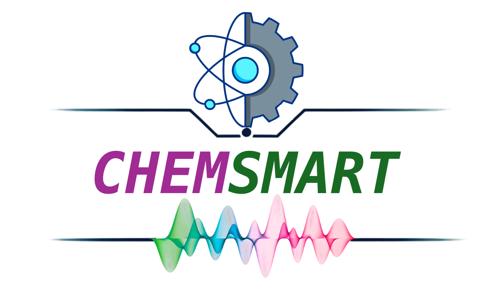

##############
 Introduction
##############

Chemsmart is a Python-based toolkit for the automatic creation of input files, submission scripts, and analysis of
quantum chemistry simulation jobs.

It uses the same submission command regardless of the queueing system (SLURM, Torque, or PBS) used by any High
Performance Computing (HPC) cluster.

Users can customize their own HPC server settings and project settings to run different jobs without modifying the
source code.

**********
 Citation
**********

If you use Chemsmart in your work, please follow good scholarly practice and cite our work:

📄 **Paper URL**: https://arxiv.org/abs/2508.20042

ACS Style
=========

Zhang, X.; Tan, H.; Liu, J.; Li, Z.; Wang, L.; Chen, B. W. J. CHEMSMART: Chemistry Simulation and Modeling Automation
Toolkit for High-Efficiency Computational Chemistry Workflows. *arXiv* **2025**, arXiv:2508.20042.
https://doi.org/10.48550/arXiv.2508.20042.

BibTeX
======

.. code:: bibtex

   @misc{zhang2025chemsmartchemistrysimulationmodeling,
     title        = {CHEMSMART: Chemistry Simulation and Modeling Automation Toolkit for High-Efficiency Computational Chemistry Workflows},
     author       = {Xinglong Zhang and Huiwen Tan and Jingyi Liu and Zihan Li and Lewen Wang and Benjamin W. J. Chen},
     year         = {2025},
     eprint       = {2508.20042},
     archivePrefix= {arXiv},
     primaryClass = {physics.chem-ph},
     url          = {https://arxiv.org/abs/2508.20042},
     doi          = {10.48550/arXiv.2508.20042}
   }

**********************
 Additional Citations
**********************

ASE (Atomic Simulation Environment)
===================================

If you use ASE Atoms objects in Chemsmart, please cite:

Ask Hjorth Larsen et al. The atomic simulation environment—a Python library for working with atoms. *J. Phys.: Condens.
Matter*, 2017, 29, 273002.

.. code:: bibtex

   @article{Hjorth_Larsen_2017,
      doi = {10.1088/1361-648X/aa680e},
      url = {https://dx.doi.org/10.1088/1361-648X/aa680e},
      year = {2017},
      month = {jun},
      publisher = {IOP Publishing},
      volume = {29},
      number = {27},
      pages = {273002},
      author = {Hjorth Larsen, Ask and others},
      title = {The atomic simulation environment—a Python library for working with atoms},
      journal = {Journal of Physics: Condensed Matter}
   }

RDKit
=====

If you use RDKit functionalities in Chemsmart, please cite:

RDKit: Open-source cheminformatics. https://www.rdkit.org

.. code:: bibtex

   @misc{Landrum2016RDKit,
      author = {Landrum, Greg},
      title = {RDKit: Open-Source Cheminformatics Software},
      url = {https://github.com/rdkit/rdkit},
      year = {2016}
   }

Pymatgen
========

If you convert Chemsmart molecules into pymatgen ``AseAtomsAdaptor``, please cite:

A. Jain, S.P. Ong, G. Hautier, W. Chen, W.D. Richards, S. Dacek, S. Cholia, D. Gunter, D. Skinner, G. Ceder, K.A.
Persson. The Materials Project: A materials genome approach to accelerating materials innovation. *APL Materials*, 2013,
1(1), 011002.

.. code:: bibtex

   @article{Jain2013,
      author = {Jain, Anubhav and others},
      doi = {10.1063/1.4812323},
      journal = {APL Materials},
      number = {1},
      pages = {011002},
      title = {{The Materials Project: A materials genome approach to accelerating materials innovation}},
      volume = {1},
      year = {2013}
   }

Scikit-learn
============

If you use scikit-learn, please cite:

Pedregosa et al., Scikit-learn: Machine Learning in Python, *J. Mach. Learn. Res.* 2011, 12, 2825-2830.

.. code:: bibtex

   @article{scikit-learn,
      title={Scikit-learn: Machine Learning in {P}ython},
      author={Pedregosa, F. and others},
      journal={Journal of Machine Learning Research},
      volume={12},
      pages={2825--2830},
      year={2011}
   }

.. note::

   Please also cite other relevant software (e.g., Gaussian, ORCA, NCIPLOT, PyMOL) and DFT functionals and basis sets
   you use in your research.
