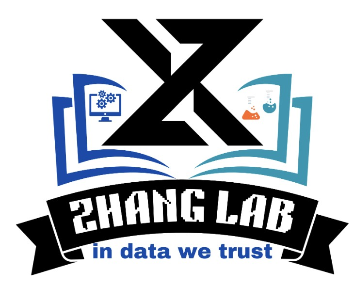

##############
 Introduction
##############

Chemsmart is a python-based toolkit for the automatic creation of input and submission script files, the submission and
the analysis of quantum chemistry simulation jobs.

It uses the same submission command regardless of the queueing systems (SLURM, Torque or SLF) used by any High
Performance Computing (HPC) cluster.

Users can customize their own HPC server settings and project settings to run different jobs, without modifying the
codes in this package.

##########
 Citation
##########

If you use **CHEMSMART** in your research, please kindly cite our paper:

📄 **Paper URL**: https://arxiv.org/abs/2508.20042

-  ACS Style

      Zhang, X.; Tan, H.; Liu, J.; Li, Z.; Wang, L.; Chen, B. W. J. CHEMSMART: Chemistry Simulation and Modeling
      Automation Toolkit for High-Efficiency Computational Chemistry Workflows. *arXiv* **2025**, arXiv:2508.20042.
      https://doi.org/10.48550/arXiv.2508.20042.

-  BibTeX

      .. code:: console

         @misc{zhang2025chemsmartchemistrysimulationmodeling,
           title        = {CHEMSMART: Chemistry Simulation and Modeling Automation Toolkit for High-Efficiency Computational Chemistry Workflows},
           author       = {Xinglong Zhang and Huiwen Tan and Jingyi Liu and Zihan Li and Lewen Wang and Benjamin W. J. Chen},
           year         = {2025},
           eprint       = {2508.20042},
           archivePrefix= {arXiv},
           primaryClass = {physics.chem-ph},
           url          = {https://arxiv.org/abs/2508.20042},
           doi          = {10.48550/arXiv.2508.20042}
