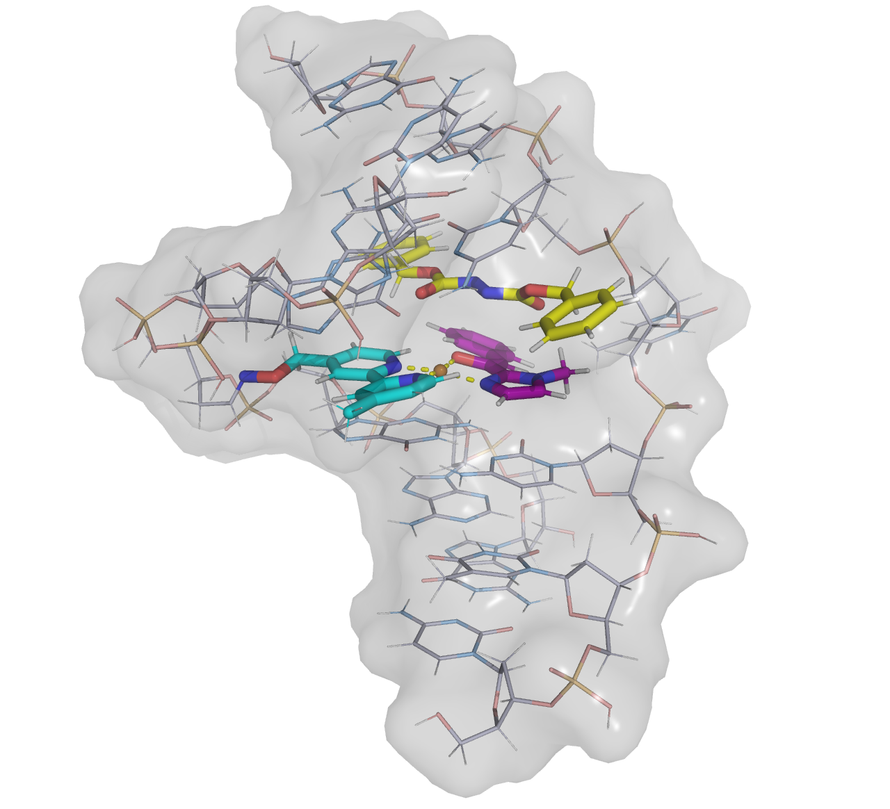

Welcome to the tutorials! We're thrilled to have you here. Please go through the code examples, and don't hesitate to
contact our team if you have questions or feedback.

##############################
 Run Basic Visualization Jobs
##############################

ChemSmart provides powerful molecular visualization capabilities using PyMOL for creating high-quality molecular
graphics, movies, and interactive visualizations.

********************
 Visualization Jobs
********************

Create static PyMOL visualizations and interactive session files.

.. code:: console

   chemsmart run [OPTIONS] mol [MOL_OPTIONS] visualize [SUBCMD_OPTIONS]

Visualization-Specific OPTIONS
==============================

.. list-table:: Visualization Job Options
   :header-rows: 1
   :widths: 30 15 55

   -  -  Option
      -  Type
      -  Description

   -  -  ``-f, --file``
      -  string
      -  PyMOL file script or style. If not specified, defaults to use zhang_group_pymol_style.py (default=None)

   -  -  ``-s, --style``
      -  string
      -  PyMOL render style. Options: pymol, cylview (default=None)

   -  -  ``-t/, --trace/--no-trace``
      -  bool
      -  PyMOL options to ray trace or not (default=True)

   -  -  ``-v, --vdw``
      -  bool
      -  Add Van der Waals surface (default=False)

   -  -  ``-q, --quiet/--no-quiet``
      -  bool
      -  Run PyMOL in quiet mode (default=False)

   -  -  ``--command-line-only/--no-command-line-only``
      -  bool
      -  Run PyMOL in command line only (default=True)

   -  -  ``-c, --coordinates <string>``
      -  string
      -  List of coordinates (bonds, angles and dihedrals) for labelling. 1-indexed (default=None)

Visualization Basic Usage
=========================

**Basic molecular visualization**

   .. code:: console

      chemsmart run mol -f molecule.xyz visualize

**Quiet mode visualization**

   .. code:: console

      chemsmart run mol -f calculation.log visualize -q

**Visualization with coordinate labeling**

   .. code:: console

      chemsmart run mol -f structure.xyz visualize -c [[1,2,3]]

**Visualization using custom style or script file**

   .. code:: console

      chemsmart run mol -f molecule.log visualize -f custom_style.py

Visualization Examples
======================

************
 Movie Jobs
************

Generate rotating movie animations of molecular structures.

.. code:: console

   chemsmart run [OPTIONS] mol [MOL_OPTIONS] movie [SUBCMD_OPTIONS]

Movie-Specific OPTIONS
======================

Movie jobs inherit all options from visualization jobs and use the same parameters.

Movie Basic Usage
=================

**Basic rotating movie**

   .. code:: console

      chemsmart run mol -f molecule.xyz movie

Movie Examples
==============

###############################
 Run Hybrid Visualization Jobs
###############################

Apart from basic visualization jobs, ChemSmart can also create graphics with different substrates displayed in different
styles (what 'hybrid' refers to).

***************************
 Hybrid Visualization Jobs
***************************

Create static PyMOL visualizations and interactive session files.

.. code:: console

   chemsmart run [OPTIONS] mol [MOL_OPTIONS] visualize [SUBCMD_OPTIONS] --hybrid [SUBCMD_OPTIONS]

Visualization-Specific OPTIONS
==============================

.. list-table:: Hybrid Visualization Job Options
   :header-rows: 1
   :widths: 25 15 60

   -  -  Option
      -  Type
      -  Description

   -  -  ``-H, --hybrid``
      -  bool
      -  Enable hybrid visualization mode. Allows drawing different groups in different styles (default=False).

   -  -  ``-G, --group``
      -  string, multiple
      -  Indexes of atoms to select for a group. Repeatable for multiple groups.

   -  -  ``-C, --color``
      -  string, multiple
      -  Color for each group. Repeatable to match -G options. Default = ['cbap', 'cbac', 'cbay', 'cbag', ...].

   -  -  ``-SC, --surface-color``
      -  string
      -  Customize the surface color (default=grey).

   -  -  ``-ST, --surface-transparency``
      -  string
      -  Customize the surface transparency (default=0.7).

   -  -  ``-NC, --new-color-carbon``
      -  string
      -  Set a custom color for carbon atoms. (default=[0.8, 0.8, 0.9]).

   -  -  ``-NN, --new-color-nitrogen``
      -  string
      -  Set a custom color for nitrogen atoms. (default=[0.6, 0.8, 1.0]).

   -  -  ``-NO, --new-color-oxygen``
      -  string
      -  Set a custom color for oxygen atoms. (default=[1.0, 0.7, 0.7]).

   -  -  ``-NS, --new-color-sulfur``
      -  string
      -  Set a custom color for sulfur atoms. (default=[1.0, 0.7, 0.7]).

   -  -  ``-NP, --new-color-phosphorus``
      -  string
      -  Set a custom color for phosphorus atoms. (default=[1.0, 0.85, 0.6]).

**********************************
 Hybrid Visualization Basic Usage
**********************************

**Basic hybrid visualization**

   .. code:: console

      chemsmart run mol -f molecule.xyz visualize --hybrid -G '1,2,3'

This is the minimal command needed for a hybrid visualization job. Only the highlighted groups are specified, others
will be assigned by default.

**Hybrid visualization with customized color scheme**

   .. code:: console

      chemsmart run mol -f calculation.log visualize --hybrid -G '1,2,3' -G '4,5,6' -C cbay -C cbak

This will assign a customized color scheme to different groups. Note that the color/group is assigned by input order,
i.e., the first color ('cbay') will be assigned to the first group ([1,2,3]), etc. A default color scheme will be used
if a group is not assigned customized colors.

**Hybrid Visualization with customized background settings**

   .. code:: console

      chemsmart run mol -f structure.xyz visualize --hybrid -G '1,2,3' -G '4,5,6' -C cbay -C cbak -ST 0.8 -NC '[0.8, 0.8, 0.9]'

Background color options, such as surface color and element-specific colors (carbon, nitrogen, etc.), can be specified using RGB values as a list.

**Visualization using custom style or script file**
===================================================

   .. code:: console

      chemsmart run mol -f molecule.log visualize -f custom_style.py

Hybrid Visualization Examples
=============================

Running a command like:
   .. code:: console

      chemsmart run mol -f molecule.xyz visualize --hybrid -G  '417-418,422-424,429-447,463-464' -G '336,397-412,414-416,419-421' -G '494-529'

will generate the below visualization style.

************
 Align Jobs
************

Align multiple molecular structures for comparison.

.. code:: console

   chemsmart run [OPTIONS] mol align [SUBCMD_OPTIONS]

Align-Specific OPTIONS
======================

Inherit all options from visualization jobs and use the same parameters.

Align Basic Usage
=================

**align files**

   .. code:: console

      chemsmart run mol -f mol1.xyz -f mol2.gjf -f mol3.log -i 1 align

This command will align the subsequent molecules to the first molecule sequentially (align mol2 and mol3 to mol1).

**align all files in same type**

   .. code:: console

      chemsmart run mol -t xyz -l xyz_alignment align

.. note::

   When using the ``-i n`` option, user should ensure that every input file contains the n-th molecule.
