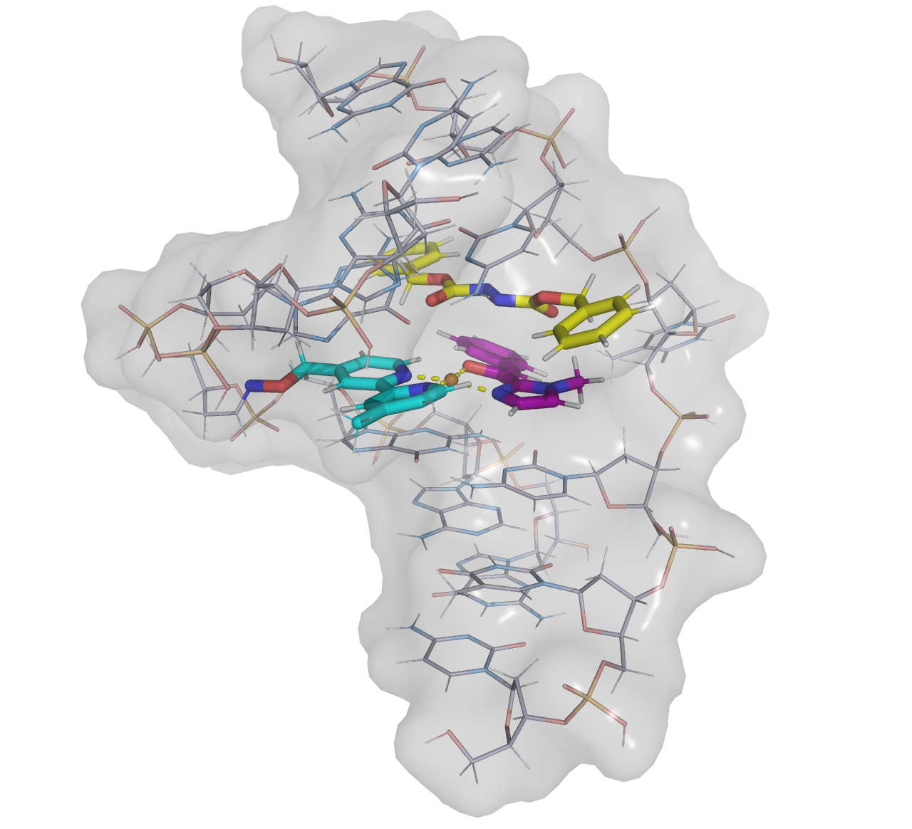

#############################
 Basic Visualization (PyMOL)
#############################

This page covers molecular visualization capabilities using PyMOL for creating high-quality graphics and interactive
session files.

********************
 Visualization Jobs
********************

Create static PyMOL visualizations and interactive PSE session files.

.. code:: bash

   chemsmart run [OPTIONS] mol [MOL_OPTIONS] visualize [SUBCMD_OPTIONS]

Visualization Options
=====================

.. list-table::
   :header-rows: 1
   :widths: 30 15 55

   -  -  Option
      -  Type
      -  Description

   -  -  ``-f, --file``
      -  string
      -  PyMOL style script (default: zhang_group_pymol_style.py)

   -  -  ``-s, --style``
      -  string
      -  Render style (see :ref:`visualization-styles`)

   -  -  ``-t, --trace/--no-trace``
      -  bool
      -  Ray trace rendering (default: enabled)

   -  -  ``-v, --vdw``
      -  bool
      -  Add Van der Waals surface (default: disabled)

   -  -  ``-q, --quiet/--no-quiet``
      -  bool
      -  Quiet mode (default: disabled)

   -  -  ``--command-line-only/--no-command-line-only``
      -  bool
      -  Run without GUI (default: enabled)

   -  -  ``-c, --coordinates``
      -  string
      -  Coordinates for labeling (1-indexed)

Basic Usage
===========

Standard visualization:

.. code:: bash

   chemsmart run mol -f molecule.xyz visualize

Quiet mode:

.. code:: bash

   chemsmart run mol -f calculation.log visualize -q

With coordinate labeling:

.. code:: bash

   chemsmart run mol -f structure.xyz visualize -c [[1,2,3]]

Custom style:

.. code:: bash

   chemsmart run mol -f molecule.log visualize -f custom_style.py

Batch visualization from a directory (by file type):

.. code:: bash

   chemsmart run mol -d /path/to/outputs -t log visualize

This creates a single PyMOL session visualizing the last structure of every ``.log`` file in the directory.

Batch visualization from a directory (by program):

.. code:: bash

   chemsmart run mol -d /path/to/outputs -p gaussian visualize

This creates a single PyMOL session visualizing the last structure of all Gaussian output files in the directory.

************
 Movie Jobs
************

Generate rotating movie animations.

.. code:: bash

   chemsmart run [OPTIONS] mol [MOL_OPTIONS] movie [SUBCMD_OPTIONS]

Movie jobs inherit all visualization options.

Basic Usage
===========

.. code:: bash

   chemsmart run mol -f molecule.xyz movie

**********************
 Hybrid Visualization
**********************

Create visualizations with different groups displayed in different styles.

.. code:: bash

   chemsmart run [OPTIONS] mol [MOL_OPTIONS] visualize --hybrid [SUBCMD_OPTIONS]

Hybrid Options
==============

.. list-table::
   :header-rows: 1
   :widths: 25 15 60

   -  -  Option
      -  Type
      -  Description

   -  -  ``-H, --hybrid``
      -  bool
      -  Enable hybrid visualization mode

   -  -  ``-G, --group``
      -  string
      -  Atom indices for a group (repeatable)

   -  -  ``-C, --color``
      -  string
      -  Color for each group (repeatable)

   -  -  ``-SC, --surface-color``
      -  string
      -  Surface color (default: grey)

   -  -  ``-ST, --surface-transparency``
      -  string
      -  Surface transparency (default: 0.7)

   -  -  ``-NC, --new-color-carbon``
      -  string
      -  Carbon atom color (RGB list)

   -  -  ``-NN, --new-color-nitrogen``
      -  string
      -  Nitrogen atom color (RGB list)

   -  -  ``-NO, --new-color-oxygen``
      -  string
      -  Oxygen atom color (RGB list)

Basic Usage
===========

Basic hybrid visualization:

.. code:: bash

   chemsmart run mol -f molecule.xyz visualize --hybrid -G '1,2,3'

Custom colors:

.. code:: bash

   chemsmart run mol -f molecule.log visualize --hybrid -G '1,2,3' -G '4,5,6' -C cbay -C cbak

Custom background settings:

.. code:: bash

   chemsmart run mol -f structure.xyz visualize --hybrid -G '1,2,3' -ST 0.8 -NC '[0.8, 0.8, 0.9]'

Example
-------

.. code:: bash

   chemsmart run mol -f molecule.xyz visualize --hybrid -G '417-418,422-424' -G '336,397-412'

.. _visualization-styles:

**********************
 Visualization Styles
**********************

Use ``-s/--style`` on the ``visualize`` subcommand to select a render style. Base styles use
``zhang_group_pymol_style.py``; scientific styles use ``zhang_group_scientific_styles.py`` and are routed through
:class:`~chemsmart.jobs.mol.visualize.PyMOLScientificStyleVisualizationJob`.

.. list-table::
   :header-rows: 1
   :widths: 28 22 50

   -  -  ``-s`` value
      -  Template
      -  Description

   -  -  ``pymol``
      -  ``zhang_group_pymol_style.py``
      -  Default PyMOL ball-and-stick visualization

   -  -  ``cylview``
      -  ``zhang_group_pymol_style.py``
      -  Cylindrical stick representation

   -  -  ``glossy``
      -  ``zhang_group_scientific_styles.py``
      -  Glossy semi-metallic rendering with transparent PNG export

   -  -  ``comic``
      -  ``zhang_group_scientific_styles.py``
      -  Comic ball-and-stick rendering with black outlines and element labels

   -  -  ``soft-cartoon``
      -  ``zhang_group_scientific_styles.py``
      -  Soft pastel ball-and-stick with radius-ratio coordination spheres and illustrated outlines

   -  -  ``editorial-minimal``
      -  ``zhang_group_scientific_styles.py``
      -  Matte minimal ball-and-stick style for main-text mechanistic figures

   -  -  ``soft-ceramic``
      -  ``zhang_group_scientific_styles.py``
      -  Soft ceramic / studio ball-and-stick style for coordination complexes

   -  -  ``neon-coordination-core``
      -  ``zhang_group_scientific_styles.py``
      -  Neon coordination-core emphasis using radius-ratio shells and a transparent background

   -  -  ``matte-clay``
      -  ``zhang_group_scientific_styles.py``
      -  Matte clay ball-and-stick using radius-ratio coordination spheres and core hydrogens

   -  -  ``xray-wire``
      -  ``zhang_group_scientific_styles.py``
      -  Monochrome wireframe style for SI structure verification

   -  -  ``steric-surface``
      -  ``zhang_group_scientific_styles.py``
      -  Transparent molecular surface for steric / space-filling views

   -  -  ``quasi-chemdraw-bold``
      -  ``zhang_group_scientific_styles.py``
      -  Bold ChemDraw-like style using radius-ratio cores and flat illustrative shading

Basic Usage
===========

Standard PyMOL style:

.. code:: bash

   chemsmart run mol -f molecule.xyz visualize
   chemsmart run mol -f molecule.xyz visualize -s pymol
   chemsmart run mol -f molecule.xyz visualize -s cylview

Scientific styles:

.. code:: bash

   chemsmart run mol -f complex.xyz visualize -s glossy
   chemsmart run mol -f complex.xyz visualize -s comic
   chemsmart run mol -f complex.xyz visualize -s soft-cartoon
   chemsmart run mol -f complex.xyz visualize -s editorial-minimal

Highlight metal–ligand bonds with ``-c``. In comic style, each pair is drawn as a ball-and-stick bond; numeric distance
labels are hidden so element labels remain visible. Other scientific styles keep the usual dashed distance measurements.

.. code:: bash

   chemsmart run mol -f complex.xyz visualize -s comic \\
       -c '[[1,2],[1,5],[1,36],[1,3],[1,15],[1,8]]'

.. note::

   ``-H/--hybrid`` and derived ``-s`` styles are mutually exclusive. Scientific styles resolve the metal center and
   coordinating atoms via the radius-ratio ``select_coordination`` algorithm. Ray-traced PNG export uses a transparent
   background for compositing.

Examples
========

Glossy
------

.. figure:: _static/pymol_styles/style_glossy.png
   :alt: Glossy semi-metallic visualization example
   :align: center
   :width: 70%

   ``chemsmart run mol -f complex.xyz visualize -s glossy``

Comic
-----

.. figure:: _static/pymol_styles/style_comic.png
   :alt: Comic visualization example
   :align: center
   :width: 70%

   ``chemsmart run mol -f complex.xyz visualize -s comic -c '[[1,2],[1,5],[1,36],[1,3],[1,15],[1,8]]'``

Soft cartoon
------------

.. figure:: _static/pymol_styles/style_soft_cartoon.png
   :alt: Soft cartoon visualization example
   :align: center
   :width: 70%

   ``chemsmart run mol -f complex.xyz visualize -s soft-cartoon``

Editorial minimal
-----------------

.. figure:: _static/pymol_styles/style_editorial_minimal.png
   :alt: Editorial minimal visualization example
   :align: center
   :width: 70%

   ``chemsmart run mol -f complex.xyz visualize -s editorial-minimal``

Soft ceramic
------------

.. figure:: _static/pymol_styles/style_soft_ceramic.png
   :alt: Soft ceramic visualization example
   :align: center
   :width: 70%

   ``chemsmart run mol -f complex.xyz visualize -s soft-ceramic``

Neon coordination core
----------------------

.. figure:: _static/pymol_styles/style_neon_coordination_core.png
   :alt: Neon coordination core visualization example
   :align: center
   :width: 70%

   ``chemsmart run mol -f complex.xyz visualize -s neon-coordination-core``

Matte clay
----------

.. figure:: _static/pymol_styles/style_matte_clay.png
   :alt: Matte clay visualization example
   :align: center
   :width: 70%

   ``chemsmart run mol -f complex.xyz visualize -s matte-clay``

X-ray wire
----------

.. figure:: _static/pymol_styles/style_xray_wire.png
   :alt: X-ray wire visualization example
   :align: center
   :width: 70%

   ``chemsmart run mol -f complex.xyz visualize -s xray-wire``

Steric surface
--------------

.. figure:: _static/pymol_styles/style_steric_surface.png
   :alt: Steric surface visualization example
   :align: center
   :width: 70%

   ``chemsmart run mol -f complex.xyz visualize -s steric-surface``

Quasi-ChemDraw bold
-------------------

.. figure:: _static/pymol_styles/style_quasi_chemdraw_bold.png
   :alt: Quasi-ChemDraw bold visualization example
   :align: center
   :width: 70%

   ``chemsmart run mol -f complex.xyz visualize -s quasi-chemdraw-bold``

************
 Align Jobs
************

Align multiple molecular structures for comparison (Alignment reference is the first structure).

.. code:: bash

   chemsmart run [OPTIONS] mol align [SUBCMD_OPTIONS]

Basic Usage
===========

Align multiple files:

.. code:: bash

   chemsmart run mol -f mol1.xyz -f mol2.gjf -f mol3.log -i 1 align

Align all files of the same type:

.. code:: bash

   chemsmart run mol -d . -t xyz -l xyz_alignment align

.. note::

   When using ``-i n``, ensure every input file contains the nth structure. Here ``-t/--filetype`` is extension-based:
   it filters filenames such as ``.xyz`` or ``.log`` and does not infer a Gaussian or ORCA program identity.

Align multiple structures in one file:

.. code:: bash

   chemsmart run mol -f conformers.xyz -i 1,3-6,-1 align

.. note::

   If there is no additional index, align all structures in the file by default.
