####################################
 Derived PyMOL styles for ``1-mer``
####################################

**********************
 Glossy semi-metallic
**********************

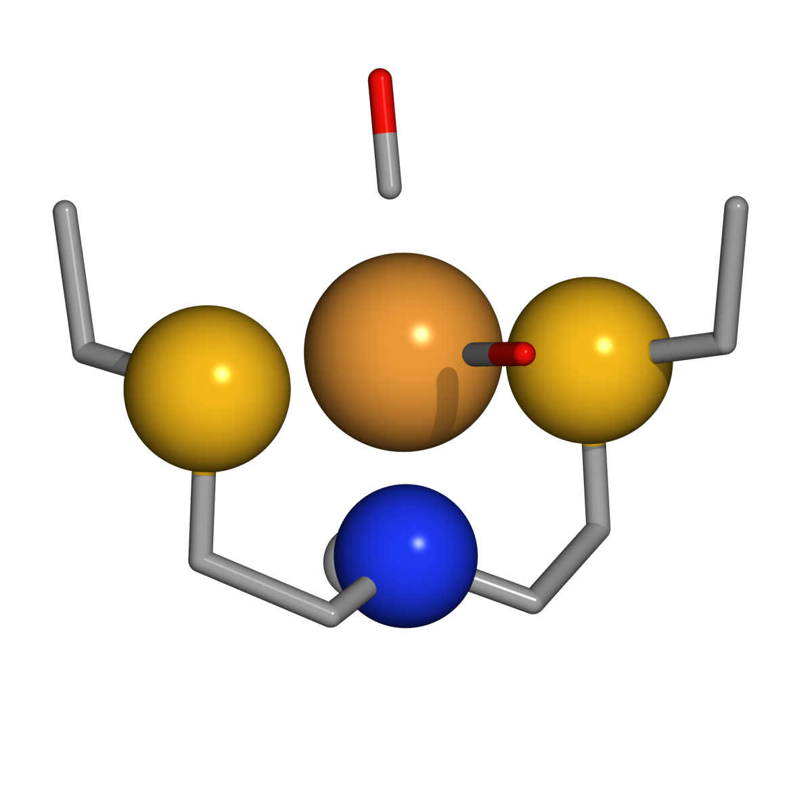

   Glossy semi-metallic style applied via ``chemsmart run mol -f 1-mer.xyz visualize -s glossy``.

*******
 Comic
*******

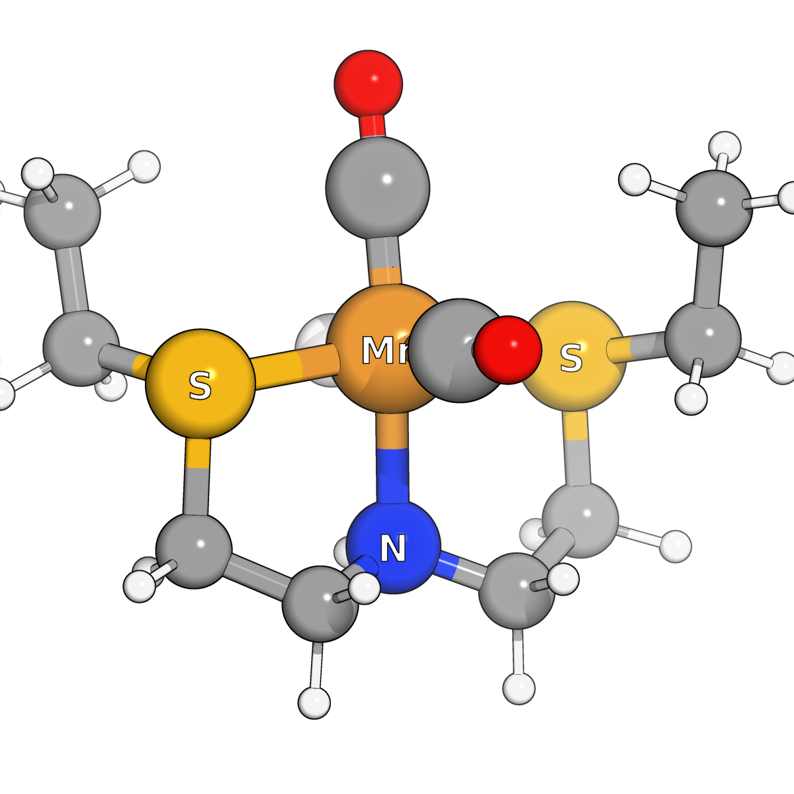

   Comic style applied via ``chemsmart run mol -f 1-mer.xyz visualize -s comic``.

**************
 Soft cartoon
**************

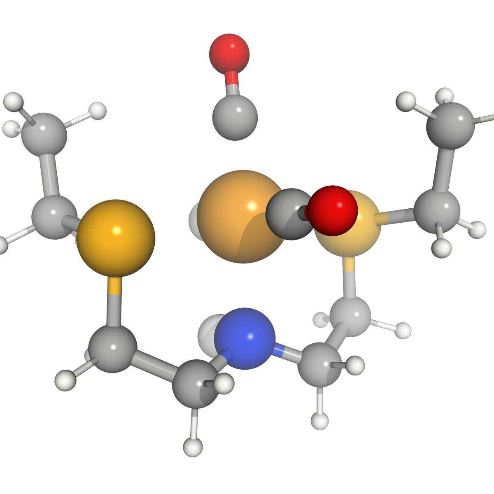

   Soft cartoon style applied via ``chemsmart run mol -f 1-mer.xyz visualize -s soft-cartoon``.

*******************
 Editorial minimal
*******************

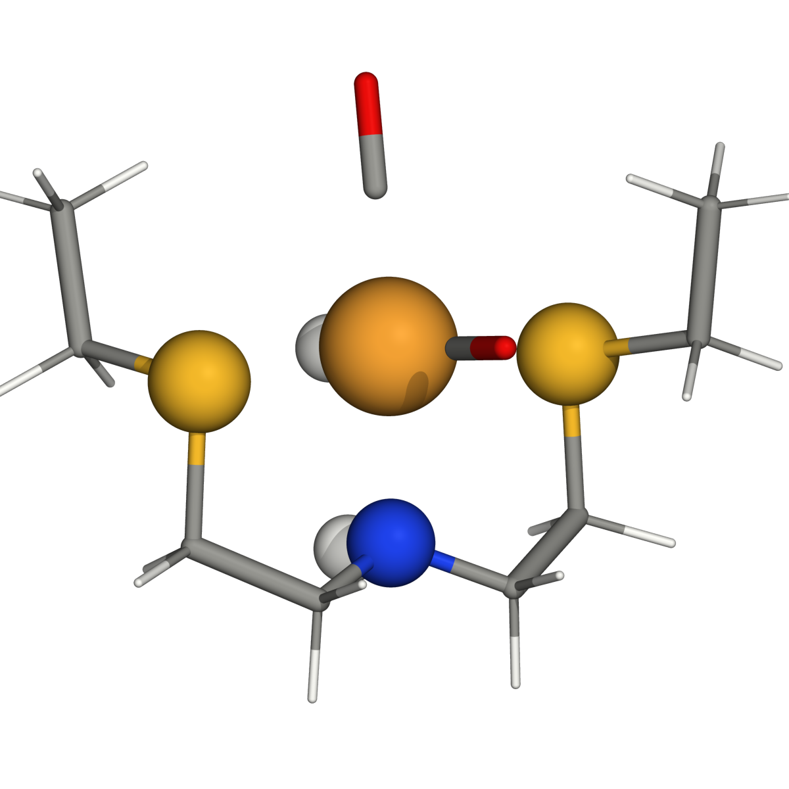

   Editorial minimal style applied via ``chemsmart run mol -f 1-mer.xyz visualize -s editorial-minimal``.

******************
 Black-gold cover
******************

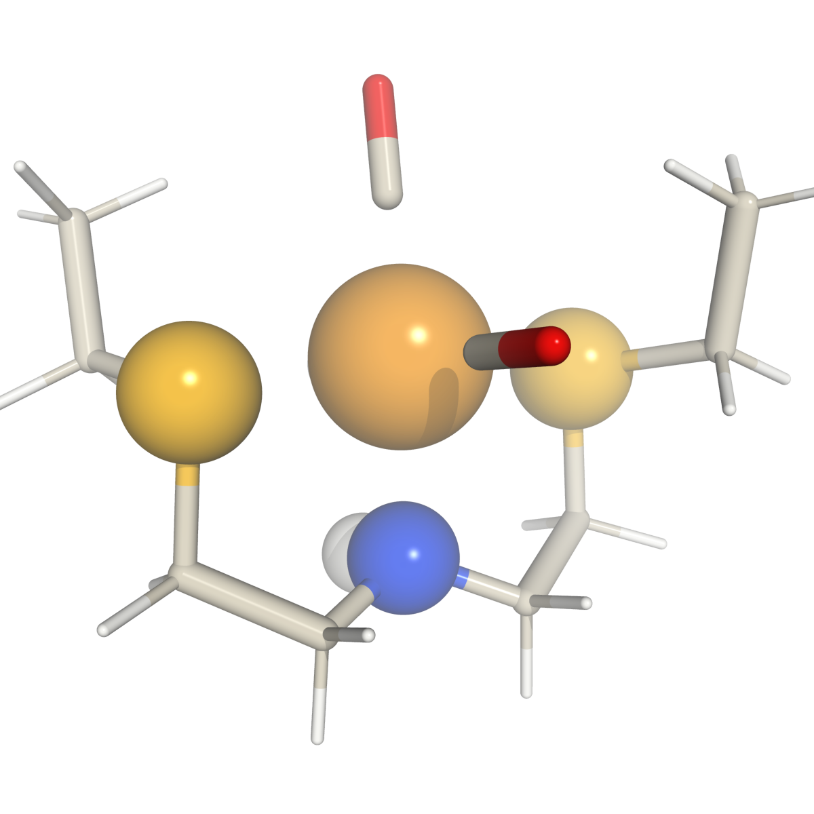

   Black-gold cover style applied via ``chemsmart run mol -f 1-mer.xyz visualize -s black-gold-cover``.

************************
 Neon coordination core
************************

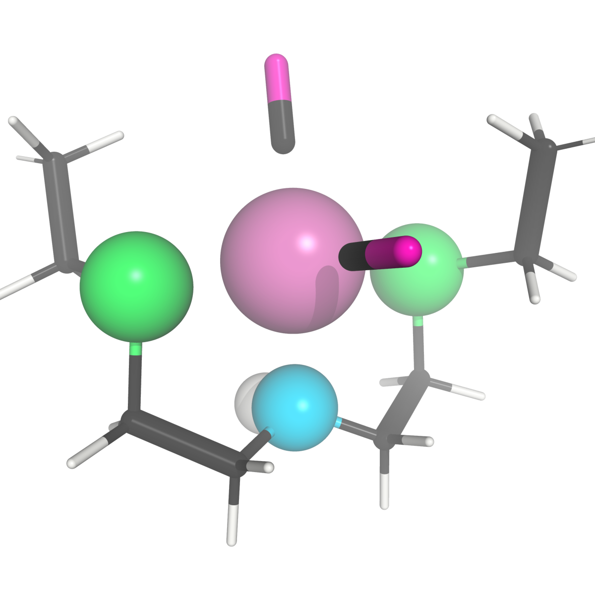

   Neon coordination core style applied via ``chemsmart run mol -f 1-mer.xyz visualize -s neon-coordination-core``.

************
 Matte clay
************

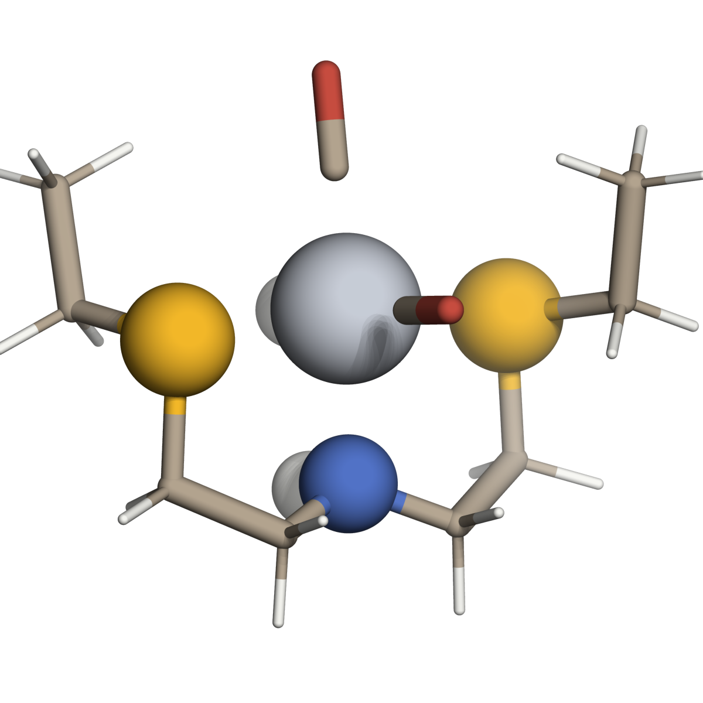

   Matte clay style applied via ``chemsmart run mol -f 1-mer.xyz visualize -s matte-clay``.

************
 X-ray wire
************

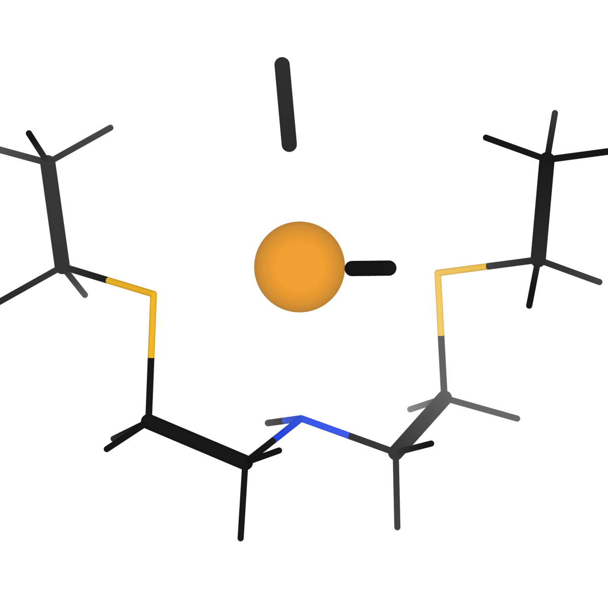

   X-ray wire style applied via ``chemsmart run mol -f 1-mer.xyz visualize -s xray-wire``.

****************
 Steric surface
****************

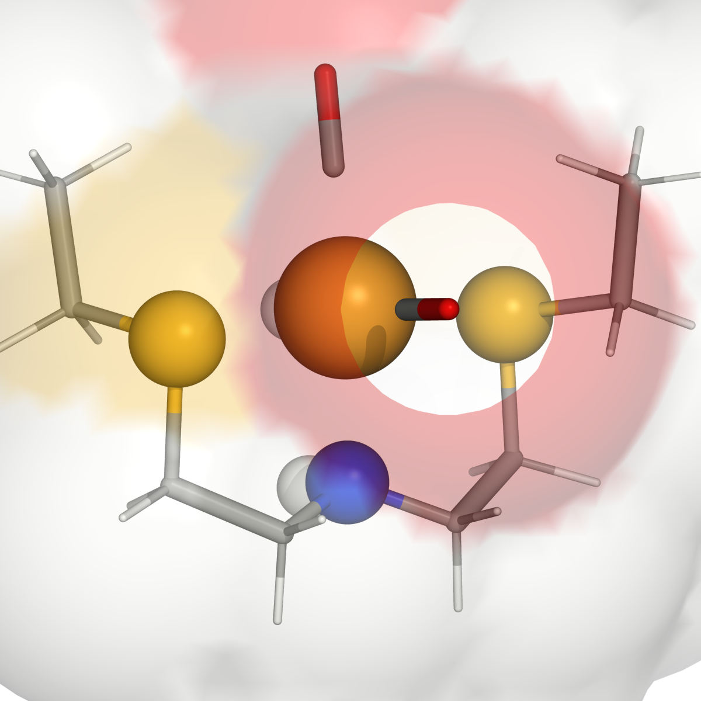

   Steric surface style applied via ``chemsmart run mol -f 1-mer.xyz visualize -s steric-surface``.

*********************
 Quasi-ChemDraw bold
*********************

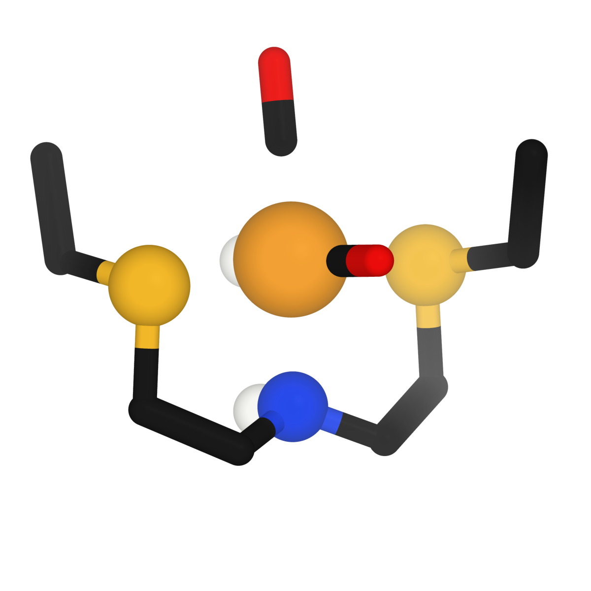

   Quasi-ChemDraw bold style applied via ``chemsmart run mol -f 1-mer.xyz visualize -s quasi-chemdraw-bold``.

***************************
 Labeled coordination core
***************************

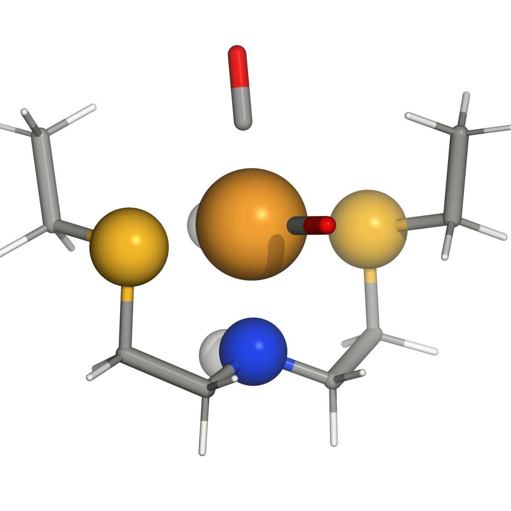

   Labeled coordination core style applied via ``chemsmart run mol -f 1-mer.xyz visualize -s labeled-coordination-core``.
