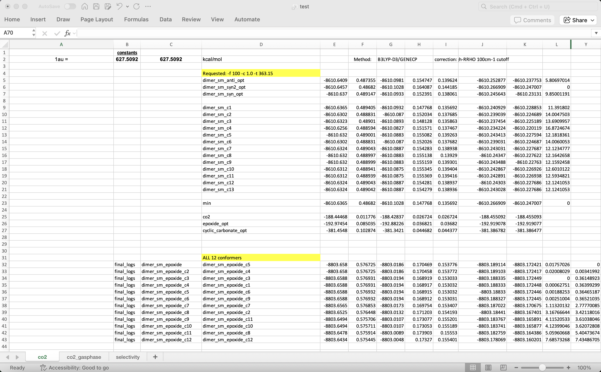

#################
 File Management
#################

This page documents file management scripts for organizing and
converting computational chemistry files.

**************************
 File Organization Script
**************************

The ``file_organizer.py`` script organizes computational chemistry
output files based on an Excel spreadsheet. It creates folders, renames
files, and moves them to their corresponding directories.

Usage
=====

.. code:: bash

   file_organizer.py [-d path/to/directory] [-f excel_file] [-t filetype]
                     [-n sheet_name] [-c columns] [-s skip_row(s)]
                     [-r organize_row(s)] [--keep-default-na|--no-keep-default-na]

Options
=======

.. list-table::
   :header-rows: 1
   :widths: 20 10 70

   -  -  Option
      -  Type
      -  Description

   -  -  ``-d, --directory``
      -  string
      -  Directory containing files to organize (default: current
         directory)

   -  -  ``-f, --filename``
      -  string
      -  Excel file with metadata (required)

   -  -  ``-t, --type``
      -  string
      -  File extension to organize (default: log)

   -  -  ``-n, --name``
      -  string
      -  Excel sheet name (required)

   -  -  ``-c, --cols``
      -  string
      -  Column range for metadata (default: B:D)

   -  -  ``-s, --skip``
      -  int
      -  Rows to skip at start

   -  -  ``-r, --row``
      -  int
      -  Number of rows to process

   -  -  ``--keep-default-na/--no-keep-default-na``
      -  bool
      -  Include default NaN values when reading Excel

Example
=======

Organize conformer files based on an Excel spreadsheet:

.. code:: bash

   file_organizer.py -f test.xlsx -n co2 -c B:D -s 2 -r 45

This skips the first 2 rows and processes up to 45 rows. The script:

#. Creates target folders if they don't exist
#. Copies files with new names to the target folders
#. Preserves original files

************************
 File Conversion Script
************************

The ``file_converter.py`` script converts structure files between
formats.

Usage
=====

.. code:: bash

   file_converter.py [-d path/to/directory] [-t filetype] [-f filename]
                     [-o output_type] [-i]

Options
=======

.. list-table::
   :header-rows: 1
   :widths: 20 10 70

   -  -  Option
      -  Type
      -  Description

   -  -  ``-d, --directory``
      -  string
      -  Directory for batch conversion (mutually exclusive with -f)

   -  -  ``-t, --type``
      -  string
      -  Input file type: log, com, gjf, out, inp, xyz, sdf

   -  -  ``-f, --filename``
      -  string
      -  Specific file(s) to convert (mutually exclusive with -d)

   -  -  ``-o, --output-filetype``
      -  string
      -  Output format: xyz or com (default: xyz)

   -  -  ``-i, --include-intermediate-structures``
      -  bool
      -  Include intermediate structures (default: disabled)

Examples
========

**Single file conversion:**

.. code:: bash

   file_converter.py -f co2.log

Output ``co2.xyz``:

.. code:: text

   3
   co2.xyz    Empirical formula: CO2    Energy(Hartree): -188.444680
   O        0.0000000000    0.0000000000    1.1630620000
   O        0.0000000000    0.0000000000   -1.1630620000
   C        0.0000000000    0.0000000000    0.0000000000

**Batch conversion:**

.. code:: bash

   file_converter.py -d . -t log -o com -i

Converts all ``.log`` files in the current directory to ``.com`` files,
including intermediate structures.
