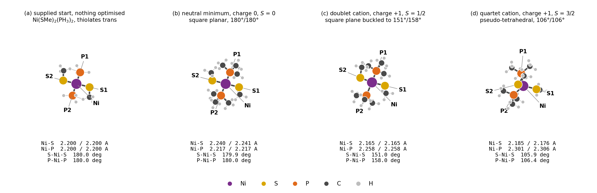
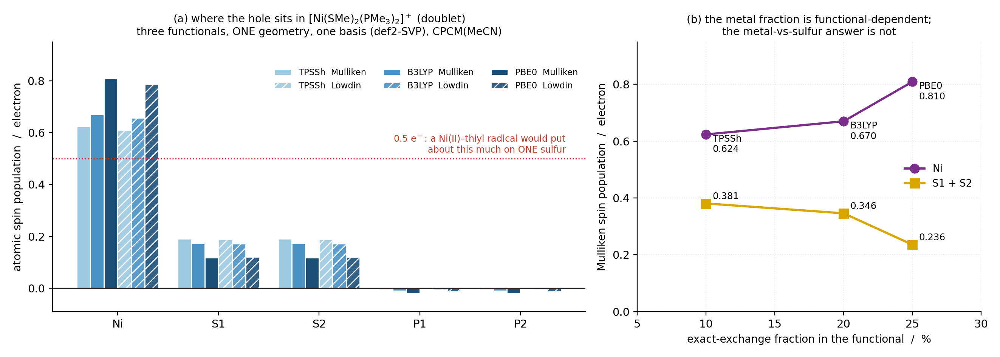
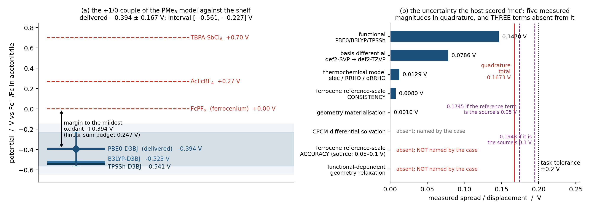

# Case A — `ino3-r12`: where does the nickel thiolate oxidise, and where does the hole go?

A forensic reconstruction of ChemSmart Agent goal `goal-ino3-r12` from the
evidence it left behind. Raw evidence: `experiments/ino3-r12/raw/ino3-r12/`
(moved here unmodified; a symlink at the original campaign path keeps every
absolute reference in the record resolvable). Figures:
`experiments/ino3-r12/figures/`, regenerated by
`experiments/ino3-r12/make_figures.py`.

Settlement: **`achieved_with_observations`**, 3 cycles, 7 engine calls of 40
granted, 338.17 s of engine wall, 0 revisions admitted. Every number below
is read back from the case's own receipts, and where I could re-derive it
independently through ChemSmart's own readers I say so.

---

## 0. Errors and limits first

Four things a reviewer should know before the science:

1. **This workspace is not self-contained.** The seven single points
   `goal-ino3-r12` ran are here. The four results they were *compared
   against* — the neutral, doublet-cation and quartet-cation
   optimisations and the cation's def2-TZVP single point — were computed
   in an earlier campaign window and live at
   `/home/chemsmart/agent-campaigns/ax41-refine-100/novel-round-3/workspaces/ino3-nickel-thiolate-redox/nodes/`.
   The goal's seeded run streams name them by absolute path, which is how
   the host's bootstrap re-registered them by content digest. I did not
   move them (they are outside the named case workspace and other windows
   depend on them); every figure that uses them says so. **Consequences
   worth stating plainly:** panels (b), (c) and (d) of figure A1, the
   couple, the quartet gap, every thermochemical input and the one
   delivered spin claim (0.809340, from `nicat-opt-pme3`) all come from
   outside this tree; only figure A2 and panel A1(a) are rebuildable from
   `raw/` alone. `make_figures.py` hard-codes that absolute path
   (`UPSTREAM`, line 36) and exits with `FileNotFoundError` for anyone
   without the directory.
2. **Two sibling goal records were already in the workspace when this
   goal started** — `novel3-goal-ino3` (which produced those four
   results) and `suff1-goal-ino3-cont`. They are *context the session
   could read*, not this case's reasoning, and nothing attributed to the
   agent below comes from them. Where the agent itself cites a prior
   number, I mark it as such.
3. **The ledger truncates some of its own strings.** Several entries in
   `approaches_recorded` at cycle 3 end mid-word (`"...lie inside the
   stated interval in"`, `"...still clears th"`, `"...bought or inv"`).
   Where I quote those I quote them as they stand and mark the cut.
4. **Cycle 2's claims never reached the workspace record.** The goal
   ledger writes `workspace_recorded` at cycle 1 (17 rows) and cycle 3
   (23 rows) and not at cycle 2, so the 26 claims cycle 2 recorded exist
   only in that run's own event stream. Nothing was lost scientifically —
   cycle 3 re-derived and re-claimed everything — but a reader going to
   `workspace-record.jsonl` for the cycle-2 numbers will not find them.
5. **Half the declared observables are limitations on the final completion
   receipt.** The cycle-3 `analysis_completion_evaluated` payload carries
   `limitation_output_ids = ["declared_observable:spin-ni-pme3",
   "declared_observable:spin-s1-pme3", "declared_observable:spin-s2-pme3"]`
   and one `declared_observable_misses` line per spin observable, because
   cycle 3 deliberately did not re-claim them. The settlement resolves all
   three at the goal grain — "delivered in an earlier cycle: spin-ni-pme3
   (delivered in cycle 1), spin-s1-pme3 (delivered in cycle 1),
   spin-s2-pme3 (delivered in cycle 1)" — so the settlement is right, but
   a reader looking only at the final receipt sees three misses, and the
   declared spin bands were never scored by any completion record (§6).
6. **The budget omits the reference constant's own stated accuracy.** The
   0.008 V "ferrocene reference scale" term is the *consistency* of two
   constructions of the scale. The source's own stated accuracy on the
   4.988 V constant is 0.05–0.1 V; the host printed it beside the constant
   in the cycle-1 analysis report; it is in neither the case's budget nor —
   until this revision — this report. The `met` verdict survives it but
   its headroom does not. See §5, §6 and §8.

---

## 1. The question, as the chemist posed it

The task (`raw/ino3-r12/.chemsmart-agent/goals/goal-ino3-r12/task.md`,
digest `5fa80683`) is an experimentalist's problem, not a calculation
request:

> "I have a diamagnetic square-planar nickel(II) bis(arenethiolate)
> bis(phosphine) complex, clean by 1H and 31P NMR, and I want to take it
> to the one-electron oxidised form and put it in an EPR tube. I cannot
> get a voltammogram I would quote: the compound films onto the electrode
> within a single sweep, the return wave vanishes, and the anodic peak
> walks with scan rate, so I have no potential at all."

The electrochemistry has failed, so the number has to come from
calculation. There are two questions and a stated tolerance:

> "Where does the +/0 couple of the model complex fall on that scale in
> acetonitrile? And when the electron leaves, does the hole sit on nickel
> or on sulfur - am I making a nickel(III) species or a nickel(II) thiyl
> radical, and how is the spin split between the metal and the two
> sulfurs?"

> "What would satisfy me: a potential versus ferrocene in acetonitrile
> good to about plus or minus 0.2 V, which is enough to choose among
> those three oxidants, together with the spin population on nickel and
> on each sulfur in the cation."

The shelf is three oxidants at 0.00, +0.27 and +0.70 V vs ferrocene. The
supplied structure is a 19-atom idealised Ni(SMe)₂(PH₃)₂ at Ni–S 2.20 and
Ni–P 2.20 Å, "nothing optimised", and the chemist asks for a better ligand
model if it is reachable:

> "My real ligands are dmpe and 2,6-dimethylbenzenethiolate, so PH3 is a
> far weaker donor than anything I actually put on a metal; if a
> trimethylphosphine model is within reach I would rather have that."

So the ±0.2 V is not a precision fetish — it is exactly the resolution
needed to pick one of three reagents, and the agent treated it that way.

---

## 2. What the agent committed to before it computed anything

The first typed act of cycle 1 was `declare_requested_observable`, and the
declarations are pre-registrations with bands, tolerances and — for one of
them — a written rule for what a falsification would change. Six
observables (ledger entry 1):

| id | meaning | band | tolerance |
|---|---|---|---|
| `e-couple-vs-fc-pme3` | the +1/0 couple of **the PMe₃ model** vs Fc⁺/Fc in MeCN | −0.75 to −0.20 V | **±0.2 V, cited to the task's own words** |
| `spin-ni-pme3` | Mulliken spin population on Ni in the doublet cation | 0.60–0.95 | — |
| `spin-s1-pme3`, `spin-s2-pme3` | the same on each thiolate sulfur | 0.05–0.25 each | — |
| `gap-qrt-dbl-pme3` | G(quartet) − G(doublet) at 298.15 K | +0.10 to +0.40 eV | — |
| `basis-shift-pme3-v` | **diagnostic**: the def2-SVP → def2-TZVP shift on the couple | −0.05 to +0.05 V | — |

Three things in that table are the case, in miniature.

**The tolerance is quoted, not invented.** `tolerance_basis` reads:
"Task words: 'a potential versus ferrocene in acetonitrile good to about
plus or minus 0.2 V, which is enough to choose among those three
oxidants'." The number the host later grades against is the chemist's own.

**The observable is scoped to the model, on the record.** The meaning
field says "the PMe₃ model complex [Ni(SMe)₂(PMe₃)₂]⁺/⁰", and the cycle-3
assumption list makes the consequence explicit: "the transfer to the real
dmpe / 2,6-dimethylbenzenethiolate compound is a limitation on the answer
to the experimental question, not a component of this observable's error
bar."

**The diagnostic carries its own falsifier.** `basis-shift-pme3-v` is
declared `role: diagnostic` with a ±0.05 V deadband and this
`failure_update_rule`:

> "If |basis shift| exceeds 0.05 V, the SVP Gibbs couple is not defensible
> as the delivered value: the basis-corrected couple becomes the delivery
> and the measured shift is carried as an evidence-backed uncertainty
> component rather than an asserted one."

That rule is what actually moved the delivered number two cycles later.
It was written before the def2-TZVP single point on the neutral existed.

---

## 3. Cycle 1 — buying the two error terms nobody had measured

### 3.1 The scientific choice

The workspace already held a couple: −0.4727 V at PBE0-D3BJ/def2-SVP +
CPCM(MeCN). What it did not hold was a defensible *error bar* on it. The
cycle-1 decision record (`ino3-r12-couple-spin-and-uncertainty`) says what
the cycle was for:

> "This cycle's scientific purpose was to attack the two components the
> previous goal could not quantify. First, basis: because ionisation
> changes total charge, error cancellation between the two partners is
> weak and the basis differential enters the answer directly, so I planned
> a def2-TZVP single point on the neutral at its own relaxed minimum to
> pair with the registered cation def2-TZVP single point. The cation's own
> SVP to TZVP stabilisation is −29.14 eV, which is exactly why only the
> neutral-minus-cation differential is meaningful and why neither absolute
> term may be quoted alone. Second, functional: the exact-exchange
> fraction is the dominant method choice for a nickel d-manifold
> ionisation, so I planned B3LYP and TPSSh single points on both partners
> at identical geometry, basis, dispersion and solvation, giving a
> measured three-functional spread on the couple instead of an asserted
> one."

That is a complete and correct reading of the physics of the problem: for
a couple, the basis error does *not* cancel because the electron count
changes, and for a first-row d-metal hole the exact-exchange fraction is
the leading method knob. Seven single points follow from it, and no more:
one def2-TZVP on the neutral (the missing half of an existing pair), and
PBE0/B3LYP/TPSSh on both partners at def2-SVP.

### 3.2 A refusal that produced a better route

The two relaxed minima existed as *results*, not as bindable geometry
artifacts. The agent tried to bind one by a digest-derived id and the host
refused:

> `[artifact.id_is_registered] a reading tool opens only an artifact the
> host registered under its id; ids are host-minted, never typed from a
> digest or a node name.`

The route it found is worth naming, because it is a chemist's move rather
than a programmer's:

> "The host mints artifact ids itself, and the only registered geometry in
> this session is the PH₃-model start — the PMe₃ minima exist only as
> results. I'll reify the validated neutral minimum as a bindable geometry
> by stepping it along its own lowest printed mode by a numerically
> negligible amplitude."

Both partners were promoted with `displace_along_vibrational_mode` at
0.001 Å along their own lowest **real** modes (20.57 cm⁻¹ neutral, 28.30
cm⁻¹ cation), connectivity unchanged. The receipt is carried in the
review packet's `geometry_lineage`, and the artifact header records it
verbatim:

```
ChemSmart mode displacement; mode 1 at 28.30 cm^-1 stepped to a maximum
atomic displacement of 0.0010 angstrom along the printed direction;
37 atoms moved; starting structure, electronic state deliberately unbound
```

The cost of that move is not hidden: it is the reason a
`geometry-materialisation residual` term appears in the final uncertainty
budget at 0.000983 V (§6), and it is measured, not assumed.

### 3.3 The hub invariant, on the record

Nothing the model wrote reached ORCA. Each node's reviewed command is a
ChemSmart CLI invocation over a project YAML — for `cat-sp-svp-pbe0`
(digests truncated to 8):

```
python -m chemsmart run --no-fake --delete-scratch --scratch
  --num-cores 10 --num-gpus 0 --mem-gb 40 --server <server:bd61f1b6>
  orca --project <project-yaml:81fc757b>
       --filename <molecular-input:83cb1cfc>
       --charge 1 --multiplicity 2 sp
```

and the project YAML it points at is the whole of the scientific
configuration, e.g. for the TPSSh cation node (the file also carries a
`gas:` section with the same seven fields, elided here):

```yaml
solv:
  aux_basis: def2/j
  basis: def2-svp
  charge: 1
  dispersion: d3bj
  functional: tpssh
  multiplicity: 2
  ri_approximation: rijcosx
  solvent_id: acetonitrile
  solvent_model: cpcm
```

Charge and multiplicity appear twice — bound on the identity and passed on
argv — and the review records `molecular_identity` with
`electronic_state: charge-and-multiplicity-specified`. All seven nodes
passed ORCA's own bounded input check before launch.

### 3.4 A refutation the agent ran against its own plan, and lost

Cycle 1 ended with a check that could have overturned the delivery: are
the three registered results really the states and minima claimed? The
answer came back clean for the chemistry and dirty for the plan:

> "The refutation lands — but on my plan, not on the chemistry. The
> neutral is a spin-restricted closed-shell run, which the parser states
> emits **no** ⟨S²⟩ at all (it is an eigenfunction by construction). So
> the planned `val-spin-state` rule that reads a neutral ⟨S²⟩ cannot ever
> be satisfied."

The host's partial-analysis report for cycle 1 carries the same fact in
its own words — `spinsq-n0-tzvp`: "this result prints no ⟨S²⟩ expectation
value; a spin-restricted closed-shell calculation is an eigenfunction of
S² by construction" — and the node
`expr-modes-spinsq` is recorded as *skipped*, which cascaded into two
validation nodes and one claim node. That is a self-inflicted plan defect,
found by the agent, reported by the agent, and left on the record.

### 3.5 What cycle 1 actually delivered

`run_recorded`: 7 engine calls, `workflow_state: validated`, slowest node
`n0-sp-tzvp` at 82.24 s. The analysis chain came back **partial** with six
findings, and one of them matters:

> `claims-redox (claim_rendering): failed -- uncertainty_reference
> '6f96fd10...:uncertainty-e-couple-pme3' does not resolve: the
> expression's own receipt names a number you supplied in it -- a
> literal, a scale factor or an exponent -- so its value is yours rather
> than the host's.`

The agent had built the couple with `scale -1` to flip the oxidation free
energy into reduction order, and had put the chemist's three oxidant
potentials into the same expression. The host therefore refused to treat
that receipt as *measured* evidence. The agent's reading of the refusal:

> "The host is right: that receipt contains literals I supplied (the
> oxidant potentials and a sign flip), so it cannot serve as measured
> evidence. I'll rebuild the couple chain with no model-authored numbers
> at all — deriving the electron count from the two states' own charge
> selectors and taking the reduction direction directly."

A second cycle-1 finding matters for a different reason, and the first
version of this report left it out. The sixth finding reads:

> `- val-svp-replication (scientific_validation): failed -- scientific
> validation input is not typed evidence from its planned producer`

From the cycle-1 review packet that node carried one rule,
`r-sp-reproduces-registered-opt`: predicate `maximum_absolute_less_equal`,
threshold **0.002 eV**, over the output `repro-diff-ev` — the planned
pass/fail control that a single point on the 0.001 Å-promoted geometry
reproduces the registered optimisation's own energy. That is the control
on exactly the *geometry materialisation* term the §6 budget later carries
at 0.000983 V. The number was eventually computed as an expression at
cycle 3 and would have cleared the threshold by a factor of two, but the
planned verdict never landed and was never re-planned. The budget's
smallest term is therefore an expression result rather than a validated
one.

So only the ten spin-related claims (from the `claims-spin` node, source
receipt `b193f6e8`) reached the workspace record at cycle 1 — which is
exactly the set that needed no new calculation, because they come from
the already-validated doublet-cation wavefunction. The 17 rows of
`workspace_recorded` at cycle 1 are those 10 claims plus the 7 new
results.

**Delivered at cycle 1** (Mulliken / Löwdin, from the PBE0-D3BJ/def2-SVP +
CPCM doublet-cation optimisation):

| claim | value |
|---|---|
| `spin-ni-pme3` | 0.809340 |
| `spin-s1-pme3` | 0.117821 |
| `spin-s2-pme3` | 0.117684 |
| `spin-s-sum-pme3` | 0.235505 |
| `spin-total-pme3` | 0.999999 |
| `lowd-spin-ni-pme3` | 0.787047 |
| `lowd-spin-s1-pme3` | 0.120030 |
| `lowd-spin-s2-pme3` | 0.119898 |
| `hole-on-ni-margin-pme3` | 0.573835 |
| `lowd-hole-on-ni-margin-pme3` | 0.547119 |

and the session's own answer to the chemist's second question:

> "**Nickel(III), not a thiyl radical.** The hole is metal-centred:
> Mulliken Ni **0.809**, S 0.118 and 0.118 (sum 0.236, total 1.000);
> Löwdin gives Ni 0.787, S 0.120 each. So ~78–81 % on nickel with
> ~20–24 % shared over the two thiolates — a Ni(III) with substantial S
> delocalisation, not Ni(II)–S•, which would put roughly half the spin on
> one sulfur. The two sulfurs agree to 0.00014, as the trans arrangement
> requires."

At this point the stated uncertainty on the couple was **0.25 V** and the
host graded it *short* of the requested ±0.2 V — correctly, because the
basis and functional terms were still unmeasured. The session said so.

---

## 4. Cycle 2 — the pre-registered falsifier fires

Cycle 1's analysis was partial, so the host opened a recovery. Cycle 2
spent **zero engine calls** and did arithmetic on what had come back.

The measurement the whole cycle turned on: re-evaluating both partners at
def2-TZVP on their own def2-SVP geometries moves the vertical-basis
ionisation *energy* — an SCF total-energy difference, not the free-energy
couple, which is the separate −0.472742 V RRHO quantity — from
**4.5094 eV to 4.5880 eV**, a shift of **+0.078593 V** —
outside the ±0.05 V band declared in cycle 1. I re-derived this
independently from the four raw energies through the ORCA reader:

| quantity | value (Hartree) | node |
|---|---|---|
| E(neutral, PBE0/def2-SVP) | −3304.836279223488 | `n0-sp-svp-pbe0` |
| E(cation, PBE0/def2-SVP) | −3304.670561413040 | `cat-sp-svp-pbe0` |
| E(neutral, PBE0/def2-TZVP) | −3305.909969834469 | `n0-sp-tzvp` |
| E(cation, PBE0/def2-TZVP) | −3305.741363794941 | registered, earlier window |

ΔE_ion(SVP) = 0.165717810448 Eh = 4.509404 eV;
ΔE_ion(TZVP) = 0.168606039528 Eh = 4.588004 eV;
difference = 0.002888229080 Eh = **0.0785927 V** — the claimed
`basis-shift-pme3-v` to every printed digit.

The declared rule then executed itself:

> "Deliver the def2-SVP RRHO couple (−0.4727 V) unchanged, as prior goals
> did. **Rejected**: the basis shift is now measured at +0.0786 V and
> exceeds the deadband I declared for it, so the SVP value is no longer
> the best estimate; it remains on the record as
> `e-couple-svp-rrho-pme3`."

The delivered couple therefore moved from −0.4727 V to **−0.3941 V**, and
the old value stayed claimed under its own id. The host recorded the
divergence as an anomaly of its own accord —
`falsified_expectation:basis-shift-pme3-v` — and that observation is the
reason the goal settled `achieved_with_observations` rather than
`achieved`. A pre-registered prediction was wrong, the agent honoured the
consequence it had written down in advance, and the word a human reads
first says the run found something.

### 4.1 The refutation that could have voided the whole correction

The def2-SVP and def2-TZVP cation single points came from *different*
geometry artifacts, which means the "basis shift" could have been a
geometry difference in disguise. The agent tested it rather than assuming:

> "Refutation read on the basis comparison: the def2-SVP and def2-TZVP
> cation single points use different geometry artifacts, so I tested
> whether they are the same structure. Ni-S and Ni-P distances agree to
> 1.8e-5 angstrom and the D3BJ dispersion energies agree to 2e-9 Ha
> (−0.050751027 vs −0.050751025). No refutation: the shift is a pure
> basis effect."

I verified the second half through the reader: the cation optimisation
reports `dispersion_energy` = −0.050751027 Eh and the def2-TZVP single
point −0.050751025 Eh. D3BJ depends only on geometry, so two runs agreeing
to 2 × 10⁻⁹ Eh in that term are the same structure. It is a good check,
cheaply chosen, and it points the right way.

### 4.2 Rejections that carry mechanism

Cycle 2's `approaches_recorded` is where the scientific judgement lives.
Four of the seven:

> "Deliver the mean of the three basis-corrected functional values
> (−0.4900 V) as a central best estimate. **Rejected**: PBE0 is the only
> level at which both partners are relaxed with their own frequencies, so
> averaging in vertical B3LYP/TPSSh single points would dilute the most
> complete chain; the mean and both corrected extremes (−0.5290, −0.5470
> V) are claimed and all lie inside the stated interval."

That rejection is right, and the referee's observation on it is that the
same wording cuts the other way: if B3LYP and TPSSh are "vertical single
points on PBE0 geometries", then the 0.146959 V spread they define bounds
the *vertical* functional error and says nothing about
functional-dependent geometry relaxation. The case then uses that spread
as the functional error term without naming the gap. Recorded in §6's
absent-term rows and in §10 C1.

> "State the uncertainty as the linear sum of the six components (0.2649
> V). **Not taken** as the claim's uncertainty because the components are
> independent and quadrature is the standard combination, but it is
> claimed as `linear-sum-e-couple-pme3` so the conservative reading is
> available; the oxidant conclusion is identical under either."

> "Re-optimise both partners at def2-TZVP (about 4 engine calls) instead
> of applying a fixed-geometry correction. **Rejected as unnecessary**:
> the differential basis effect on a one-electron difference is what the
> fixed-geometry pair measures, and the residual geometry-materialisation
> term is measured at 0.0010 V."

> "Quantify the functional dependence of the doublet-quartet splitting by
> optimising B3LYP and TPSSh quartets (2-4 engine calls). **Not done**:
> the gap is not tolerance-bearing and the component is named
> unquantified on the claim rather than silently omitted."

The last one is the honest version of a budget decision: the gap is not
the tolerance-bearing observable, so the money goes elsewhere and the
omission is named.

Cycle 2 also resolved a *label* conflict the workspace had been carrying
rather than pretending it was a numerical one:

> "gap-qrt-dbl-pme3 previously carried both 0.3502 and 0.2191 eV because
> the electronic-energy difference and the Gibbs difference were claimed
> under one id; both are now claimed under distinct state-explicit ids
> with their 0.1311 eV thermal term, whose dominant piece is the quartet's
> 0.1088 eV larger T*S."

That is the right diagnosis and it is checkable: the quartet is
pseudo-tetrahedral (S–Ni–S 105.95°, P–Ni–P 106.42°, figure A1d) where the
doublet is only partly flattened out of square planar (151.04° / 158.01°),
so a larger vibrational entropy on the quartet is exactly what the
structures predict.

Cycle 2 ended with the host still holding the requirement open:
`state: attested`, uncertainty 0.165712 V, `uncertainty_basis: inferred`,
`uncertainty_evidence_backed: false`. The re-wake said why:

> "a requested observable is resolved when its stated uncertainty is
> within the tolerance the task asked for **and rests on evidence the host
> can resolve**, or when the session refuses it with receipts."

---

## 5. Cycle 3 — the number does not move, the provenance does

Cycle 3 spent zero engine calls and changed nothing about the answer. The
agent's own summary of the cycle is the cleanest statement of what it was:

> "Nothing about the number — everything about its provenance. The
> previous cycle delivered −0.3941 V with an uncertainty that rested on my
> own word, which is why the requirement stayed open. I rebuilt the same
> value from the registered results (no new engine calls; 33 of 40 remain
> unspent) so that every magnitude in the error bar is a quantity the host
> can read off a receipt."

Three things in this cycle deserve a chemist's attention.

**It pre-registered a refutation of its own reference scale — within this
cycle.** The first typed act declared a *new* diagnostic,
`u-reference-scale-pme3`, before reading any constant: is the ferrocene
scale this couple is quoted against internally consistent? Expected
0.00–0.02 V, with a written rule that a larger gap becomes a named
uncertainty component rather than a silent assumption. Both halves are
literally true inside cycle 3 — the declaration is event sequence 10–12
and the first extraction is sequence 21 — but the goal already carried two
cycles of extraction, thermochemistry, expression and claim receipts, so
this is a pre-registration relative to its own measurement rather than to
the goal. The host did not stamp `declared_after_evidence` here, and that
absence is a harness-version fact rather than evidence of
pre-registration: this window ran on harness `d692818c`, where the flag
never appears in any of the three sessions, whereas the later harness that
ran Case B (`e08c34fe`) stamps exactly this pattern four times. A reader
comparing the two cases' pre-registration discipline has to read that
difference as an instrument change, not an agent difference. Measured:
**0.008 V** — the registry's direct entry
(4.988 V, Namazian, Lin and Coote 2010, G3(MP2)-RAD/COSMO-RS) against the
same family's SCE construction (0.380 V vs SCE, Pavlishchuk and Addison
2000, plus 4.60 V for the SCE's absolute potential in acetonitrile =
4.980 V). I confirmed all three entries and their values in
`chemsmart/analysis/literature_constants.py`. The agent's reading:

> "The refutation read came back the other way: the registered ferrocene
> scale is internally consistent to **0.008 V** ... That bounds the
> reference-scale term with a receipt instead of my word."

What it bounds is the scale's **consistency**, which is not its
**accuracy**. Two constructions of one reference agreeing to 0.008 V says
nothing about how far that reference sits from the true absolute
potential, and the registry entry the host printed in the same run states
the source's own answer to that question — a likely accuracy of
0.05–0.1 V. The case carried the smaller number into the budget and never
carried the larger one; §6 and §8 state the consequence.

**It hit the model-authored-number gate twice more and split the chain.**
The first rebuilt budget still carried the chemist's three oxidant
potentials as literals, which taints the whole receipt:

> "The taint rule is per-receipt, not per-output: because R5's receipt
> contains my literals anywhere in it, nothing from it can be cited as
> measured — even the geometry residual, whose own derivation is
> literal-free."

The repair was to quarantine the task-supplied numbers:

> "The budget re-runs with zero literals; the oxidant margins move to a
> second expression that reads the clean one."

`repair_menu_dispositions` at cycle 3 records the outcome in the agent's
words, and it is the only disposition on the record for this goal:

> "Backed it rather than re-asserting it: the five-component budget was
> re-derived as a dimension-aware expression over extraction,
> thermochemistry and registered-constant receipts, the three
> task-supplied oxidant potentials were quarantined into a second
> expression after the host refused the first combined receipt as an
> uncertainty reference, and `e-couple-vs-fc-pme3` was re-claimed at the
> identical −0.394149 V with basis measured citing the clean receipt; the
> host now records state **met**, uncertainty 0.167348 V,
> evidence-backed **true**. No engine call was spent and no identity,
> state or condition changed."

**It refused to buy a number that would have changed the problem.** The
repair menu offered a route to the one unmeasured term:

> "Spend engine calls to measure the missing solvation term, as the repair
> menu offers (gas-phase or SMD single points on the same geometries):
> **rejected**, because changing the solvation model changes a physical
> condition, so it is not admitted under this goal's standing decision and
> would return the goal to the human on its final revision. The term is
> named as unmeasured instead of being bought or inv[ledger string cut]"

And it refused the cheap exit too:

> "Refuse the observable as unreachable_from_evidence: **rejected**,
> because every component except the continuum-solvation residual is
> measurable from receipts already in hand and the total sits inside the
> requested tolerance."

---

## 6. What was delivered, and how the host graded it

### The couple

**E°(+1/0) = −0.394149 V vs Fc⁺/Fc in acetonitrile**, interval
[−0.561497, −0.226801] V, built as the def2-SVP RRHO couple of the two
validated frequency-bearing minima (−0.472742 V) **plus** the measured
def2-SVP → def2-TZVP differential (+0.078593 V). Adiabatic: each state at
its own relaxed geometry, Gibbs free energies at 298.15 K and 1 atm,
converted through the host's `gibbs_to_redox_potential` (E = −ΔG/nF, IUPAC
sign) with n derived as the difference of the two states' own charge
selectors rather than typed, then referenced by ordinary subtraction
against the registered ferrocene constant so the electrode stays visible.

### The sufficiency assessment — the only `met` on this record

```json
{"observable_id": "e-couple-vs-fc-pme3", "state": "met",
 "required_tolerance": 0.2, "uncertainty": 0.167348, "unit": "V",
 "meets_tolerance": true, "uncertainty_basis": "measured",
 "uncertainty_evidence_backed": true}
```

Five measured magnitudes, combined in quadrature by an expression node.
They are **not** 1σ half-widths and the record does not call them that: the
claim's own component meanings say "the **largest displacement** of the
couple" (functional), "carried **in full** as the scale of the uncomputed
residual beyond triple-zeta" (basis) and "**the full spread** of the
def2-SVP couple across electronic-only, harmonic RRHO and Grimme
quasi-RRHO" (thermochemical model). I verified two of them as ranges:
0.146959 V is max − min over {−0.394149, −0.523195, −0.541109} V and
0.012906 V is max − min over the three treatments. The claim also carries
`uncertainty_combination: null` — **no rule, no dependence statement and
no coverage statement** — unlike Case B's claim, which records all three
including the explicit phrase "each taken as a 1-sigma half-width". The
two cases invite comparison here and the difference is real.

| term | measured spread / displacement, V | basis |
|---|---|---|
| functional (PBE0 / B3LYP / TPSSh at identical geometries) | 0.146959 | measured |
| basis differential (def2-SVP → def2-TZVP) | 0.078593 | measured |
| thermochemical model (electronic / RRHO / Grimme qRRHO) | 0.012906 | measured |
| ferrocene reference-scale **consistency** | 0.008000 | measured |
| geometry materialisation (the 0.001 Å promotion) | 0.000983 | measured (an expression, not a verdict — §3.5) |
| **total, quadrature** | **0.167348** | vs a 0.2 V tolerance |
| linear sum, claimed separately | 0.247442 | conservative reading; cycle 2's linear sum was 0.2649 V over six components, because the decomposition changed between cycles — the settlement's fifth `decision_uncertainty` says so |
| CPCM differential solvation | **absent from the total** | named by the case, not invented |
| ferrocene reference-scale **accuracy**, source-stated 0.05–0.1 V | **absent from the total** | **not named by the case** |
| functional-dependent geometry relaxation | **absent from the total** | **not named by the case** |

**Three absent terms, and the case named only one of them.** The 0.008 V
row is the *internal consistency* of two constructions of the ferrocene
scale, not its accuracy. The registry entry the host itself printed in the
cycle-1 analysis report carries the source's own figure — "electron at
rest in the gas phase; **the source states a likely accuracy of
0.05-0.1 V**" — and that number appears nowhere in the case's budget. It
does not cancel: the delivered couple is
E_abs(complex, PBE0-D3BJ/CPCM) − E_abs(Fc, G3(MP2)-RAD-Full-TZ/COSMO-RS),
so an error in the ferrocene leg enters volt for volt against a complex
leg computed by an entirely different method. The settlement's
"common-mode to the subtraction" argument covers the continuum *solvent
model*; it does not cover that method mismatch. Substituting the
source-stated accuracy for the consistency gap gives a quadrature total of
**0.1745 V at the 0.05 V end** and **0.1948 V at the 0.1 V end** — I
re-derived both from the five components — so `met` against ±0.2 V
survives, with about 3 % headroom at the pessimistic end rather than 16 %.

The third absent term the case did not name either: every geometry here is
a PBE0-D3BJ/def2-SVP optimisation, so the 0.146959 V functional term is
measured *vertically* on PBE0 structures. It bounds the vertical part of
the functional error and says nothing about the relaxation part. No
approach in the record considers re-optimising at another functional — the
only re-optimisations considered are at def2-TZVP and for the quartet gap.
See §10 C1 and C3 for the referee's reasoning on both points.

### The oxidant answer

| oxidant (vs Fc) | margin over the couple |
|---|---|
| FcPF₆, 0.00 V | **+0.394149 V** |
| AcFcBF₄, +0.27 V | +0.664149 V |
| TBPA·SbCl₆, +0.70 V | +1.094149 V |

and the robustness statement is itself a claim
(`margin-fcplus-over-linear-budget-pme3` = 0.146708 V): the smallest
margin exceeds even the conservative *linear sum* of every measured term,
so the recommendation survives the least favourable combination. The
agent's chemical advice is labelled as such:

> "Ferrocenium hexafluorophosphate is the mildest that works, and its
> margin still exceeds the *entire* linear-sum budget by **0.147 V** ...
> TBPA⁺ at 1.09 V above the couple is a plausible cause of the filming and
> the vanished return wave you saw: that is a lot of driving force for a
> thiolate-rich species."

and, from cycle 2, marked explicitly: "That last sentence is my chemical
judgement, not a computed quantity."

### The spin answer and the quartet

Delivered at cycle 1 and not re-claimed (the agent's stated reason:
"nothing about the result they came from changed, and re-delivering them
was already judged redundant"). One consequence of that choice: **no
completion record in this goal ever scored the three spin observables
against their declared bands** (0.60–0.95 for Ni, 0.05–0.25 for each S).
Both completion receipts show them `not_comparable` with empty delivered
values, and the cycle-3 receipt carries all three as
`limitation_output_ids` (§0.5). The settlement resolves them at the goal
grain and the numbers are right; they were simply never graded against the
bands the case declared for them. `gap-qrt-dbl-pme3` = **+0.219078 eV**,
inside its declared 0.10–0.40 eV band — a ~2 × 10⁻⁴ Boltzmann population
at 298 K, so the EPR tube holds the doublet. ⟨S²⟩ = 0.774059 against
0.75 for the doublet and 3.764735 against 3.75 for the quartet: both are
the states that were requested.

### The limitations, in the settlement itself

The `goal_settled` entry carries six `decision_uncertainties`. Two are the
ones a synthetic chemist should read:

> "The CPCM-specific systematic on the 0/+1 differential solvation of this
> pair is NOT in the 0.167348 V and cannot be measured in this workspace:
> every registered level uses CPCM, so there is no gas-phase or
> alternative-model counterpart to difference against. Two things bound
> its impact rather than excuse its absence: the same continuum model and
> solvent also enter the ferrocene reference couple, so the leading
> systematic is common-mode to the subtraction; and the whole delivered
> interval [−0.561497, −0.226801] V lies below the mildest oxidant on the
> shelf, so a solvation error of order 0.2 V would not change the oxidant
> choice, which is what the tolerance exists to support."

> "Transfer from the model to the real compound is unbounded here and is
> the dominant limitation on answering the experimental question. The
> workspace's own PH3-versus-PMe3 comparison moved the same couple by
> 0.196 V, so ligand substitution is a few-tenths-of-a-volt effect; an
> aryl thiolate is a weaker donor than SMe and should shift the couple
> positive, while dmpe chelation shifts it the other way. Nothing in this
> workspace separates those two for 2,6-dimethylbenzenethiolate/dmpe."

And one that is a genuine finding about the delivered number:

> "The delivered value sits at the edge of its own functional spread, and
> the spread is one-sided: PBE0 −0.394149, B3LYP −0.523195, TPSSh
> −0.541109 V. A symmetric error bar is what the budget can express, but
> the evidence says the couple is at least as negative as the delivered
> value and probably more negative. This is a finding about the delivery,
> not a defect in it."

---

## 7. Figures

### Figure A1 — `figures/figA1-structures.png`



**What it shows.** The four structures that carry the whole answer, all
drawn with ChemSmart's own bond perceiver
(`chemsmart.io.molecules.perception.adjacency_matrix`) and oriented with
the Ni coordination plane in the page. (a) the 19-atom idealised
Ni(SMe)₂(PH₃)₂ the chemist supplied, exactly trans at 2.200 Å. (b)–(d) the
three relaxed 37-atom PMe₃ species at PBE0-D3BJ/def2-SVP + CPCM(MeCN),
read back through the ORCA reader's `reached_positions`; these are the
results registered from the earlier window (§0.1), not files inside this
case.

**What a chemist should conclude.** The oxidation is not a bare hole
removal: it is accompanied by a real structural change. Ni–S contracts
2.240 → 2.165 Å (a shorter bond to a more oxidised metal, as expected)
while Ni–P *lengthens* 2.217 → 2.258 Å, and the square plane buckles from
S–Ni–S 179.9° / P–Ni–P 180.0° to **151.0° / 158.0°**. An adiabatic
potential includes that relaxation, which is why the number is a
thermodynamic couple and not a vertical ionisation — and a cation whose
equilibrium geometry differs this much from its parent is a plausible
mechanical reason for the irreversible, film-forming voltammetry the
chemist could not quote. Panel (d) shows why the quartet is no threat: at
S–Ni–S 105.9° / P–Ni–P 106.4° it is essentially tetrahedral, a different
coordination geometry altogether, 0.219 eV uphill, and its much larger
T·S is the 0.109 eV that closes most of the electronic 0.350 eV gap.

### Figure A2 — `figures/figA2-spin-per-functional.png`



**What it shows.** The chemist's second question, answered three times.
Panel (a): Mulliken (solid) and Löwdin (hatched) atomic spin populations
on Ni, both thiolate sulfurs and both phosphorus atoms of the doublet
cation, from the three single points this goal ran — TPSSh, B3LYP and PBE0
— **on one geometry, one basis (def2-SVP) and one solvation model**, so
the only thing varying is the functional. Panel (b): the Ni population and
the two-sulfur sum against the exact-exchange fraction. All values read
through `mulliken_atomic_spin_populations` /
`loewdin_atomic_spin_populations` on the case's own node outputs; each row
sums to 1.000 e within 3 × 10⁻⁶ (worst case B3LYP Mulliken,
0.9999969999999999).

| functional | HF exchange | Ni (Mull / Löw) | S1 | S2 | S1+S2 | ⟨S²⟩ |
|---|---|---|---|---|---|---|
| TPSSh | 10 % | 0.6239 / 0.6108 | 0.1905 | 0.1902 | 0.3807 | 0.7618 |
| B3LYP | 20 % | 0.6702 / 0.6571 | 0.1732 | 0.1729 | 0.3461 | 0.7635 |
| PBE0 | 25 % | 0.8095 / 0.7872 | 0.1179 | 0.1177 | 0.2356 | 0.7742 |

**What a chemist should conclude.** Two things, and the distinction is the
point. The *answer to the question asked* is functional-independent: the
hole is metal-dominated at every level tested — 62 % to 81 % on nickel,
and each sulfur carries at most 0.19 e. A Ni(II)–thiyl radical would put
roughly half the spin on **one** sulfur; here the two sulfurs are
equivalent to 0.0003 e and neither approaches the red line. So
"nickel(III), not a thiyl radical" is robust. The *degree of thiolate
covalency*, however, is not: it slides monotonically with exact exchange,
by 0.19 e on the metal across a perfectly ordinary set of hybrids, in the
direction textbook DFT behaviour predicts (more exact exchange → more
localised, more metal-centred hole). ⟨S²⟩ moves the same way, 0.762 →
0.774. A chemist quoting "81 % on nickel" from PBE0 alone would be
over-claiming by about a fifth of an electron; a chemist quoting "the
hole is on the metal, with 20–40 % delocalised onto the two thiolates" is
saying what this evidence supports. The agent delivered only the PBE0
numbers as claims, which is consistent — those come from the wavefunction
of the validated minimum the thermochemistry also rests on — and did not
claim the functional dependence of the populations. That dependence is my
reading of its own executed outputs, not a claim on its record. (Note also
that Mulliken populations are basis-dependent: the registered def2-TZVP
cation single point gives Ni 0.7081 at the same geometry and functional,
which is why the comparison above is made at fixed basis.)

### Figure A3 — `figures/figA3-couple-and-budget.png`



**What it shows.** Panel (a): the delivered couple with its ±0.167 V error
bar and its [−0.561, −0.227] V interval, the two other basis-corrected
functional values, and the three shelf oxidants on the same axis. Panel
(b): the five measured magnitudes of the uncertainty budget (full spreads
and displacements, not 1σ half-widths — the record calls them "the full
spread", "carried in full" and "the largest displacement"), the quadrature
total, the task's ±0.2 V tolerance, and the **three absent terms**: the
one the case named (CPCM differential solvation) and the two it did not
(the reference constant's own source-stated 0.05–0.1 V accuracy, and
functional-dependent geometry relaxation). The two purple dashed lines are
where the total lands if the source-stated accuracy replaces the 0.008 V
consistency term.

**What a chemist should conclude.** The decision is safe even though the
number is not precise. Every candidate oxidant lies above the entire
delivered interval, and the smallest margin (0.394 V to ferrocenium)
exceeds not just the quadrature budget but the conservative linear sum
(0.247 V). Ferrocenium is therefore the mildest sufficient reagent on this
evidence, and choosing it does not depend on the 0.167 V being right to
better than a factor of two. Panel (b) also shows where a further engine
call would and would not help: functional choice dominates at 0.147 V, so
a fourth functional narrows nothing — it widens the spread — while
continuum solvation on a 0/+1 differential could only be measured by
changing the solvation model, which changes a physical condition and is
outside what this approved goal admits. What panel (b) shows that the case
did not is the size of the two absent terms it never named. Carrying the
reference constant's own stated accuracy instead of the scale-consistency
gap moves the total to 0.1745 V (at 0.05 V) or 0.1948 V (at 0.1 V): `met`
survives, its headroom mostly does not, and the oxidant choice is
untouched at either.

---

## 8. Why this case is scientifically successful

Not because the number is good. Because every step from the chemist's
question to the delivered digits is inspectable, and because the case
changed its own answer when its own evidence said to.

- **The tolerance came from the chemist and was graded against.** ±0.2 V
  was quoted into the declaration with its source sentence, frozen at
  declaration, and the final grade (`met`, 0.167348 V, evidence-backed) is
  the host's arithmetic on numbers the host resolved — not the model's
  self-assessment.
- **A pre-registered prediction was falsified and the consequence was
  pre-written.** The basis-shift diagnostic said ±0.05 V; physics said
  +0.0786 V; the declared `failure_update_rule` then *required* the
  delivered value to move from −0.4727 V to −0.3941 V, and it did. The
  old value stayed on the record under its own id, and the host recorded
  the falsification as an anomaly, which is why the settlement word is
  `achieved_with_observations`. That is a working self-correction loop
  with a human-readable receipt at both ends.
- **Refusals shaped better science.** An artifact-id refusal produced the
  0.001 Å mode-displacement promotion (and its measured 0.000983 V
  residual). A model-authored-number refusal fired three times and forced
  the couple to be rebuilt in reduction order with the electron count
  *derived* from the two states' own charge selectors, and the chemist's
  own shelf potentials quarantined into a separate expression. Every
  magnitude that *is* in the final error bar is one the host can read off
  a receipt — which is not the same as the error bar being complete, and
  §6 names the three terms that are absent from it.
- **The agent refuted itself where it counted.** The basis shift could
  have been a geometry artefact; the D3BJ-energy check (2 × 10⁻⁹ Eh)
  ruled that out. The ferrocene scale could have been internally
  inconsistent; a pre-registered probe bounded it at 0.008 V. A planned
  validation rule was found to be unsatisfiable in principle, and that was
  reported as a defect in the plan rather than quietly dropped.
- **It said some of what it could not do.** The CPCM
  differential-solvation term is *named and unquantified* in the final
  budget rather than filled with a plausible number, and the
  model-to-real transfer is stated as the dominant limitation on the
  actual experimental question, with the workspace's own PH₃→PMe₃
  measurement (0.196 V) as the scale of it. Two other absent terms are
  **not** named anywhere in the case: the reference constant's own
  source-stated 0.05–0.1 V accuracy, and functional-dependent geometry
  relaxation. Both are in §6's table now.

**The honest sensitivity of the `met` verdict.** Swapping the 0.008 V
scale-*consistency* term for the source's own 0.05–0.1 V scale-*accuracy*
moves the quadrature total from 0.167348 V to **0.1745 V** (at 0.05 V) or
**0.1948 V** (at 0.1 V), against the ±0.2 V the chemist asked for. `met`
survives either way and the oxidant choice is untouched — the smallest
margin is 0.394 V — but the headroom on the tolerance goes from about 16 %
to about 3 %, and a reader entitled to check the budget is entitled to
know that.
- **No model-authored native input exists anywhere in this case.** Seven
  ORCA calculations, seven project YAMLs, seven ChemSmart CLI
  invocations, one displayed decision, and a provider-free executor. That
  decision was **delegated**: the goal record reads
  `granted_by: claude-owner-delegated-reviewer`, and the product discloses
  it on every record it touches. The invariant is one displayed decision
  per goal, not that a human read this particular page.

The one thing a reader should hold against the delivery: the delivered
value sits at the *positive edge* of a one-sided functional spread, and
the agent says so in its own settlement. −0.394 V is the least negative
defensible answer; −0.49 V is the functional midpoint. Neither changes the
oxidant choice, which is what the chemist actually asked for.

---

## 9. Where the evidence contradicted the brief, and what I could not establish

**Confirmed as briefed.** Goal `goal-ino3-r12`, 17 ledger entries, 7
engine calls, settlement `achieved_with_observations`, 7 nodes all
single points, no scan, and the node list is exactly three functionals on
the neutral and the cation plus one def2-TZVP check.

**One clarification on the def2-TZVP check.** The brief says "plus a
def2-TZVP check". The check is one node — `n0-sp-tzvp`, the **neutral**
only. Its partner, the cation's def2-TZVP single point, was already
registered from the earlier window (`nicat-sp-pme3`, artifact
`orca-result-f73d05168ff5f48b`, E = −3305.741363794941 Eh). The basis-shift
measurement is therefore a differential built from one new calculation and
one pre-existing one; the agent states this in its assumptions and tested
the geometry equivalence of the pair explicitly (§4.1).

**The sibling seeded records.** The brief names
`suff1-goal-ino3-cont`. There is a second seeded goal record,
`novel3-goal-ino3`, and it is the one that actually produced the four
upstream results this case consumed. Neither is attributed to this case
above.

**What the first version of this report got wrong.** An independent
referee read this case against the raw corpus and found one blocking
omission and a pattern behind it: I was scrupulous about what the record
*says* and much less scrupulous about what the record says is *missing*.
The blocking item was the reference constant's source-stated 0.05–0.1 V
accuracy — printed by the host beside the constant, in the run's own
analysis report, four times in the cycle-1 event stream — which I did not
carry into §6 while calling the budget's provenance complete. Four
further omissions of the same species: the sixth cycle-1 finding
(`val-svp-replication`, §3.5), the three `limitation_output_ids` on the
final completion receipt (§0.5), the absent functional-dependent-geometry
term (§6), and the missing seal and harness pin (§10). All are now in the
report. The lesson generalises: a reconstruction that only reports what a
record asserts will systematically overstate how complete that record is.

**What I could not establish.**

- The cycle-2 claim values (`couple-b3lyp-basiscorr-pme3` = −0.5290 V and
  `couple-tpssh-basiscorr-pme3` = −0.5470 V) are named in the cycle-3
  record but are not in the workspace record, because no
  `workspace_recorded` entry exists for cycle 2 (§0.4). I can confirm the
  cycle-3 replacements (−0.523195 and −0.541109 V) and the agent's stated
  reason for the 0.004863 V difference (the PBE0 RRHO thermal term), but I
  cannot read the cycle-2 rows from the workspace projection.
- Whether the CPCM differential-solvation systematic is in fact
  common-mode to the Fc reference subtraction, as the settlement argues.
  That is a defensible chemical argument and it is not measured anywhere
  in this workspace, which is what the agent says.
- The agent's `spin-ni-pme3` = 0.809340 comes from the earlier window's
  cation optimisation, which is outside this case's directory. I verified
  it reads back as 0.809340 from that file through the product's reader,
  and that the case's own PBE0 single point on the promoted geometry gives
  0.809502 — a 1.6 × 10⁻⁴ difference attributable to the 0.001 Å
  displacement. The two are consistent; only the first is a claim.

---

## 10. Referee's chemistry concerns on the underlying work

**Referee's chemistry concerns on the underlying work.** Three of the
seven concerns in the independent review bear on this case. They are the
referee's judgements as a chemist about the *run*, not defects in this
report, and the run is historical: nothing here is fixed, only recorded.
The reasoning is the referee's and is attributed as such.

**C1 — the whole answer rests on one functional's geometry, and it is the
outlier functional.** All three species are PBE0-D3BJ/def2-SVP
optimisations, so the adiabatic couple, the quartet gap and every
thermochemical term inherit PBE0 geometry, and the functional uncertainty
was measured *vertically* on those geometries. The case's own
three-functional table shows PBE0 is the most localising of the three
(Ni spin 0.810 against B3LYP 0.670 and TPSSh 0.624), and nothing tested
whether a less localising functional gives the same structure. The
referee notes this is not a mild perturbation: the square plane buckles
from S–Ni–S 179.9° / P–Ni–P 180.0° to 151.0° / 158.0° on one-electron
oxidation, four-coordinate Ni(III) is genuinely uncommon (most Ni(III) is
five- or six-coordinate), and a 29° buckle is a large second-order
distortion for a non-degenerate d⁷ state — exactly the sort of quantity
that moves with exact exchange. It also feeds the question the chemist
actually asked, because the g-tensor of a near-planar d⁷ and of a
substantially flattened one are not the same measurement. The referee
accepts the Ni–P *lengthening* (2.217 → 2.258 Å) as chemically sensible
for a d⁷ centre with less density to back-donate into the phosphine
acceptor orbitals. **The record does not acknowledge this term**; §6 now
carries it as an absent row.

**C2 — the delivered spin population is the extreme of every level in the
workspace.** Delivered: Ni 0.809 (PBE0/def2-SVP Mulliken). Also available
on the same geometry: 0.670 (B3LYP/SVP), 0.624 (TPSSh/SVP) and **0.708**
(PBE0/def2-TZVP, from `nicat-sp-pme3`). Basis alone moves it 0.10 e and
functional 0.19 e, and the delivered value is the most metal-localised of
the four. The honest combined range for "how much of the hole is on
nickel" is therefore **≈ 0.62–0.81 e**, not the functional-only 0.62–0.81
range §7 gives with the basis effect in a closing parenthesis. The
qualitative answer the chemist needs is robust across all of it: no sulfur
exceeds 0.19 e at any level, against the ~0.5 e a Ni(II)–S• would place on
one sulfur. **The record acknowledges the functional dependence** (through
the three single points it ran) **and does not state the combined range**.

**C3 — the reference-scale argument covers the solvent and not the
method.** The settlement argues the CPCM systematic is "common-mode to the
subtraction" because the same continuum model enters the ferrocene
reference. The referee's point is that this is true of the solvation model
and false of the electronic-structure method: the registered 4.988 V is a
G3(MP2)-RAD-Full-TZ/COSMO-RS number and the complex is PBE0-D3BJ/CPCM, so
nothing about the two legs' method error cancels. That is the physical
reason the omitted 0.05–0.1 V matters rather than being bookkeeping.
**The record does not acknowledge the method mismatch.**

The referee also records (C7) that PBE0-D3BJ/def2-SVP for a first-row
d-manifold ionisation is an ordinary starting level, that this report says
so, and that the case's own "the delivered value sits at the edge of its
own functional spread, and the spread is one-sided" is the correct thing
to say about a number like this.

---

## 11. Provenance

| what | where (relative to `experiments/ino3-r12/`) |
|---|---|
| task text | `raw/ino3-r12/.chemsmart-agent/goals/goal-ino3-r12/task.md` |
| goal record, envelope, grant | `.../goal-ino3-r12/goal.json`, `driver.json` |
| the chronological ledger (17 entries) | `.../goal-ino3-r12/ledger.jsonl` |
| the displayed human decision packet | `.../goal-ino3-r12/reviews/cycle-1.json` |
| host-rendered analysis report, cycle 1 | `.../goal-ino3-r12/runs/cycle-1/analysis/partial-analysis-report.md` |
| claims and results, goal grain | `raw/ino3-r12/.chemsmart-agent/workspace-record.jsonl` |
| the three sessions' public transcripts | `raw/ino3-r12/.chemsmart-agent/runs/live-*/public-transcript-*.json` |
| the seven executed nodes (`.inp`, `.out`, receipts) | `raw/ino3-r12/nodes/` |
| the two promoted geometries | `raw/ino3-r12/.chemsmart-agent/runs/live-20260909T0859*/artifacts/` |
| the seven project YAMLs | `.../runs/live-20260909T0859*/projects/` |
| **upstream results, NOT in this tree — required by `make_figures.py`** | `/home/chemsmart/agent-campaigns/ax41-refine-100/novel-round-3/workspaces/ino3-nickel-thiolate-redox/nodes/` |
| the campaign seal for this window | `/home/chemsmart/agent-campaigns/ax41-refine-100/novel-round-7/seals/SUFFICIENCY-3-INO3-R12.md` |
| harness pinned for the window | **`d692818c`** (`feat/agent-accountable-precision`, 40 commits on `5bbade01`); witness bank 47/47 green, report `7d860d52` |

Sessions, in order: `live-20260909T0859…-883d4d4b` (cycle 1, planning +
7-node plan + spin delivery), `live-20260909T1001…-f73feb5b` (cycle 2,
analysis only, the falsifier fires), `live-20260909T1046…-77f484d1`
(cycle 3, provenance rebuild, `met`). Goal digest `800ac4b8`; initial
review digest `d6954781`; granted by `claude-owner-delegated-reviewer`;
provider profile `alibaba-token-plan-qwen`; harness `d692818c`. Every
figure number can be regenerated with
`PYTHONPATH=/home/chemsmart/research/chemsmart /opt/miniforge3/envs/chemsmart-controller/bin/python make_figures.py`,
which prints the spin table it plots.
