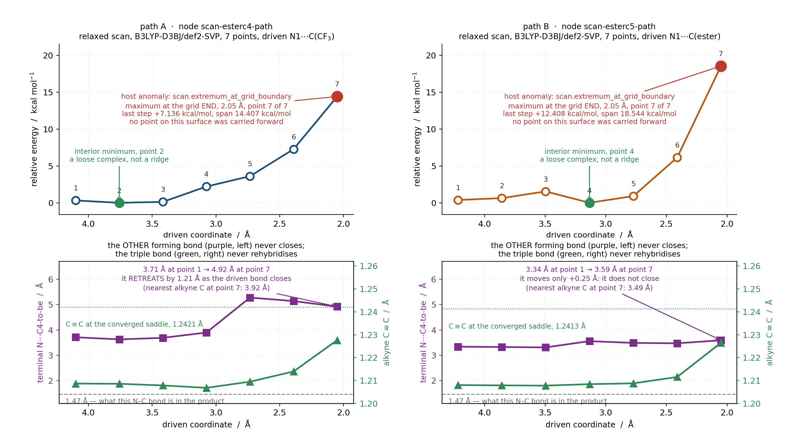
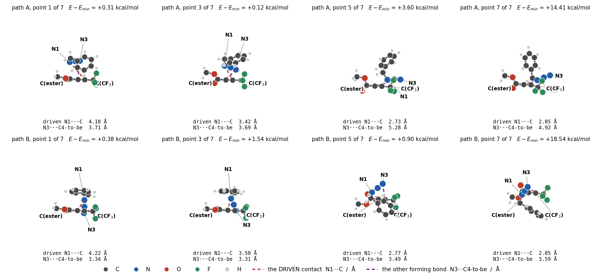
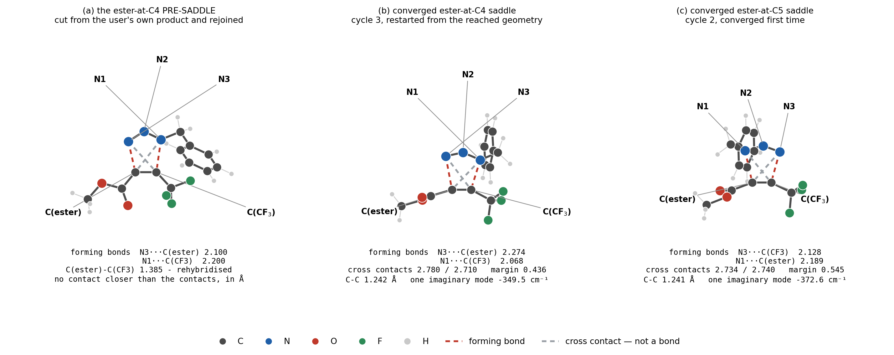
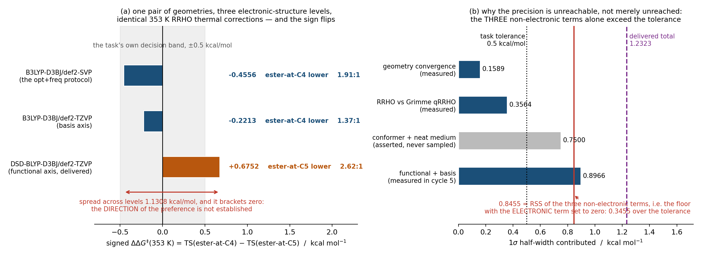

# Case B — `po3-r19`: a triazole regiochemistry the method cannot decide, established as such

A forensic reconstruction of ChemSmart Agent goal `goal-po3-r19` from the
evidence it left behind. Raw evidence:
`po3-r19/workspace/` (moved here unmodified; a symlink at
the original campaign path keeps every absolute reference in the record
resolvable). Figures: `po3-r19/figures/`.

Settlement: **`unreachable_from_evidence`**, 6 cycles, 11 engine calls of
40 granted, 33 812 s of engine wall (9.4 h of the 12 h episode), 4
revisions admitted. In this product that settlement is a **deliverable**,
not a failure: the value was computed, delivered and claimed at three
levels of theory, and the host then *verified* that the precision the task
demanded — 0.5 kcal/mol — cannot be reached inside this envelope. Section
8 argues why that is a real result for the chemist who asked.

---

## The one thing the chemist should read first

**Both supplied product files are labelled the wrong way round, so going
by their own file names the chemist would pick the wrong compound.** The
agent found this before any calculation ran, by reading connectivity
instead of filenames; I re-derived it independently with ChemSmart's own
perceiver and from the task's own SMILES; the commissioning scientist
re-derived it again. Under IUPAC 1,2,3-triazole numbering N1 is the
benzyl-bearing nitrogen and C4 is the ring carbon bonded to N3:

| file (sha256, 8) | what the connectivity says it is | so the ester is on |
|---|---|---|
| `triazole-ester-at-c4.xyz` (`e57f5c9d`) | the ester carbon is bonded **directly to the benzyl nitrogen** | **C5** |
| `triazole-ester-at-c5.xyz` (`560bf8cb`) | the ester carbon is **two nitrogens away** from it | **C4** |

The isomer the task says is needed for the next step — "the isomer bearing
the ester at C4" — is the structure in the file called
`triazole-ester-at-c5.xyz`. It costs no engine call to check and it is the
single most actionable thing in the case. It also replicates: an earlier
window on the same task (`po3-r17`) measured the same transposition from
its own empty workspace. Details and the agent's own words in §3.1.

---

## 0. Errors and limits first

1. **The brief undercounts the nodes.** It says 10 nodes and three single
   points. The evidence is **11 nodes and 11 engine calls**: two reactant
   optimisations, two 7-point relaxed scans, three transition-state
   searches (one non-converged, one restart, one converged first time) and
   **four** single points — B3LYP-D3BJ/def2-TZVP *and* DSD-BLYP-D3BJ/def2-TZVP,
   each on both saddles. The fourth single point is load-bearing: the
   DSD-BLYP pair is what flips the sign of the answer (§6).
2. **The two scans produced no usable point.** Both were flagged
   `scan.extremum_at_grid_boundary` and both were then *abandoned on
   measurement*, not repaired. **Two of the eleven engine calls —
   26 521 s, 78 % of all engine wall this goal spent — bought a negative
   result.** (From the per-node receipts: `scan-esterc5-path` 14 213.05 s
   and `scan-esterc4-path` 12 308.02 s, against 33 812 s total. The other
   two cycle-1 calls were the reactant optimisations, `opt-benzyl-azide`
   266.98 s and `opt-tfm-ynoate` 107.59 s, and those were *used* — they
   are the reference both absolute barriers stand on. The first version of
   this report charged all four to the negative result, which was wrong.)
   That is still the largest single fact about this case and it is where
   the science is.
3. **One delivered claim was wrong and the agent caught it.** Cycle 2
   reported the ester-at-C5 saddle's "forming bonds" as 2.740 and 2.734 Å.
   Those are its *cross* contacts; the forming bonds are 2.128 and
   2.189 Å. Cycle 3 found it by re-measuring, cycle 4 reproduced the
   wrong numbers from the cross pairs to every digit to prove the
   diagnosis, and no energy or channel assignment changed.
4. **A second self-caught error, in the uncertainty budget.** Cycle 5
   delivered the vibrational-entropy term as **0.0** kcal/mol. Cycle 6
   found the cause — its quasi-harmonic input never entered the
   expression, so the quantity came back byte-identical to the harmonic
   one — re-measured it at 0.3564 kcal/mol, and raised the stated total
   from 1.1796 to **1.2323** kcal/mol. The final number is *less*
   favourable than the one it replaced.
5. **`declared_observable_misses` at cycle 6.** The final completion
   receipt records that no cycle-6 claim carries the bare id
   `ddg-activation-regio-353k` — cycle 6 delivered it under level-named
   ids instead — and lists it as a limitation. Delivery is judged at the
   goal grain and three earlier cycles did claim it under that exact id
   (cycles 2, 4 and 5, all in `workspace-record.jsonl`), so the
   settlement is consistent; but a reader looking only at cycle 6 will see
   the miss line.
6. **The `approaches_recorded` payloads duplicate their own entries** at
   several cycles, and some strings are truncated mid-word. I quote them
   as they stand and mark the cuts.
7. **The most useful output of the case is not a number.** It is the
   product-label transposition above — a finding about the chemist's own
   input files, delivered in cycle 1 at zero engine cost, which would have
   sent them to the wrong compound.

---

## 1. The question, as the chemist posed it

The task (`workspace/.chemsmart-agent/goals/goal-po3-r19/task.md`,
digest `4de41b20`) is a go/no-go decision with real material at stake:

> "I am about to run the uncatalysed thermal cycloaddition of benzyl azide
> onto methyl 4,4,4-trifluorobut-2-ynoate, neat at 80 C. The alkyne takes
> me four steps and I have 300 mg of it, so I would rather know in advance
> whether this gives me one regioisomer or a mixture."

The chemistry is genuinely undecided, and the chemist says why:

> "Both ends of the triple bond are electron-poor and I cannot decide
> which one controls the orientation: the ester is the conventional
> activating group and I would expect it to end up at C4, but the
> trifluoromethyl is polarising the alkyne as well and I do not know
> whether it reinforces or opposes that. I need the isomer bearing the
> ester at C4 for the next step."

And the decision rule is stated, with a threshold and an alternative:

> "So: which regiochemistry does the thermal reaction favour, and by how
> much in activation free energy at 353 K? If the two orientations are
> within a few tenths of a kcal/mol I will not bother with the thermal
> route and will go straight to a ruthenium catalyst instead."

> "What would satisfy me: the major regioisomer named unambiguously, plus
> ddG(activation) between the two orientations in kcal/mol at 353 K.
> Anything below roughly 0.5 kcal/mol I will read as 'no thermal
> condition will fix this'."

Four hand-built RDKit/MMFF structures are supplied: the two reactants and
both product triazoles, "nothing optimised".

Note that "0.5 kcal/mol" can be read two ways, and the difference decides
the settlement word. Read as a **decision threshold**, it is the width of
a choice the chemist has already made: below it, they switch routes. Read
as a **required precision**, it is a demand on the calculation's error
bar. The task states the first; the agent declared the second —
`required_tolerance: 0.5` with `tolerance_origin: task`, and a
`tolerance_basis` quoting the chemist's sentence. That is a defensible
interpretation (you need precision comparable to a threshold to place a
value against it) and it is recorded where a reader can find it, but it is
an interpretation, and `unreachable_from_evidence` follows only from the
precision reading. Under the decision reading the case answers the chemist
outright: no level puts |ΔΔG‡| above 0.7 kcal/mol, the stated uncertainty
is 1.23, so by the chemist's own rule the thermal route is out. §8 makes
that argument; §1 should not borrow its conclusion from the reading it has
just set aside.

---

## 2. What the agent committed to before any calculation

Two declarations in cycle 1 (ledger entry 1). The first is the requested
observable:

| field | value |
|---|---|
| `observable_id` | `ddg-activation-regio-353k` |
| meaning | ΔΔG‡ at 353 K, "the higher-barrier (minor) orientation minus the lower-barrier (major) orientation, so its magnitude is the kinetic regioselectivity the synthetic decision turns on" |
| band | 0.0–3.0 kcal/mol, sign positive |
| `required_tolerance` | **0.5 kcal/mol**, `tolerance_origin: task` |
| `tolerance_basis` | "The task's own decision rule: 'Anything below roughly 0.5 kcal/mol I will read as no thermal condition will fix this'." |
| `expectation_basis` | "Thermal azide-alkyne cycloadditions are documented to be only weakly regioselective, and here both alkyne termini carry acceptors that direct the terminal azide nitrogen in opposite senses, so the two asynchronous transition states should differ by tenths to a few kcal/mol rather than by many." |

The second is a **diagnostic that contradicts the chemist**, pre-registered
before a single calculation existed:

> `dg-ts-esterc4-minus-esterc5-353k`, `role: diagnostic`,
> `method_resolution: 1.0` kcal/mol, band 0.0–2.5, sign positive.
>
> "Frontier-orbital and electrostatic reading of the alkyne: the ester is
> a pi-acceptor and pushes LUMO density onto the distal CF3-bearing alkyne
> carbon, while CF3 acts mainly through sigma-induction and should not
> outweigh that resonance effect; the CF3-bearing carbon should therefore
> be both the larger-LUMO-coefficient and the more delta-positive
> terminus, so the nucleophilic terminal azide nitrogen (which becomes N3
> and bonds C4) attacks it, placing CF3 at C4 and the ester at C5. **This
> opposes the task's conventional 'ester to C4' expectation, so it is
> declared as a falsifiable diagnostic rather than assumed.**"

with a written consequence:

> "If the sign comes out negative outside the 1.0 kcal/mol deadband, the
> conventional ester direction controls instead: I would name the
> ester-at-C4 isomer as the thermal major product, revise the rationale to
> say the ester's own alkyne carbon is the preferred partner for the
> terminal azide nitrogen in the asynchronous transition state (or that
> benzyl-ester secondary interactions dominate the CF3 induction), and
> report that the user's target isomer is also the thermal major one."

Three features of that declaration matter. It is a *mechanistic* claim
(LUMO coefficient and electrostatics, with the σ-vs-π distinction spelled
out), it predicts the **opposite** of what the person asking believes, and
it carries a `method_resolution` of 1.0 kcal/mol — an admission, in
advance, that a difference smaller than 1 kcal/mol will not be graded
either way. That last field is what the host used at the end (§6.4).

---

## 3. Cycle 1 — a finding before any physics, and 7.5 h spent on the wrong coordinate

### 3.1 The finding the chemist can use today

The agent's first substantive act was to read the *connectivity* of the
four supplied structures rather than trusting their filenames. The result:

> "**Your two product reference files are labelled the wrong way round.**
> ...
> - In `geometry-e57f5c9d4a3dc3bf` (your `triazole-ester-at-c4.xyz`, SMILES
>   `COC(=O)c1c(C(F)(F)F)nnn1Cc2ccccc2`) the benzyl nitrogen is bonded to
>   the **ester-bearing** ring carbon. Under IUPAC 1,2,3-triazole
>   numbering N1 is the benzyl nitrogen and its carbon neighbour is C5, so
>   this isomer has the **ester on C5** and CF3 on C4.
> - In `geometry-560bf8cb72cb9c39` (your `triazole-ester-at-c5.xyz`, SMILES
>   `COC(=O)c1nnn(Cc2ccccc2)c1C(F)(F)F`) the benzyl nitrogen is bonded to
>   the **CF3-bearing** carbon, so the **ester is on C4**.
>
> So the isomer you say you need for the next step — ester at C4, i.e. on
> the ring carbon bonded to N3 and *not* adjacent to the benzyl nitrogen —
> is `geometry-560bf8cb72cb9c39`, the file you called
> `triazole-ester-at-c5.xyz`. Worth checking before you assign any
> spectra. From here on I will name isomers by connectivity and locant,
> never by filename."

**I verified this independently** with ChemSmart's own bond perceiver on
the supplied files: in `triazole-ester-at-c4.xyz` (sha `e57f5c9d`) the
carbon bonded to the benzyl nitrogen is the ester-bearing one (so the
ester is at C5); in `triazole-ester-at-c5.xyz` (sha `560bf8cb`) the carbon
bonded to N3 is the ester-bearing one (so the ester is at C4). Both
SMILES strings in the task confirm it. The finding is correct, it is worth
money to the person who asked, and it needed no engine call.

For the record: the campaign seal for this window
(`seals/ROUND17-PO3-R19-CLEAN-REPLAY.md`) notes that an earlier window
(`po3-r17`) had already measured the same transposition, and treats a
repeat as an observation rather than a first. So this is a *replication*
of a prior finding by a session that started from an empty workspace.

### 3.2 Why the agent built one complex and scanned it twice

The regiochemistry is kinetic, so the answer needs the two competing
transition states. Getting a bimolecular concerted saddle from hand-built
fragments is the hard part, and the record shows the agent measuring its
way through four failed attempts before choosing a route.

`compose_molecular_arrangement` placed the azide against the ynoate at a
single 2.15 Å contact. Guess A worked:

> "Guess A is clean and useful: the placement put the azide's terminal
> nitrogen almost symmetrically over the triple bond (2.150 Å to the
> ester-side carbon, 2.075 Å to the CF3-side carbon), with N(benzyl) at
> ~4.1 Å — a reasonable pre-orientation that a doubly-constrained
> relaxation can close into either saddle."

Guess B — the mirror orientation — did not, and the agent measured *why*:

> "Guess B is **not usable**: to hold N(terminal) at 2.15 Å from the
> CF3-side carbon, the placer drove that nitrogen to 1.77 Å from the CF3
> carbon and **1.58 Å from a fluorine**. That is a hard clash."

Two re-placements (a longer 3.0 Å contact, and a mirrored placement moving
the alkyne instead of the azide) reproduced the same pathology, and the
third was measured rather than taken on the reported figure:

> "Measured, r3 is confirmed unusable and worse than reported: its
> terminal nitrogen is perceived as **bonded** to the CF3 carbon *and* to
> a fluorine (row 0 → atoms 1, 23, 25). Every single-contact placement
> made on the CF3-side alkyne carbon drives the incoming nitrogen into the
> CF3 group, so one common complex is the only clean seed available."

Hence the design: **one** composed complex, and one relaxed scan per
orientation, each driving the *long* contact — N(benzyl)···C(CF₃-side) for
the ester-at-C4 path, N(benzyl)···C(ester-side) for the ester-at-C5 path.
I confirmed from the two `.inp` files that the starting geometries are
byte-identical and only the driven coordinate differs
(`B 5 15 = 4.1, 2.05, 7` versus `B 4 15 = 4.22, 2.05, 7`). Using one
complex for both is a real methodological choice, and the agent names the
benefit: "That one arrangement seeds **both** orientations, which also
makes them directly comparable."

It also rejected, on the record, the thing most sessions would do:

> "Direct OptTS from the composed complex with no scan: rejected. One
> forming bond is at 2.15 A and the other at 4.10 A, so the lowest Hessian
> modes include fragment separation and the saddle search may follow them
> apart; the scan brackets the ridge first."

and it explained why the scan's *minimum* is useless here — a point the
product's own scan rule turns on:

> "Because the cycloaddition is strongly exothermic the minimum of this
> surface is the product side, not the ridge, so the ridge requires an
> explicit scan-point binding whose consuming stage is a new workflow."

### 3.3 The input check that saved four engine calls

All four cycle-1 nodes compiled through ChemSmart's validator and then
**ORCA's own bounded input check aborted every one of them**, naming the
field:

```
Use one of the keywords
RIJDX : treat the HF exchange exactly (equals RIJONX)
RIJCOSX: treat the HF exchange by chain-of-spheres
RIJK : treat Coulomb and exchange both by RI
[file orca_main/main_input_check.cpp, line 3594]: Error (ORCA_MAIN): ... aborting the run
```

(All five lines exactly as the ledger's `aborted_engine_lines` records
them for each of the four nodes. The first version of this report dropped
the `RIJDX` line and the source-file prefix and added an `orca: ` prefix
that is not in the record — inside a block a reader will take for the
program's own words. The dropped line is not inert: ORCA named **three**
legal options and the session's reading below names two.)

The agent's reading:

> "`ri_approximation: ri` with `def2/j` is not admissible for a hybrid
> functional — B3LYP needs RIJCOSX (or RIJK). That is not a green
> preview, so nothing here is executable yet. Re-establishing all six
> projects with `rijcosx`, restating every field since a promoted project
> carries nothing it does not state."

The ledger records the arithmetic: cycle 1, `passed: 4, aborted: 4`. Four
inputs ORCA had already rejected, caught in tenths of a second at zero
engine cost, then repaired at the project-YAML layer and re-probed green.
The agent also reported a genuine registry/loader discrepancy it hit on
the way — the ORCA loader rejects the keyword `inithess` although the
capability receipt lists it as project-owned; the guide named `inhess` and
that validated.

### 3.4 What cycle 1 predicted about its own limits

Cycle 1 delivered no number and said so, twice, at length. The important
part is that it pre-registered the shape of the final answer:

> "your decision threshold is 0.5 kcal/mol, and I expect the spread across
> basis, functional and entropy treatment to be of order 1 kcal/mol —
> larger than the threshold. DFT may well resolve the *direction* and not
> the *magnitude*."

> "It is quite possible that the honest answer is a direction you can trust
> and a magnitude you cannot — in which case your own rule, 'below roughly
> 0.5 kcal/mol means no thermal condition will fix this,' may not be
> decidable by DFT at all, and the coupled-cluster single points that would
> decide it do not fit in this budget."

It also refused to close the gap dishonestly when the host noted budget
remained:

> "I could only 'deliver' it by asserting a value with no executed result
> behind it, which I will not do. A claim bound to nothing is worse than
> an owed observable."

and it refused to call the observable unreachable, correctly:

> "Refusing `ddg-activation-regio-353k` as unreachable_from_evidence: not
> available and would be false. ORCA declares `ts` on cpu as both preview-
> and execution-supported in this envelope, the plan node whose output_id
> is that observable is support_state=planned, and both engine nodes hold
> green previews. The gap is an unrun calculation, not a missing
> capability, so the honest state is 'owed pending exec[ledger string cut]"

Cycle 1's run: 4 engine calls, `validated`, 26 896.19 s of engine wall
(the `scan-esterc5-path` node alone took 14 213.28 s), two anomalies
raised by the host.

---

## 4. Cycle 2 — the anomaly says "grid edge"; the structures say "wrong coordinate"

### 4.1 What the host flagged

Both scans tripped `scan.extremum_at_grid_boundary` (ledger entry 7):

| | `scan-esterc4-path` (A) | `scan-esterc5-path` (B) |
|---|---|---|
| grid | 4.10 → 2.05 Å, 7 points | 4.22 → 2.05 Å, 7 points |
| maximum | at 2.05 Å, **point 7 of 7** | at 2.05 Å, **point 7 of 7** |
| minimum | 3.758 Å, point 2 | 3.135 Å, point 4 |
| last step | +7.136 kcal/mol | +12.408 kcal/mol |
| span | 14.407 kcal/mol | 18.544 kcal/mol |

The naive reading of an extremum at a grid edge is "the grid was too
short — extend it". The agent explicitly rejected that:

> "Extending the scans to shorter contacts to bracket a ridge: rejected.
> The anomaly is not a truncated grid but a coordinate that is not the
> reaction coordinate."

### 4.2 The measurement that settled it

It read the structures at each surface's boundary maximum:

> "The scans are decisive, and not in the way the anomaly label suggests.
> Typed measurement of both surfaces' final points:
>
> - **path A** (driven coordinate = N_benzyl···C_CF3-side): driven contact
>   2.050 Å, but N_terminal···C_ester-side = **4.920 Å**,
>   N_terminal···C_CF3-side = 3.921 Å, and C≡C = **1.2277 Å** (intact
>   alkyne).
> - **path B** (driven = N_benzyl···C_ester-side): driven contact 2.050 Å,
>   N_terminal···C_ester-side = 3.487 Å, N_terminal···C_CF3-side =
>   3.593 Å, C≡C = **1.2265 Å**.
>
> Neither surface is a cycloaddition ridge: both dragged the *benzyl*
> nitrogen into an alkyne carbon while the terminal nitrogen — the one
> that must bond C4 — retreated, and the triple bond never lengthened. The
> boundary maximum is a repulsive wall, not a saddle. Seeding a TS search
> there would find an azide-sliding saddle."

**Every one of those numbers reproduces.** I reconstructed both scans
point by point from ORCA's own per-point structure sidecars, with atom
roles assigned from the perceived graph rather than from atom order (full
table in figure B1):

| path A, point | driven / Å | E−E_min / kcal mol⁻¹ | N3···C(ester) / Å | C≡C / Å |
|---|---|---|---|---|
| 1 | 4.100 | +0.310 | 3.712 | 1.2087 |
| 2 | 3.758 | 0.000 | 3.628 | 1.2086 |
| 3 | 3.417 | +0.121 | 3.689 | 1.2079 |
| 4 | 3.075 | +2.202 | 3.898 | 1.2068 |
| 5 | 2.733 | +3.600 | **5.276** | 1.2095 |
| 6 | 2.392 | +7.271 | 5.139 | 1.2140 |
| 7 | 2.050 | +14.407 | **4.920** | **1.2277** |

That is the whole diagnosis in one column. The bond that must *also* form
to give the ester-at-C4 triazole — terminal N to the ester-bearing carbon
— starts at 3.71 Å and **ends 1.21 Å farther away**, while the C≡C moves
from 1.2087 to 1.2277 Å (the saddle value is 1.2421 Å). The azide pivots
on one contact instead of folding into a five-membered ring. The 14.4
kcal/mol rise is the cost of that pivot, not a barrier.

A subtlety worth naming: the agent's quoted "3.921 Å (path A)" is the
distance to the *nearest* alkyne carbon, not to the partner that must
bond. Both numbers are in my table and both make the same point; the
partner distance (4.920 Å) makes it more strongly.

### 4.3 Delivering the negative result rather than dropping it

The cycle-1 plan had an output called `ridge-coordinate`. It could have
been silently abandoned. Instead:

> "The previous plan's unclaimed `ridge-coordinate` output has no physical
> referent; I delivered the measured driven-contact value at each grid
> maximum (2.050 Å, both paths) as claims beside that statement instead of
> leaving it silently unfulfilled."

Cycle 2's claims include exactly that, plus the two measurements that
justify abandoning the surfaces. A negative result with receipts.

### 4.4 The route that replaced the scans

Rather than compose again from unrelaxed fragments, the agent cut the
chemist's own product structures in half and rejoined them stretched:

> "There is a much better guess available in this workspace: the two
> user-supplied product triazoles, cut into their azide-derived and
> alkyne-derived halves and rejoined with both C–N bonds stretched. That
> carries the product's ring planarity, substituent splay and bent azide."

Four `derive_molecular_species` calls produced C₅H₃F₃O₂ and C₇H₇N₃ halves
(the artifact headers record the exact parent atom lists kept and
removed), then two `compose_molecular_arrangement` calls rejoined each
pair at **both** forming bonds at once — 2.10 Å for N3···C4 and 2.20 Å for
N1···C5. The measured result:

> "Both pre-saddles composed cleanly — and critically,
> `min_interfragment_distance` is exactly the requested 2.10 Å contact, so
> unlike the direct-fragment placement there is **no clash at all** (the
> earlier attempt had N···F at 1.96 Å)."

> "in `presaddle-esterc4`, C4···N3 = 2.100 Å, C5···N1 = 2.200 Å, C4–C5 =
> 1.385 Å, N3–N2 = 1.324 Å, N2–N1 = 1.349 Å, the ester carbonyl lies
> 0.22 Å out of the forming-ring plane (conjugated, not twisted), and C4
> carries the ester while C5 carries CF3."

The out-of-plane figure is the agent's and its **plane convention is not
recorded**, which matters because the answer depends on it: I get 0.222 Å
for the carbonyl carbon against the plane of C4/C5/N3, and 0.112 Å against
the best-fit plane of all five forming-ring atoms. The accompanying
dihedrals (−4.1° and 168.6°) reproduce independently and carry the same
conclusion — the ester is conjugated with the forming ring, not twisted
out of it — so nothing rests on which convention was meant.

And it named what was wrong with the alternative it discarded — a
dual-contact compose of the *unrelaxed* fragments:

> "the host placed the azide **2.0 Å out of the ynoate's own σ-plane** ...
> with an N···F contact at 1.964 Å. That ring plane is perpendicular to
> the ester's π system, so the ester is twisted out of conjugation with
> the forming ring — the correct Huisgen saddle is near-planar with the
> ester coplanar."

That is a chemist's objection, expressed as a measurement. The
ester–ring dihedrals of the accepted pre-saddles are −4.1° and 168.6°:
coplanar and conjugated.

### 4.5 Hardening the plan before spending engine time

Before letting the plan execute, the agent restructured it so that an
arithmetic surprise could not destroy the delivery after the engine had
run:

> "`expr-regio-geometry` currently carries both the distances the
> **required claim** needs *and* the `imaginary_mode_count` nodes, so one
> arity surprise there would block every claim after the engine time is
> already spent."

> "The claim path for the required number now runs only through
> `ref`/`sum`/`subtract`/`convert`/`abs`/`add` and `distance`/`subtract`;
> the imaginary-mode counting, the `exp`-based ratio and the
> mode-participation extractions sit in stages that feed nothing it needs,
> so an operation-level surprise costs a diagnostic rather than the
> deliverable after the engine time is spent."

Cycle 2's run: 2 engine calls, `workflow_state: failed` —
`ts-esterc4` ended `failed_nonconverged_geometry` — 5 471.42 s. Two
`geometry.heavy_atom_rmsd_ge_0.3` anomalies (1.4066 and 1.2245 Å from
their hand-built guesses).

---

## 5. Cycle 3 — is a failed saddle search a wrong basin or an unfinished walk?

This is the cycle that shows the difference between a workflow executor
and a scientist. A `failed_nonconverged_geometry` node plus a 1.41 Å RMSD
anomaly reads like a search that wandered off. The agent tested that
reading instead of acting on it.

It called `characterise_stationary_point` on the structure the failed
search *reached*, which asks the host to count imaginary modes against
ORCA's own printed frequencies:

> "The failed C4 structure is confirmed as a genuine **first-order saddle**
> (one imaginary mode, −352.4 cm⁻¹) that simply ran out of optimiser
> iterations — so the walk is recoverable, not a wrong channel. I'll
> restart it from the geometry it reached."

and it disposed of the RMSD anomaly with a control:

> "Its large RMSD from the hand-built guess is not evidence of a wrong
> basin; the *validated* ester-at-C5 saddle moved almost as far (1.22 Å)
> from its own loose guess."

The repair was `bind_reached_geometry` plus a fresh OptTS at the identical
level with only `geom_maxiter` raised from 30 to 100. It rejected the two
obvious alternatives on the record:

> "Fresh restart from the original cycle-2 pre-saddle guess with a larger
> iteration budget: rejected on the host's own record that a fresh start
> repeats the same path to the last decimal."

> "Loosening `opt_convergence`: rejected. It lowers the bar the same walk
> must clear instead of buying iterations, and can stop on a worse
> structure than one already held."

and it refused to deliver from the unconverged structure, with the
mechanism:

> "Stand by the unconverged ester-at-C4 structure and deliver from it:
> rejected. It is a first-order saddle by mode count, but its energy is
> not stationary, so it sits above the true saddle and biases precisely
> the difference being measured; and it carries a 15.76 cm⁻¹ mode
> (near_zero_mode_count 1, absent from the converged ester-at-C5 saddle)
> that inflates its RRHO entropy."

That judgement was right in a checkable way, and the **direction** is the
part that matters. The restart *raised* the ester-at-C4 barrier from
23.194181 to 23.353043 kcal/mol, +0.158862 — 34.9 % of the difference
being measured — and moved the signed ΔΔG‡ from −0.6145 to −0.4556. So
standing by the unconverged structure would have made the ester-at-C4
preference look **larger**: biased, that is, toward the very isomer the
chemist said they need. A bias in that direction is the one worth naming.
The two structures' ORCA total energies differ by only 0.001 kcal/mol
(−1076.08259671 against −1076.08259831 Eh), so essentially the whole
0.158862 is thermal — the 15.76 cm⁻¹ mode inflating the unconverged
structure's RRHO entropy, exactly as the agent said. The agent then turned
that number into an uncertainty component rather than discarding it
(`u-convergence-kcal`).

### 5.1 The refutation that became the dominant error term

Cycle 3 also ran an unrequested probe on the thermal treatment, and it
came back badly:

> "The probe refutes the previous delivery, and the refutation stands. Two
> measured facts:
>
> - **RRHO** at 353 K: ΔG(C4−C5) = −0.00097919 Ha = **−0.614 kcal/mol**
>   (reproduces cycle 2 exactly).
> - **Grimme quasi-RRHO** (100 cm⁻¹ cutoff): ΔG(C4−C5) = −0.00019766 Ha =
>   **−0.124 kcal/mol**.
>
> So the entropy treatment of four sub-50 cm⁻¹ modes moves the answer by
> ~0.49 kcal/mol — nearly the whole effect."

> "the thermal term (−1.01 kcal/mol) already flips the sign of the
> electronic difference (+0.40 kcal/mol), so the whole answer lives in the
> part of the calculation that RRHO describes worst."

That measured spread **replaced** cycle 2's asserted 1.5 kcal/mol
allowance in the budget. The repair-menu disposition states the trade in
the agent's own words:

> "Took two of the three branches. 'Compute it' for the terms I can narrow
> without new engine time ... 'Ask a question this number can answer' by
> adding `thermal-ddg-margin-over-threshold` and a validation rule asking
> whether ddG still clears the task's own 0.5 kcal/mol threshold once its
> uncertainty is subtracted. The 'refuse it' branch is rejected: the
> producer exists, is planned and holds a green preview, so
> unreachable_from_evidence would be false — the shortfall is precision,
> not capability, and is recorded as such."

Cycle 3's run: 1 engine call, `validated`, 627.53 s.

---

## 6. Cycles 4–6 — the number, the re-wake, and the sign flip

### 6.1 Cycle 4: the first complete delivery

Cycle 4 spent no engine call and delivered the full chain from the two
converged saddles. It also caught the mislabelled forming bonds (§0.3),
and proved the diagnosis rather than asserting it:

> "`c5-d-nalpha-cester` = 2.7344349 and `c5-d-ngamma-ccf3` = 2.7402663
> reproduce cycle 2's claimed `c5ts-d-n3-c5` and `c5ts-d-n1-c4`
> **exactly** — confirming that cycle 2 applied the C4 file's atom mapping
> to the C5 file, where the two former alkyne carbons occupy indices 0 and
> 1 in the opposite order, and so reported that saddle's two *non-bonding
> cross* contacts as its forming bonds. Its real forming bonds are 2.128
> and 2.189 Å."

**Delivered at cycle 4** (B3LYP-D3BJ/def2-SVP, 353 K, 1 atm, gas phase):

| claim | value |
|---|---|
| `ddg-activation-regio-353k` | **0.4556 ± 1.3095 kcal/mol** (`short`) |
| `dg-activation-esterc4-353k` | 23.3530 kcal/mol |
| `dg-activation-esterc5-353k` | 23.8086 kcal/mol |
| `dg-ts-esterc4-minus-esterc5-353k` (signed) | −0.4556 kcal/mol |
| `dg-ts-esterc4-minus-esterc5-qrrho-353k` | −0.0991 kcal/mol |
| `regio-ratio-major-to-minor-353k` | 1.9145 : 1 |
| `thermal-ddg-margin-over-threshold` | **−0.0444 kcal/mol** |
| `u-convergence-kcal` (measured) | 0.1589 kcal/mol |
| `u-entropy-model-kcal` (measured) | 0.3564 kcal/mol |

and the uncertainty carries a full decomposition with per-term provenance,
a stated combination rule and a stated coverage:

> `rule`: "root-sum-square of the four components";
> `dependence`: "assumed independent; the two measured terms come from
> disjoint perturbations and the two asserted terms from disjoint model
> axes, so any positive correlation would make this total an
> underestimate";
> `coverage`: "approximately one standard deviation of the stated error
> sources; it does not cover a systematic DFT bias of unknown sign common
> to both saddles beyond the 1.0 kcal/mol allowance".

Two components `measured` with receipts (0.1589 geometry convergence,
0.3564 entropy model), two `asserted` and labelled as the session's
judgement (1.0 functional/basis, 0.75 conformer-plus-neat-medium). The
host's own observation line on the claim records the model-authored
literals by name: `literal_value=1.0@lit-dft-allowance;
literal_value=0.75@lit-model-allowance`. **This is cycle 4's budget and
not the delivered one** — cycle 5 replaced the asserted 1.0 with a
measurement; §6.3 gives the final four-term version.

The agent's own headline was not the value:

> "**The uncertainty (1.31) is nearly three times the value (0.46)**, so
> the *direction* of the preference is not established by this work."

It then declined the one calculation that would narrow the dominant term,
and gave a reason that a later cycle held it to:

> "It is still affordable in the remaining budget (10.2 ks, 33 calls) and I
> deliberately did not schedule it, because doing so would have put the
> delivered claims behind an unrun producer and risked a second cycle that
> computed everything and rendered nothing."

The host disagreed, in the only way it can: `rewake_opened` with
`state: short`, uncertainty 1.3095 against a required 0.5, and a route —
"compute it ... or ask a question this number can answer ... or refuse it".

### 6.2 Cycle 5: buying the dominant term, and paying ORCA's price twice

Cycle 5 took the "compute it" branch on exactly the axis cycle 4 had
named as dominant, and said what it had changed so the repeat was not a
repeat:

> "What is different from cycle 4, which rejected exactly this
> calculation: cycle 4's stated reason was that scheduling it 'would have
> put the claim nodes behind an unrun producer and risked a second cycle
> that evaluated everything and delivered nothing', so this cycle the
> claim nodes are **inside** the plan behind those producers, wired by
> observable id, and every zero-engine-cost quantity was re-derived first
> so the arithmetic floor of the refusal does not depend on the run at
> all."

Four single points on the **same two converged saddle geometries**, one
method axis at a time: def2-SVP → def2-TZVP at fixed B3LYP-D3BJ (basis),
and B3LYP-D3BJ → DSD-BLYP-D3BJ at fixed def2-TZVP (functional), with the
def2-SVP RRHO thermal corrections held constant throughout. That design is
what makes the resulting ladder interpretable, and the agent states the
reason only two points per level are needed: "both saddles are the same
30-atom neutral formula, so the reactant reference cancels identically in
a difference between channels."

To get the saddle geometries back as bindable artifacts it used the same
mode-displacement promotion as Case A, at 1.0 × 10⁻⁴ Å along soft **real**
modes (17.07 and 20.81 cm⁻¹) — "the saddles to within ~10⁻¹⁰ kcal/mol" —
after the host refused a zero-amplitude promotion.

ORCA's input check aborted the DSD-BLYP pair and named the field:

```
[file orca_main/main_input_check.cpp, line 4644]:
ERROR: RI-MP2 needs an AuxC basis but none was defined!
```

> "a double hybrid needs a correlation-fitting basis, and this project
> exposes a single `aux_basis`, so `def2/jk` supplies J/K but not C. I'll
> probe `autoaux` (ORCA generates both) and promote a range-separated-hybrid
> fallback in the same turn."

`autoaux` passed, and the ωB97X-V fallback was validated and then
deliberately not used:

> "A double hybrid bounds the error against coupled-cluster-quality
> reference behaviour, whereas a second range-separated hybrid only widens
> an already-wide spread; it remains available if DSD-BLYP fails at
> runtime."

The ωB97X-V project also carries a chemically specific decision, stated:
"ωB97X-V deliberately restates no `dispersion` field — ωB97X-V carries its
own non-local (VV10) correlation, so adding D3BJ would double-count."

Cycle 5's run: 4 engine calls, `validated`, 817.07 s (the DSD-BLYP single
points cost 334–338 s each on a 30-atom system).

Cycle 5 also introduced the entropy-term bug (§0.4) and delivered
`u-entropy-model-kcal` = 0.

### 6.3 Cycle 6: the sign flips, and the refusal becomes arithmetic

Cycle 6 spent no engine call and did three things.

**It re-established channel identity from bytes.** Not from node names,
not from the guesses that seeded the searches:

> "`orca-result-b1d1824ac8fdf3ad` (node "esterc4"): connectivity puts the benzyl
> nitrogen at atom 15 and the terminal azide nitrogen at 13; the benzyl N
> is 2.068 Å from the CF3-side alkyne carbon and the terminal N is 2.274 Å
> from the ester-side alkyne carbon. Since the benzyl N becomes ring N1
> (bonding C5) and the terminal N becomes N3 (bonding C4), this saddle
> delivers **ester at C4** — the node name is correct under IUPAC
> numbering."

and corrected its own earlier labels while protecting the numbers:

> "cycle 4's α/γ nitrogen labels were inverted relative to this
> connectivity; its substituent labels and every number were right, so no
> delivered value changes."

I reproduced every one of those distances through the ORCA reader with
atom roles derived from the perceived graph: ester-at-C4 saddle
N3···C(ester) 2.2742 Å, N1···C(CF₃) 2.0679 Å, cross contacts 2.7100 /
2.7802 Å, one imaginary mode at −349.50 cm⁻¹; ester-at-C5 saddle
N3···C(CF₃) 2.1284 Å, N1···C(ester) 2.1894 Å, cross 2.7344 / 2.7403 Å, one
imaginary mode at −372.61 cm⁻¹. The regio margins — smallest cross minus
largest forming — are 0.4358 and 0.5450 Å, matching the claims.

**It found and repaired its own cycle-5 bug.**

> "cycle 5 delivered `u-entropy-model-kcal` = 0.0 while cycle 4 delivered
> 0.3564 — the host states that divergence without explaining it. The
> reason is visible in the record: cycle 5's
> `dg-ts-esterc4-minus-esterc5-qrrho-353k` came back as −0.4555901,
> byte-identical to the *harmonic* value, so the quasi-harmonic input
> never entered its expression and the term collapsed to zero by
> construction. It re-measures here as 0.3564."

The workspace record confirms both rows verbatim. The correction raised
the stated total uncertainty from 1.1796 to 1.2323 kcal/mol — the agent
made its own answer look worse because the evidence said so.

**It measured the level dependence, and the sign flipped.** Three levels
on one pair of geometries with one thermal correction:

| level | ΔΔE electronic / kcal mol⁻¹ | signed ΔΔG‡(353 K) / kcal mol⁻¹ | major : minor |
|---|---|---|---|
| B3LYP-D3BJ/def2-SVP (the opt+freq protocol) | +0.3257 | **−0.4556** — ester-at-C4 lower | 1.91 : 1 |
| B3LYP-D3BJ/def2-TZVP (basis axis) | +0.5600 | **−0.2213** — ester-at-C4 lower | 1.37 : 1 |
| DSD-BLYP-D3BJ/def2-TZVP (functional axis, delivered) | +1.4565 | **+0.6752** — ester-at-**C5** lower | 2.62 : 1 |

I verified the arithmetic independently from the four single-point
energies and the ts energies read through the product's reader: the
electronic differences are 0.3257, 0.5600 and 1.4565 kcal/mol
(1.4565436 in full), and adding
the common 353 K RRHO thermal difference of −0.78133 kcal/mol gives
−0.4556, −0.2212 and +0.6753. Spread across levels: **1.1308 kcal/mol**,
and it brackets zero.

The agent's own reading:

> "**The thermal reaction will give you a mixture, and the calculation
> cannot tell you which regioisomer is major.** That is not a hedge — the
> direction of the preference flips with the density functional, while its
> smallness does not."

> "The two global-hybrid rows favour your ester-at-C4 isomer; the double
> hybrid favours the other one. The full spread, 1.131 kcal/mol, is larger
> than any single prediction and brackets zero, so no direction is
> established. What *is* robust: every level puts the two within ~0.7
> kcal/mol, i.e. **58:42 to 72:28 at best** — a mixture you would
> chromatograph, never one regioisomer."

**It converted the refusal from an argument into a receipt.** This is the
mechanism of the settlement. The agent's own sentence, as it stands on the
record:

> "with the electronic-structure term set to **exactly zero**, the measured
> entropy-model term (0.3564) and the unsampled conformer-and-medium
> allowance (0.75) still combine to **0.8455 kcal/mol — 0.3455 above the
> task's 0.5 tolerance**. No admissible calculation can reach that
> precision."

**That sentence enumerates two of the three terms in the number it
quotes, and the first version of this report repeated the error.** The
claim `u-floor-without-method-kcal` = 0.845452 is a **three**-term
quadrature: the only term zeroed is the functional one. Only one
combination reproduces it:

| combination | value |
|---|---|
| RSS(0.356444, 0.750) — the two terms the sentence names | 0.830393 |
| 0.356444 + 0.750 | 1.106444 |
| **RSS(0.158862, 0.356444, 0.750)** — geometry convergence, entropy model, conformer-plus-medium | **0.845452** ✓ |

I reproduce 0.845452117 to nine figures from the claim's own
`uncertainty_components`, and the omitted term is recoverable by
subtraction: 0.845452² − 0.158862² − 0.356444² = 0.5625 = 0.750² exactly.
Note what the third term is: the **0.750 kcal/mol conformer-and-medium
allowance is the session's own asserted judgement**, not a measurement,
and it exists only as a literal inside the expression — the host's
observation line on the claim records it as
`literal_value=0.75@lit-model-allowance`, and there is no
`u-conformer-medium-kcal` claim id on the workspace record to look it up
by. So the floor is two measured terms plus one asserted one.

**The conclusion survives either arithmetic.** 0.830 and 0.845 both exceed
the 0.5 kcal/mol tolerance — by 0.330 and 0.345 respectively — so "even a
perfect electronic-structure method leaves the total above tolerance"
holds whichever way the floor is composed, and the shape of the argument
is untouched. But this is the number the `unreachable_from_evidence`
settlement rests on and this report invites the reader to check it, so it
has to be checkable as written.

The two floor numbers are themselves claims
(`u-floor-without-method-kcal` = 0.845452,
`u-floor-excess-over-tolerance-kcal` = 0.345452) standing on receipt
`d3bca43a`. A blocked analysis stage, `ddg-at-task-tolerance`,
carries `ddg-activation-regio-353k` as its output id, which is what the
host checks. The verdict:

```json
{"observable_id": "ddg-activation-regio-353k", "verified": true,
 "blocked_node_id": "ddg-at-task-tolerance",
 "basis": "analysis node 'ddg-at-task-tolerance' is declared
           blocked_unsupported in this session's plan and names
           'ddg-activation-regio-353k' as its output"}
```

and the refusal statement names the two producers that would be needed,
with why each is out of reach: a DLPNO-CCSD(T)/CBS pair (declarable in
this envelope — "so this is a wall-time gap and not a selector or keyword
gap" — against 9 388 s of engine wall remaining and 334–338 s already
spent per DSD-BLYP single point), and Boltzmann-weighted conformer
ensembles of both saddles ("each opt+freq on these saddles cost 627–5 471 s
in cycles 1–3 and an ensemble needs several per channel, while ORCA's
`solvent_id` domain holds no entry for a neat reactant medium, so
`custom_solvent` parameters would themselves be an unevidenced model
choice").

Note the shape of the argument: the precision is refused not because the
better method is unaffordable, but because **the floor survives the better
method going to zero**. Cost alone would be a budget excuse; this is a
statement about the physics of the model.

**The delivered budget, for the record.** §6.1's four-term table is
cycle 4's and is right for cycle 4. The cycle-6 budget that the
settlement carries is not the same object, and the difference is in the
run's favour:

| term | magnitude / kcal mol⁻¹ | basis |
|---|---|---|
| geometry convergence | 0.158862 | measured |
| vibrational-entropy model (RRHO vs Grimme qRRHO) | 0.356444 | measured |
| density functional (B3LYP → DSD-BLYP at def2-TZVP) | **0.896554** | **measured, in cycle 5** |
| conformer + neat medium | 0.750 | asserted |
| **total, quadrature** | **1.232312** | vs a 0.5 kcal/mol tolerance |

I reproduced all four magnitudes and the total. Cycle 4's asserted
1.0 kcal/mol functional/basis allowance was **replaced by a measurement**
(0.896554, the shift the four cycle-5 single points bought), so the host's
observation line on the cycle-6 claim records one model-authored literal
where cycle 4's recorded two. Three of the four terms in the final error
bar are measured, not two — this report's first version left that upgrade
unstated and so undersold the work.

**The pre-registered trigger for the refusal never fired.** Worth saying,
because this report makes much of pre-registered consequences firing.
`ddg-functional-shift-tzvp-kcal` was declared at cycle 5 with this
`failure_update_rule`:

> "If the shift exceeds 1.0 kcal/mol the functional choice, not the basis
> or the geometry, is the dominant irreducible error: I state that as the
> reason the task's 0.5 kcal/mol tolerance cannot be met in this envelope
> and refuse the tolerance on that measured receipt rather than on an
> asserted allowance."

The shift came in at **0.896554** — inside the declared 0–1.0 band, graded
`agreed`, rule not triggered. The refusal was reached instead by the
separately constructed cycle-6 floor argument. That route is arguably the
stronger one, because a floor that survives the functional term going to
zero does not depend on how large the functional term is; but it is not
the route the session pre-registered, and the pre-registered one did not
fire.

The goal settled `unreachable_from_evidence` with seven
`decision_uncertainties`, including:

> "The sign of the preference is level-dependent: −0.4556 kcal/mol
> (ester-at-C4 favoured) at the B3LYP-D3BJ/def2-SVP protocol level,
> −0.2213 at B3LYP-D3BJ/def2-TZVP, +0.6752 (ester-at-C5 favoured) at
> DSD-BLYP-D3BJ/def2-TZVP. A spread of 1.1308 that brackets zero is the
> finding; any single one of those numbers quoted as 'the' answer would
> overstate it."

> "RRHO is a poor description of modes below 50 cm⁻¹, and both saddles have
> four such modes (17.07, 21.68, 32.85, 46.74 and 20.81, 27.46, 37.41,
> 41.33 cm⁻¹) contributing 37.5 and 36.2 kJ/mol of T·S. The measured
> RRHO-to-qRRHO sensitivity of 0.3564 kcal/mol is 53% of the delivered
> difference, which is why it is carried as a term rather than dismissed."

> "The 0.1589 kcal/mol convergence term is a residual on the ester-at-C4
> saddle only; the ester-at-C5 saddle has no comparable unconverged
> structure to differ from, so its convergence residual is unmeasured and
> assumed smaller."

### 6.4 How the host graded the five diagnostics, and which one was actually pre-registered

The first version of this report headed this section "the pre-registered
prediction" and tabulated five diagnostics without the one field that
separates them. **Only one of the five is a pre-registration.** The host
stamped `declared_after_evidence: true` on the other four, which is
exactly what that field exists for — the charter's reason for it is that
"a restatement is never displayed as a pre-registration" — and this
report displayed them that way anyway. The fault is mine: the host
behaved correctly and recorded the flag on every row, and the session was
open about what it was doing in its own declaration text. What follows is
the table with the host's own field restored:

| declared observable | declared in | `declared_after_evidence` | agreement | delivered |
|---|---|---|---|---|
| `dg-ts-esterc4-minus-esterc5-353k` | cycle 1 | *(not stamped — genuinely pre-registered)* | **indeterminate** | +0.6752 kcal/mol (band 0–2.5) |
| `c4-restart-imaginary-mode-count` | cycle 3 | **true** | agreed | 1 (band 1–1) |
| `ddg-basis-shift-tzvp-kcal` | cycle 5 | **true** | agreed | 0.2343 kcal/mol (band 0–0.5) |
| `ddg-functional-shift-tzvp-kcal` | cycle 5 | **true** | agreed | 0.8966 kcal/mol (band 0–1.0) |
| `ddg-regio-signed-spread-across-levels-353k` | cycle 6 | **true** | agreed | 1.1308 kcal/mol (band 0.5–1.5) |
| `ddg-activation-regio-353k` | cycle 1 | — | not_comparable at cycle 6 | delivered under level-named ids |

The clearest case is the cycle-6 spread diagnostic, and it is clear
because **the session said so itself** in the `expectation_basis` it
wrote:

> "The host-written workspace record **already carries** the three levels'
> signed differences (-0.456, -0.221 and +0.675 kcal/mol for the channel
> the workflow names esterc4 minus the one it names esterc5), so their
> range **cannot be smaller than about 1.13 kcal/mol**; this diagnostic is
> declared to make that level dependence a typed, scored quantity rather
> than prose."

It was then graded `agreed` for landing at 1.1308 inside a 0.5–1.5 band.
The stated motive — typing a fact so it is scored rather than left in
prose — is legitimate, and the host both stamped the row and kept the
session's own admission on the record. What is not legitimate is a
reconstruction that reprints the `agreed` grade as a successful
prediction, which is what this section previously did.
`c4-restart-imaginary-mode-count` is milder but the same in kind: its own
`expectation_basis` notes that the reached structure's "parsed mode list
already carries an imaginary mode". `ddg-basis-shift-tzvp-kcal` and
`ddg-functional-shift-tzvp-kcal` were declared at the start of cycle 5,
before the four single points that measured them ran, but after three
cycles of physics under the same goal — which is precisely the
distinction the goal-scoped flag draws.

**The one genuine pre-registration is the cycle-1 mechanistic
prediction**, and it is the only one the host declined to score.
`dg-ts-esterc4-minus-esterc5-353k` was written before any calculation
existed, predicts the opposite of what the chemist believed, carries a
mechanism (LUMO coefficient plus σ-induction versus π-resonance), and
carries a `method_resolution` of 1.0 kcal/mol. It came in at +0.6752 — the
sign it predicted, inside its declared band — and was graded
**`indeterminate`**, because 0.6752 is inside the resolution the session
had itself declared. It was right in sign and gets no credit for it,
because it had said in advance that a number this small could not be
graded either way. *That* is the instance of honesty-by-construction in
this case; putting it in a table beside four host-flagged restatements
diluted it.

---

## 7. Figures

### Figure B1 — `figures/figB1-scans.png`



**What it shows.** The two 7-point relaxed scans, reconstructed from
`scan_coordinate_values` and `scan_energies` through the ORCA reader, with
every point numbered in its actual sequence, the grid-edge maximum the
host flagged in red and the interior minimum in green. Below each: the
bond that also has to form — terminal N to the carbon that becomes ring
C4 in *that path's own product*, on the left axis — and the alkyne C≡C
length on the right, both measured per point from ORCA's own structure
sidecars with atom roles assigned from the perceived graph.

**What a chemist should conclude.** These are not cycloaddition profiles.
In path A the driven contact closes from 4.10 to 2.05 Å and the energy
climbs 14.41 kcal/mol, but the second forming bond **retreats from 3.71 to
4.92 Å** and the C≡C only reaches 1.2277 Å against 1.2421 Å at the real
saddle; in path B the second bond goes 3.34 → 3.59 Å and the C≡C reaches
1.2265 Å. A concerted Huisgen transition state requires *both* C–N
distances near 2.1–2.2 Å with the alkyne substantially rehybridised (see
figure B3). Neither surface approaches that. The grid-edge maximum is the
repulsive wall of an azide being pressed against one carbon while it
pivots away from the other, and a saddle search seeded there would have
converged on an azide-sliding saddle whose energy is not a barrier — which
the agent said in exactly those words. **No point on either surface was
carried forward**; the only quantities delivered from them were the
measured driven contact at each grid maximum (2.050 Å) and the two
distances that prove what the surfaces are. Read this figure as the
justification for an expensive negative result: the two scans cost
26 521 s of engine wall, 78 % of everything this goal spent, on the wrong
coordinate — and it was caught before it was turned into a barrier.

### Figure B2 — `figures/figB2-scan-structures.png`



**What it shows.** The same two scans as structures, points 1, 3, 5 and 7
in sequence, drawn with ChemSmart's bond perceiver. All eight panels share
**one camera and one scale**: each frame is aligned on the same three
atoms (the two former alkyne carbons and the ester carbonyl) and drawn
with a common half-span, so sizes and aspects are directly comparable
across the sequence. Red dashed: the driven N1···C contact. Purple dashed:
the other forming bond, N3 to the carbon that becomes C4. Both distances
are printed beneath each panel rather than on the bond, so no text
overprints an atom; atom labels sit outside the projected molecule on
leader lines.

**What a chemist should conclude.** Watch the azide in the top row. At
point 1 it lies over the triple bond with both nitrogens within 3.7–4.1 Å
— a plausible pre-reaction orientation. By point 5 the driven contact is
2.73 Å but N3 has swung to 5.28 Å; by point 7 the azide lies essentially
alongside the alkyne with its terminal nitrogen pointing away from the
carbon it needs to bond. The molecule is doing the cheapest thing
available to satisfy a constraint on one distance, and that is not the
reaction. This is the mechanical picture behind figure B1's numbers, and
it is the reason a single-coordinate scan is the wrong instrument for a
concerted bimolecular cycloaddition: there are two forming bonds and
driving one of them does not bring the other along.

### Figure B3 — `figures/figB3-saddles.png`



**What it shows.** (a) the ester-at-C4 pre-saddle the agent built by
cutting the chemist's own product triazole into an azide-derived half
(C₇H₇N₃) and an alkyne-derived half (C₅H₃F₃O₂) and rejoining them with
**both** forming bonds placed at once at 2.100 and 2.200 Å. (b), (c) the
two converged transition states, read through `reached_positions`. Red
dashed: forming bonds. Grey dashed: the non-bonded cross contacts. All
three panels are aligned on C(ester), C(CF₃) and N1, so the forming
five-membered ring lies in the page, and share one scale; distances are
printed beneath each panel.

**What a chemist should conclude.** Compare panel (a) with figure B2's
point 7: the pre-saddle already has a closed N–N–N···C–C ring, an
already-rehybridised C–C at 1.385 Å, the ester coplanar with the forming
ring, and no contact closer than the contacts themselves — everything the
scan endpoints lacked. That is why cutting a product in half beat
composing unrelaxed fragments, and it is a construction a synthetic
chemist would recognise: take the thing you know the answer looks like and
pull it apart. Both saddles then converged to ordinary asynchronous
Huisgen transition states — forming bonds 2.068 / 2.274 Å and 2.128 /
2.189 Å, C–C stretched to 1.242 Å from 1.209 Å in the free alkyne, one
imaginary mode each at −349.5 and −372.6 cm⁻¹ — with cross contacts
0.44–0.55 Å longer than the forming bonds. That margin is what assigns
each saddle to its own regiochemical channel without running an IRC, and
the agent stated the condition under which it would have run one: "IRC
remains the stronger proof and is the route to take if a regio margin ever
comes back near zero." 0.44 and 0.55 Å are not near zero.

### Figure B4 — `figures/figB4-level-ladder.png`



**What it shows.** (a) the signed ΔΔG‡(353 K) at the three levels, all on
the same two converged geometries with the same 353 K RRHO thermal
corrections, against the task's own ±0.5 kcal/mol decision band. (b) the
four terms of the final cycle-6 uncertainty budget — three measured, one
asserted — with the task tolerance, the delivered total 1.2323, and the
**floor** the refusal rests on. Case B's claim states its own combination
rule, including the phrase "each taken as a 1-sigma half-width", which is
why that axis label is used here and not in Case A.

**What a chemist should conclude.** Panel (a) is the answer. Every level
puts the two orientations within 0.7 kcal/mol of each other — that is a
mixture at 80 °C under any of them, and the chemist's own rule then says
"no thermal condition will fix this". But the two global hybrids favour the
ester-at-C4 isomer (the one wanted) and the double hybrid favours the
other, so the *direction* is a property of the functional rather than of
the molecule at this level of theory. A chemist handed only the def2-SVP
number (−0.456, 1.9:1 toward the desired isomer) would reasonably try the
thermal route; the same chemist handed the ladder would not. Panel (b)
says why no affordable calculation rescues this: even with the
electronic-structure term driven to exactly zero, the three remaining
terms — geometry convergence 0.1589 (measured), the
RRHO-versus-quasi-RRHO sensitivity 0.3564 (measured) and the never-sampled
conformer-plus-neat-medium allowance 0.7500 (**asserted**) — still combine
in quadrature to 0.8455 kcal/mol, already 0.3455 over the tolerance.
(Dropping the geometry term as well still leaves 0.8304, so the conclusion
does not hinge on which non-electronic terms are counted.) The binding
constraints are the anharmonicity of four sub-50 cm⁻¹ modes at each saddle
and an unsampled conformational space — not the correlation treatment
everyone reaches for first. Note that the largest of the three is the one
nobody measured.

---

## 8. Why an honest "this level cannot answer your question" is the success

The chemist asked two things: which isomer, and by how much. The case
delivered the second (three times, at three levels, with a measured error
bar) and established that the first is not determined by this method. Both
of those are answers, and the second one is worth more than a number would
have been.

**It is a decision, not a shrug.** The chemist's own rule was "below
roughly 0.5 kcal/mol I will read as no thermal condition will fix this".
Every level here puts the difference at or below 0.7 kcal/mol — a 1.4:1 to
2.6:1 mixture. The thermal route does not give one regioisomer, and that
conclusion is robust across the whole level ladder, across both entropy
treatments, and across the entire delivered uncertainty interval. The
chemist can stop, and keep the 300 mg of alkyne.

**The refusal is narrow, verified and correctly aimed.** The *value* is
not refused and never was — it is claimed at three levels with a measured
1.2323 kcal/mol uncertainty. What is refused is the declared ±0.5 kcal/mol
precision, on an arithmetic receipt, and the host verified the refusal
against the session's own plan. Three earlier cycles rejected exactly this
refusal and were right to: while the producer existed, was planned and
held a green preview, `unreachable_from_evidence` would have been false.
The agent said so three times in three different cycles and only refused
when the floor arithmetic made the refusal true.

**The most useful thing it produced cost no engine call.** Before any
calculation, reading connectivity rather than filenames, it established
that both of the chemist's own product reference files are labelled the
wrong way round — so the isomer the task says is needed for the next step
is the structure in the file called `triazole-ester-at-c5.xyz`. A chemist
who trusted the file names would have carried the wrong compound forward
and assigned spectra to it. The finding is independent of everything the
calculations later said, it replicates across windows, and it is the one
result here that would have been worth the session's time even if every
engine call had failed.

**The cost of the wrong answer was shown, not hidden.** Had the agent
seeded transition-state searches from the grid-edge maxima — the obvious
move, and the one the anomaly label invites — it would have found
azide-sliding saddles and reported their energies as cycloaddition
barriers. The numbers would have looked fine. Nothing downstream would
have caught it. The thing that caught it was a chemist reading four
distances and a bond length at a structure the host had flagged for an
unrelated reason.

**It corrected itself twice, in the direction that hurt.** The mislabelled
forming bonds were found by re-measuring and proved by reproducing the
wrong numbers from the cross pairs. The zeroed entropy term was found by
noticing that a quasi-harmonic quantity came back byte-identical to its
harmonic partner, and the correction *increased* the stated uncertainty
from 1.1796 to 1.2323 kcal/mol. Neither correction was forced by the host;
both are in the record with their mechanism.

**A recoverable failure was distinguished from a wrong answer.** A
`failed_nonconverged_geometry` plus a 1.41 Å RMSD anomaly was tested —
one imaginary mode at −352.4 cm⁻¹, forming contacts at 2.07 and 2.27 Å,
and a control showing the *validated* saddle had moved almost as far from
its own guess — and restarted from the geometry it reached for one engine
call. The residual bias that restart removed (0.1589 kcal/mol) was then
measured and carried as an uncertainty term rather than forgotten.

**Every rejected route carries its mechanism.** Across six cycles the
ledger holds 60 `approaches_recorded` entries — 9, 19, 10, 7, 7 and 8 by
cycle — of which **51 are distinct approach texts** (44 distinct opening
clauses, because several rejections are restated in a later cycle with
updated reasons). The ones that recur — continuum solvation, IRC, the excursion calls, DLPNO-CCSD(T),
loosening `opt_convergence` — are re-rejected each time with what changed
since. The clearest example, from cycle 6, is a refusal on *typed* grounds
rather than repeated opinion: "ORCA's `solvent_id` domain contains no entry
for a neat reactant medium ... so `custom_solvent` parameters would
themselves be an unevidenced model choice."

**And the hub invariant held throughout.** Eleven ORCA calculations, every
one of them a ChemSmart CLI invocation over a project YAML, none of them a
model-authored input file, under one displayed decision — a **delegated**
one, `granted_by: claude-owner-delegated-reviewer` in the goal record and
on the four `revision_admitted` entries, disclosed on every record it
touches. Twice ORCA's own bounded input check refused
bytes before an engine call was spent — the RI keyword on four cycle-1
nodes and the missing AuxC basis on the two DSD-BLYP nodes — and both were
repaired at the YAML layer and re-probed green.

The one thing a chemist should hold against the delivery: the 0.75
kcal/mol conformer-and-medium allowance is asserted, it is the second
largest term in the budget, and it is the one term that could plausibly be
wrong in the direction that matters. The agent says exactly that: "A second
saddle conformer lying below the one used in either channel would move the
difference directly, and this was never sampled." One conformer per
channel, gas phase, for a reaction run neat.

---

## 9. Where the evidence contradicted the brief, and what I could not establish

**Contradicted.** The brief's node list. The evidence shows **11 nodes and
11 engine calls**, with **four** single points, not three: `sp-c4-b3lyp-tzvp`,
`sp-c5-b3lyp-tzvp`, `sp-c4-dsd-tzvp`, `sp-c5-dsd-tzvp`. The DSD-BLYP pair
is not incidental — it is the level at which the sign of ΔΔG‡ reverses, and
without it the case would have delivered a direction it could not defend.
Cycle-by-cycle engine calls are 4 + 2 + 1 + 0 + 4 + 0 = 11, matching the
brief's total.

**Confirmed as briefed.** Goal `goal-po3-r19`, 6 cycles, 11 engine calls,
settlement `unreachable_from_evidence`, two 7-point relaxed scans, three
transition-state searches (one non-converged, one restart from the reached
geometry, one converged), two reactant optimisations, both scans flagged at
the grid boundary, the seal at
`seals/ROUND17-PO3-R19-CLEAN-REPLAY.md`.

**One nuance on "the value was delivered".** The final completion receipt
at cycle 6 records `declared_observable_misses` for
`ddg-activation-regio-353k` and lists it under `limitation_output_ids`,
because cycle 6 claimed only level-named ids. Delivery under the exact id
happened in cycles 2, 4 and 5, and the settlement reads the goal's whole
record, so the settlement is right. The cycle-6 miss line is real and I am
not smoothing it over.

What those three rows contain is a second nuance, and a reader who greps
`workspace-record.jsonl` for the required observable — which this report
directs them to do — needs it:

| cycle | `ddg-activation-regio-353k` / kcal mol⁻¹ | stated uncertainty | sufficiency | provenance |
|---|---|---|---|---|
| 2 | 0.614452 | 2.513852 | `short` | unconverged `ts-esterc4`; that saddle's forming bonds also mislabelled (§0.3) |
| 4 | 0.455590 | 1.309500 | `short` | converged pair, B3LYP-D3BJ/def2-SVP |
| 5 | 0.675214 | 1.179635 | `short` | DSD-BLYP-D3BJ/def2-TZVP; entropy term zeroed by the cycle-5 bug (§0.4) |

Three values under one id spanning 48 % of the largest, **all three graded
`short`**, and nothing in the row marks which is current. Two are
superseded and by what is documented elsewhere in this report: the cycle-2
value by the cycle-3 restart of the ester-at-C4 saddle, and the cycle-5
uncertainty by the cycle-6 entropy re-measurement. The current value is
cycle 6's 0.675214 kcal/mol with an uncertainty of 1.232312, delivered
under the level-named ids.

**What I could not establish.**

- Whether the *direction* of the preference is actually ester-at-C4 or
  ester-at-C5. Nothing in this case decides it, which is the finding. My
  independent arithmetic confirms the three signed values and the 1.1308
  kcal/mol spread; it does not break the tie.
- Whether a DLPNO-CCSD(T)/CBS pair would agree with the double hybrid or
  the global hybrids. The agent's argument that it would not *matter* — the
  floor survives the electronic term going to zero — is checkable and
  correct as arithmetic; whether it would change the **sign**, and so the
  named major product, is not addressed by anything here, and the agent
  says the naming is read from the sign.
- The two `geometry.heavy_atom_rmsd_ge_0.3` anomalies (1.4066 and
  1.2245 Å) are recorded `unreplicated` and were never replicated under a
  perturbation; the agent answered them by characterising the structures
  rather than by replication, and declined to spend the two excursion
  calls, with reasons on the record. That is a judgement, not a
  measurement.
- The absolute barriers (23.3530 and 23.8086 kcal/mol at the protocol
  level) rest on RRHO thermochemistry that includes a 4.43 cm⁻¹ mode in
  the free ynoate — I read it back from `opt-tfm-ynoate`. A larger effect
  sits beside it, and the first version of this report missed it: the host
  thermochemistry's own recorded assumption is an **ideal-gas
  translational standard state at 1 atm**, and for a bimolecular
  association the 1 atm → 1 M correction at 353 K is
  RT ln(RT/P°) ≈ **+2.4 kcal/mol** (I get 2.361), which would put these
  barriers near 25.8 kcal/mol for a solution-phase comparison. Both terms
  cancel exactly in the ΔΔG‡ the chemist asked for, and the agent labelled
  the absolutes "context rather than the deliverable" — but the digits are
  softer than they look.
- The agent's closing caution — that ruthenium gives 1,5-disubstituted
  triazoles and copper the 1,4 pattern, so "'straight to ruthenium' may
  deliver the isomer you do not want" — is labelled in the record as
  "prior chemical knowledge, not something computed here". I verified only
  that the label is there and did not verify the chemistry, and neither
  did the case. The report reproduced the sentence, so the qualification
  is owed.

---

## 10. Provenance

| what | where (relative to `po3-r19/`) |
|---|---|
| task text | `workspace/.chemsmart-agent/goals/goal-po3-r19/task.md` |
| the four supplied structures | `workspace/*.xyz` |
| goal record, envelope, grant | `.../goal-po3-r19/goal.json`, `driver.json` |
| the chronological ledger (52 entries) | `.../goal-po3-r19/ledger.jsonl` |
| displayed decision packets, cycles 1/2/3/5 | `.../goal-po3-r19/reviews/cycle-*.json` |
| host-rendered analysis reports | `.../goal-po3-r19/runs/cycle-{1,2,3,5}/analysis/*.md` |
| claims and results, goal grain | `workspace/.chemsmart-agent/workspace-record.jsonl` |
| the six sessions' public transcripts | `workspace/.chemsmart-agent/runs/live-*/public-transcript-*.json` |
| the 11 executed nodes (`.inp`, `.out`, scan sidecars, `.hess`) | `workspace/nodes/` |
| composed / derived / promoted geometries with lineage headers | `workspace/.chemsmart-agent/runs/live-*/artifacts/` |
| the campaign seal for this window | `/home/chemsmart/agent-campaigns/ax41-refine-100/novel-round-7/seals/ROUND17-PO3-R19-CLEAN-REPLAY.md` |

Sessions, in order: `live-20260911T1756…-3146cb58` (cycle 1, prep plan +
the label finding), `live-20260912T0231…-7cb5f44c` (cycle 2, scans
abandoned, pre-saddles built), `live-20260912T0515…-aa761a3b` (cycle 3,
characterise + restart + the entropy probe),
`live-20260912T0604…-5d21299f` (cycle 4, first full delivery),
`live-20260912T0639…-c01c3c94` (cycle 5, the four single points),
`live-20260912T0737…-99b6acd6` (cycle 6, sign flip, bug repair,
settlement). Goal digest `8a25e717`; task digest `4de41b20`; granted by
`claude-owner-delegated-reviewer`; provider profile
`alibaba-token-plan-qwen`; harness pinned at `e08c34fe` for the window's
whole life.
